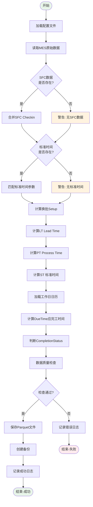

# ETL 处理流程详解

本文档详细说明 ETL 数据处理的完整流程。

---

## 整体流程图



---

## 详细步骤说明

### 步骤 1: 加载配置文件

**文件：** `config/config.yaml`

**读取内容：**
```yaml
paths:
  input_folder: "..."
  output_folder: "..."
  
processing:
  default_oee: 0.77
  setup_time_buffer: 0.5
  daily_work_hours: 8
  
incremental:
  enabled: false
  days: 7
```

**关键参数：**
- 输入/输出路径
- 默认 OEE 值
- 工作时间配置
- 增量更新设置

---

### 步骤 2: 读取 MES 原始数据

**输入文件：** `Product Output -CZM -FY26.xlsx`

**关键操作：**
1. 自动查找最新文件
2. 读取所有 Sheet（如有多个）
3. 数据类型转换
4. 清理空行

**示例代码：**
```python
# 查找最新MES文件
mes_files = glob.glob(os.path.join(input_folder, 'Product Output*.xlsx'))
latest_mes = max(mes_files, key=os.path.getmtime)

# 读取数据
df_mes = pd.read_excel(latest_mes, sheet_name=0)

# 数据清洗
df_mes = df_mes.dropna(how='all')  # 删除空行
df_mes['ProductionOrder'] = df_mes['ProductionOrder'].astype('Int64')
```

**输出：** DataFrame with ~100k+ rows

---

### 步骤 3: 合并 SFC Check In 数据

**输入文件：** `SFC_处理后数据_latest.parquet`

**合并键：** `['BatchNumber', 'Operation']`

**合并方式：** 左连接（保留所有 MES 记录）

**示例代码：**
```python
# 读取SFC数据
df_sfc = pd.read_parquet('SFC_处理后数据_latest.parquet')

# 选择需要的列
sfc_checkin = df_sfc[['BatchNumber', 'Operation', 'Checkin_SFC']]

# 合并
df_mes = df_mes.merge(
    sfc_checkin,
    on=['BatchNumber', 'Operation'],
    how='left'
)

# 统计匹配情况
match_rate = df_mes['Checkin_SFC'].notna().mean()
print(f"SFC匹配率: {match_rate:.2%}")
```

**结果：**
- 匹配成功：Checkin_SFC 有值
- 匹配失败：Checkin_SFC 为 NaN（使用备用时间）

---

### 步骤 4: 匹配标准时间参数

**输入文件：** `SAP_Routing_yyyymmdd.parquet`

**匹配键：** `['CFN', 'Operation']`

**匹配字段：**
- EH_machine(s) - 单件机器时间
- EH_labor(s) - 单件人工时间
- OEE - 设备综合效率
- Setup Time (h) - 调试时间

**示例代码：**
```python
# 读取最新Routing文件
routing_files = glob.glob('SAP_Routing_*.parquet')
latest_routing = max(routing_files, key=os.path.getmtime)
df_routing = pd.read_parquet(latest_routing)

# 匹配
df_mes = df_mes.merge(
    df_routing[['CFN', 'Operation', 'EH_machine(s)', 'EH_labor(s)', 'OEE', 'Setup Time (h)']],
    on=['CFN', 'Operation'],
    how='left'
)

# 填充默认OEE
df_mes['OEE'] = df_mes['OEE'].fillna(config['processing']['default_oee'])
df_mes.loc[df_mes['OEE'] == 0, 'OEE'] = config['processing']['default_oee']
```

---

### 步骤 5: 计算换批标识（Setup）

**逻辑：**
1. 按 machine 和 TrackOutTime 排序
2. 计算每条记录的上一批次结束时间
3. 判断产品号（CFN）是否变化

**示例代码：**
```python
# 排序
df_mes = df_mes.sort_values(['machine', 'TrackOutTime'])

# 计算上批结束时间
df_mes['PreviousBatchEndTime'] = df_mes.groupby('machine')['TrackOutTime'].shift(1)

# 上批产品号
df_mes['PreviousCFN'] = df_mes.groupby('machine')['CFN'].shift(1)

# 判断换批
df_mes['Setup'] = 'No'
df_mes.loc[df_mes['PreviousBatchEndTime'].isna(), 'Setup'] = 'Yes'  # 第一批
df_mes.loc[df_mes['CFN'] != df_mes['PreviousCFN'], 'Setup'] = 'Yes'  # 产品切换
```

---

### 步骤 6: 计算 Lead Time (LT)

**公式：**
```
0010工序: LT(d) = (TrackOutTime - 开始时间) / 24
非0010工序: LT(d) = (TrackOutTime - EnterStepTime) / 24

开始时间优先级（0010工序）:
1. Checkin_SFC
2. EnterStepTime
3. TrackInTime
```

**示例代码：**
```python
def calculate_lt(row):
    if row['Operation'] == '0010':
        # 0010工序：优先Checkin_SFC
        start_time = row['Checkin_SFC']
        if pd.isna(start_time):
            start_time = row['EnterStepTime']
        if pd.isna(start_time):
            start_time = row['TrackInTime']
    else:
        # 非0010工序：EnterStepTime
        start_time = row['EnterStepTime']
    
    if pd.isna(start_time) or pd.isna(row['TrackOutTime']):
        return np.nan
    
    # 计算天数
    lt_hours = (row['TrackOutTime'] - start_time).total_seconds() / 3600
    return round(lt_hours / 24, 2)

df_mes['LT(d)'] = df_mes.apply(calculate_lt, axis=1)
```

---

### 步骤 7: 计算 Process Time (PT)

**公式：**
```
PT(d) = (TrackOutTime - 开始时间) / 24

开始时间优先级:
1. Checkin_SFC（如果有）
2. TrackInTime
```

**示例代码：**
```python
def calculate_pt(row):
    # 优先Checkin_SFC
    start_time = row['Checkin_SFC'] if pd.notna(row['Checkin_SFC']) else row['TrackInTime']
    
    if pd.isna(start_time) or pd.isna(row['TrackOutTime']):
        return np.nan
    
    pt_hours = (row['TrackOutTime'] - start_time).total_seconds() / 3600
    return round(pt_hours / 24, 2)

df_mes['PT(d)'] = df_mes.apply(calculate_pt, axis=1)
```

---

### 步骤 8: 计算标准时间 (ST)

**公式：**
```
单件时间(h) = EH_machine(s) or EH_labor(s) / 3600
OEE = OEE or 0.77
调试时间 = Setup Time (h) if Setup=="Yes" else 0
换批时间 = 0.5

ST_小时 = 调试时间 + (数量 × 单件时间 / OEE) + 换批时间
ST(d) = ST_小时 / 24
```

**示例代码：**
```python
def calculate_st(row):
    # 1. 单件时间
    if pd.notna(row['EH_machine(s)']) and row['EH_machine(s)'] > 0:
        unit_time_sec = row['EH_machine(s)']
    elif pd.notna(row['EH_labor(s)']) and row['EH_labor(s)'] > 0:
        unit_time_sec = row['EH_labor(s)']
    else:
        return np.nan
    
    unit_time_hour = unit_time_sec / 3600
    
    # 2. OEE
    oee = row['OEE'] if pd.notna(row['OEE']) and row['OEE'] > 0 else 0.77
    
    # 3. 调试时间
    setup_time = row['Setup Time (h)'] if row['Setup'] == 'Yes' else 0
    if pd.isna(setup_time):
        setup_time = 0
    
    # 4. 计算ST
    quantity = row['StepInQuantity']
    buffer_time = 0.5  # 换批时间
    
    st_hours = setup_time + (quantity * unit_time_hour / oee) + buffer_time
    return round(st_hours / 24, 2)

df_mes['ST(d)'] = df_mes.apply(calculate_st, axis=1)
```

---

### 步骤 9: 计算应完工时间 (DueTime)

**核心算法：** 基于工作日日历逐天累加

**输入：**
- 开始时间：TrackInTime
- 计划小时数：ST(d) × 24
- 工作日日历

**示例代码：**
```python
def calculate_due_time(start_time, plan_hours, calendar_df):
    """
    按工作日逐天累加
    """
    if pd.isna(start_time) or pd.isna(plan_hours):
        return np.nan, np.nan
    
    current_time = start_time
    remaining_hours = plan_hours
    weekend_hours = 0
    
    while remaining_hours > 0:
        current_date = current_time.date()
        
        # 查询是否工作日
        is_workday = calendar_df[
            calendar_df['日期'] == current_date
        ]['是否工作日'].values[0]
        
        if is_workday:
            # 工作日：减少剩余时间（24小时连续工作）
            daily_hours = min(remaining_hours, 24)
            remaining_hours -= daily_hours
        else:
            # 非工作日：计入weekend
            weekend_hours += 24
        
        # 推进到下一天
        current_time += timedelta(days=1)
    
    due_time = current_time
    weekend_days = round(weekend_hours / 24, 2)
    
    return due_time, weekend_days

# 加载日历
calendar = pd.read_csv('日历工作日表.csv')
calendar['日期'] = pd.to_datetime(calendar['日期'])

# 批量计算
results = df_mes.apply(
    lambda row: calculate_due_time(
        row['TrackInTime'],
        row['ST(d)'] * 24,
        calendar
    ),
    axis=1,
    result_type='expand'
)

df_mes['DueTime'] = results[0]
df_mes['Weekend(d)'] = results[1]
```

---

### 步骤 10: 判断完工状态

**逻辑：**
```
IF TrackOutTime <=DueTime THEN
    CompletionStatus = "OnTime"
    SA状态 = 1
ELSE
    CompletionStatus = "Overdue"
    SA状态 = 0
END IF
```

**示例代码：**
```python
df_mes['CompletionStatus'] = df_mes.apply(
    lambda row: 'OnTime' if row['TrackOutTime'] <= row['DueTime'] else 'Overdue',
    axis=1
)

df_mes['SA状态'] = df_mes['CompletionStatus'].map({'OnTime': 1, 'Overdue': 0})

# 统计
ontime_count = (df_mes['SA状态'] == 1).sum()
total_count = len(df_mes)
sa_rate = ontime_count / total_count
print(f"SA达成率: {sa_rate:.2%}")
```

---

### 步骤 11: 数据质量检查

**检查项：**

1. **必填字段**
   ```python
   required_fields = ['BatchNumber', 'CFN', 'Operation', 'TrackOutTime']
   for field in required_fields:
       missing = df_mes[field].isna().sum()
       if missing > 0:
           print(f"警告: {field} 缺失 {missing} 条")
   ```

2. **数据类型**
   ```python
   # 数量字段非负
   quantity_fields = ['StepInQuantity', 'TrackOutQuantity']
   for field in quantity_fields:
       negative = (df_mes[field] < 0).sum()
       if negative > 0:
           print(f"警告: {field} 存在负数 {negative} 条")
   ```

3. **逻辑检查**
   ```python
   # TrackOutTime >= TrackInTime
   logic_error = (df_mes['TrackOutTime'] < df_mes['TrackInTime']).sum()
   if logic_error > 0:
       print(f"警告: 时间逻辑异常 {logic_error} 条")
   ```

---

### 步骤 12: 保存 Parquet 文件

**输出文件：**
- `MES_处理后数据_latest.parquet` - 最新版本
- `MES_处理后数据_20250110.parquet` - 日期备份

**示例代码：**
```python
import os
from datetime import datetime

# 输出路径
output_folder = config['paths']['output_folder']

# 最新版本
latest_file = os.path.join(output_folder, 'MES_处理后数据_latest.parquet')
df_mes.to_parquet(latest_file, index=False)

# 日期备份
date_str = datetime.now().strftime('%Y%m%d')
backup_file = os.path.join(output_folder, f'MES_处理后数据_{date_str}.parquet')
df_mes.to_parquet(backup_file, index=False)

print(f"✓ 保存成功: {latest_file}")
print(f"✓ 备份成功: {backup_file}")
```

---

## 性能统计

### 典型处理时间

| 步骤 | 时间占比 | 优化建议 |
|------|----------|----------|
| 读取原始数据 | 10% | 使用 Parquet |
| 合并 SFC | 5% | 索引优化 |
| 匹配标准时间 | 10% | 索引优化 |
| 计算 LT/PT/ST | 20% | 向量化 |
| 计算 DueTime | 40% | 多进程 |
| 保存 Parquet | 10% | 压缩配置 |
| 其他 | 5% | - |

---

## 相关链接

- [SA 数据清洗详解](etl-sa.md)
- [SFC 数据清洗详解](etl-sfc.md)
- [配置说明](configuration.md)
- [数据更新流程](../guide/data-update.md)

