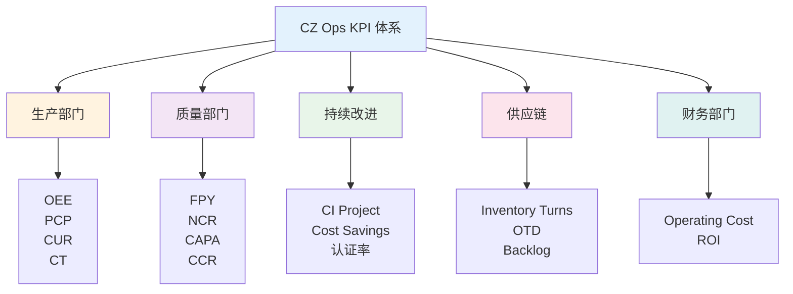

# CZ Ops KPI 指标体系

本章节介绍 CZ Ops 数字化数据平台的完整 KPI 指标体系，包括供应链、生产、质量、持续改进等多个维度的关键绩效指标。

---

## 📊 KPI 体系架构

---

## 🎯 KPI 分类导航

### 🚚 供应链 KPI

衡量库存管理、交付准时性、生产计划达成的关键指标。

**核心指标：**

| 指标 | 英文名称 | 单位 | 目标值 | 状态 |
|------|----------|------|--------|------|
| **SA - 计划达成率** | **Schedule Adherence** | **%** | **≥ 95%** | ✅ **已实施** |
| Inventory Turns | Inventory Turns | 次 | ≥ 6 | 🔄 计划中 |
| OTD - 准时交付率 | On-Time Delivery | % | ≥ 95% | 🔄 计划中 |
| Backlog | Backlog | $M | 控制范围内 | 🔄 计划中 |

👉 **[查看供应链 KPI 详细说明](supply-chain.md)**

---

### 🏭 生产部门 KPI

衡量生产效率、产能利用和制造成本的关键指标。

**核心指标：**

| 指标 | 英文名称 | 单位 | 目标值 |
|------|----------|------|--------|
| OEE | Overall Equipment Effectiveness | % | ≥ 85% |
| PCP | Production Completion Percentage | % | ≥ 95% |
| CUR | Capacity Utilization Rate | % | ≥ 80% |
| Labor Efficiency | Labor Efficiency | % | ≥ 90% |

👉 **[查看生产部门 KPI 详细说明](production.md)**

---

### 🛡️ 质量部门 KPI

衡量产品质量、过程控制和质量改进的关键指标。

**核心指标：**

| 指标 | 英文名称 | 单位 | 目标值 |
|------|----------|------|--------|
| FPY | First Pass Yield | % | ≥ 98% |
| NCR | Non-Conformance Rate | % | ≤ 2% |
| CAPA | CAPA Completion Rate | % | ≥ 95% |
| Rework | Rework Rate | % | ≤ 3% |

👉 **[查看质量部门 KPI 详细说明](quality.md)**

---

### 📈 持续改进 KPI

衡量改善活动、成本节约和员工发展的关键指标。

**核心指标：**

| 指标 | 英文名称 | 单位 | 目标值 |
|------|----------|------|--------|
| CI Project | CI Project Completion Rate | % | ≥ 90% |
| Cost Savings | Cost Savings | $M | 年度目标 |
| Employee Engagement | Employee Engagement | % | ≥ 80% |

👉 **[查看持续改进 KPI 详细说明](ci.md)**

---

## KPI 使用建议

### 📊 仪表板设计

1. **高层管理看板**
   - 关注部门级 KPI 汇总
   - 月度/季度趋势
   - 目标达成情况

2. **运营管理看板**
   - 关注日常运营 KPI
   - 异常预警
   - 根因分析

3. **专项分析看板**
   - 深入单个 KPI
   - 多维度钻取
   - 对标分析

### 🎯 目标设定

- 基于历史数据设定合理目标
- 考虑行业标杆值
- 分阶段设定改进目标

### 📈 持续改进

- 定期回顾 KPI 表现
- 识别改进机会
- 跟踪改进措施效果

---

## 相关资源

- [SA 指标](../sa/index.md) - 计划达成率详细说明
- [数据更新流程](../guide/data-update.md) - 了解如何更新数据
- [常见问题](../guide/faq.md) - KPI 相关常见问题

