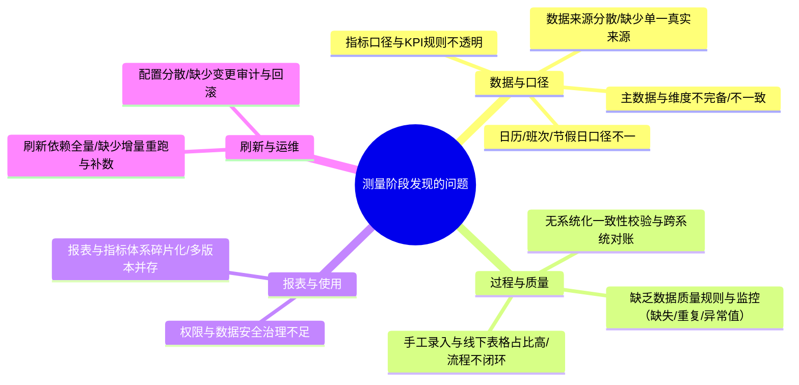
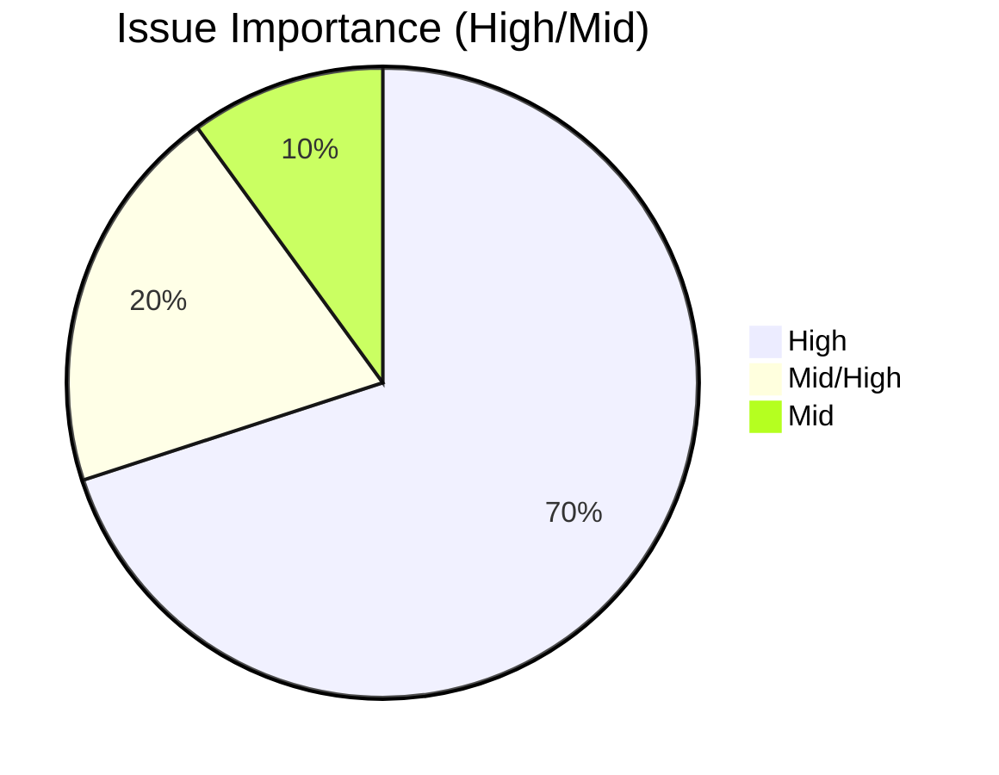
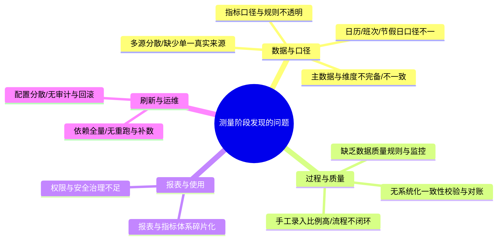

# 测量阶段（Measure）

本页整合测量阶段的现状度量、方法、发现问题与影响评估，结论用于支撑后续“分析/改进/控制”三个阶段的决策。SA/SFC 报表用于技术试点与结构验证，但度量与问题定位面向“整个平台”与多部门指标。

---

## 1. 度量方法与数据范围

- 数据域与来源：Planisware、Project、Excel、Power BI、OEE、SFC、MES、SharePoint（含线下表格）。
- 抽样窗口：按月/周选取代表性样本期，覆盖工作日与跨日班次。
- 方法
  - 结构对齐：对主数据（产品、工序、日历/班次、字典表）进行字典化与采样核对。
  - 口径回放：对样本期进行 ETL 与 DAX 双向重算，目标误差阈值 ≤ 0.5%。
  - 稳定性基线：统计近 4 周作业成功率、耗时、异常类型与瓶颈节点。
  - 覆盖性评估：对关键字段（日期、工序、数量、停机等）进行缺失率与异常率统计。

流程示意（测量方法）

```mermaid
flowchart TD
    A[多源系统\n(MES/SFC/OEE/Excel/SharePoint)] --> B[结构对齐\n字典/日历/主数据采样]
    B --> C[口径回放\nETL vs DAX 双向重算]
    C --> D[稳定性基线\n成功率/耗时/异常类型]
    D --> E[覆盖性评估\n缺失率/异常率]
    E --> F[问题清单与影响评估]
```

补充参考：`02_Measure_测量阶段/01_DataCollectionPlan_数据收集计划.md`

---

## 2. 发现的问题与影响

| 序号 | 问题 | 说明（为何是问题） | 影响（业务/技术） | 重要性 |
| --- | --- | --- | --- | --- |
| 1 | 数据来源分散、缺少统一“单一真实来源” | Power BI、Excel、SFC、OEE、MES、邮件、SharePoint 各自维护数据，字段与口径不统一 | 各报表结果不一致，管理层难以获得统一口径；整合依赖人工拼表，工作量随业务规模成倍增长 | 高 |
| 2 | 指标口径与业务规则不透明 | KPI/计算公式分散在脚本、个人 Excel、口头约定中，缺乏集中定义与版本管理 | 同一指标在不同报表中数值不同，质疑与解释频发，报表可信度下降 | 高 |
| 3 | 主数据与维度表不完备且不一致 | 产品、工序、组织、客户等主数据由不同系统维护，存在缺失、重复和历史版本混用 | 聚合分析时出现“统计口径不一致”“部分对象缺失”，影响运营分析与对外汇报 | 高 |
| 4 | 时间相关口径不统一（日历/班次/时区/节假日） | 各系统对班次、跨日、节假日的处理方式不同，时间戳粒度与含义不一致 | 交期、产能、稼动率等时间敏感指标在不同系统间出现系统性偏差，难以定位根因 | 高 |
| 5 | 数据质量问题缺少监控（缺失/重复/异常值） | 缺乏统一的数据质量规则与自动校验机制，依赖项目成员“看数”发现问题 | 异常数据进入报表后被放大，导致决策偏差；质量问题往往在汇报前夕才暴露，补救成本高 | 高 |
| 6 | 手工录入与线下表格占比高，流程不闭环 | 关键业务数据通过邮件、Excel、手工 A3 报告维护，审批与修改记录不完备 | 数据难以追溯责任人和修改历史，审计与合规风险上升；同一数据被多处维护，容易出现版本冲突 | 高 |
| 7 | 报表刷新机制依赖全量与人工触发 | 刷新策略以全量为主，缺少稳健增量、重跑与补数机制，且多依赖人工按钮操作 | 数据量增长后刷新时间过长或失败，形成“报表不可用窗口”，用户对系统时效性产生不信任 | 高 |
| 8 | 报表与指标体系碎片化、重复建设 | 不同部门根据本地需求各自搭建报表，同一主题存在多份相似但不一致的仪表板 | 用户不知道“应该看哪一张报表”，导致对同一问题出现多种解释；维护成本高且难以统一下线旧版 | 中高 |
| 9 | 权限与数据安全治理不完善 | 报表与数据集缺少统一的权限模型，粒度过粗或过细，审批链不清晰 | 敏感数据存在越权访问风险；或因过度收紧导致业务同事取数困难，通过线下导出绕开控制 | 中高 |
| 10 | 配置分散、缺少变更审计与回滚机制 | 报表配置与查询逻辑分散在脚本、多份 pbix、参数文件中，缺少集中配置库与版本记录 | 线上数值变化难以追溯“是哪一次修改导致”，排查时间长，影响发布节奏和用户信任 | 中 |

问题分层（测量视角）



占比示意（按重要性粗分）



---

## 3. 影响与风险

- 决策影响：各部门 KPI 难以对齐，管理层难以获得可信的一致视图。  
- 成本影响：人工整合与对账随范围扩大而线性甚至指数增长。  
- 稳定性风险：刷新失败与延迟导致报表“不可用窗口”，削弱用户信任。  
- 维护风险：缺少配置审计与版本控制，问题难定位且回滚困难。

---

## 4. 变更的必要性与重要性（Why Now）

- 业务扩展要求“跨部门一致、可复用”的平台化能力；当前做法在规模上不可持续。  
- 统一口径与配置治理是提升数据可信度与复用效率的基础工程。  
- 引入一致性校验与稳健增量/补数/重跑，是保障报表时效与可靠性的关键。  
- 通过 SA/SFC 试点已验证结构可复用，具备推广到各部门的现实基础。

---

## 5. 输出与进入下一阶段

- 形成问题清单、影响评估与优先级，作为分析阶段的输入。  
- 对关键问题建立样本期与对照数据集，为后续“口径回放”“一致性检验”提供基线。  
- 在分析阶段产出鱼骨与现状流程，映射到可落地的改进措施与控制点。

---

## 6. 案例分析与对比（来自本文件夹材料）

### 案例A：跨系统项目状态不一致（来源：数据收集计划与实施指南）

| 维度 | 观察 | 影响 | 量化（样本期） |
| --- | --- | --- | --- |
| Project vs Planisware | 同一项目状态“进行中/已完成”不一致 | 进度汇总口径不一，月度汇报偏差 | 30个活跃项目比对，一致率约85% |
| SharePoint 报告 vs 系统记录 | 手工A3报告未及时更新 | 决策滞后，重复沟通 | 随机20个项目，滞后>7天占35% |

结论：需要统一“项目状态字典与映射”，并将报告数据来源切换为系统主数；建立跨系统对账规则，纳入每周质量报告。

### 案例B：日历/班次口径导致的 SA 偏差（来源：实施指南与SA试点）

| 现象 | 根因 | 影响 | 量化（样本期） |
| --- | --- | --- | --- |
| 夜班跨日导致 LT 起止不一致 | 无统一班次与节假日口径 | SA在跨日边界偏差 | 跨夜批次中，差异>1h占22% |

结论：需建立“日历与班次服务”，统一跨日与节假日规则；在ETL中显式使用统一接口生成起止时间。

### 案例C：标准时间覆盖不足（来源：实施指南与KPI口径说明）

| 现象 | 根因 | 影响 | 量化（样本期） |
| --- | --- | --- | --- |
| 少量工序无标准时间 | 规则分散、来源多样 | 指标无法按统一口径聚合 | 覆盖率~93%，导致部分产品被排除 |

结论：将标准时间转换接口化，缺失项形成“待补清单”，作为每周治理任务。

### 案例D：全量刷新造成时效不稳（来源：实施指南与数据流）

| 方案 | 刷新方式 | 问题 | 建议 |
| --- | --- | --- | --- |
| 现状 | 全量刷新 | 数据量增长后失败/延迟 | 引入增量+重跑窗口与补数清单 |

结论：设置最近N天重跑窗口，异常后可回补；并在发布前执行“样本期口径回放”校验点。

---

### 思维导图（测量阶段发现的问题）



---

### 对比示意（问题到对策）


---

## 7. PPT 片段（可直接复制）

- 标题：测量阶段总结（方法·发现·影响·必要性）
- 方法
  - 结构对齐：主数据/日历/字典采样核对
  - 口径回放：ETL 与 DAX 双向重算（阈值≤0.5%）
  - 稳定性基线：成功率、耗时、异常类型
  - 覆盖性：缺失率、异常率
- 主要发现与影响
  - 数据分散与口径不一 → 指标不一致、重复劳动、难追溯（高）
  - 术语与KPI定义不清 → 计算差异、沟通成本高（高）
  - 无系统化一致性校验 → 发布质量不稳、回溯困难（高）
  - 刷新不稳 → 时效与信任度下降（高）
  - 日历/班次不统一、标准时间未接口化 → 口径漂移（中高）
  - 配置分散无审计 → 回滚困难（中）
- 案例（精简版）
  - 跨系统状态不一致：30个项目一致率85%；建议建立主数与对账规则
  - 夜班跨日LT差异：跨夜批次>1h差异占22%；建议统一日历/班次服务
  - 标准时间覆盖不足：覆盖率~93%；建议接口化转换+缺失清单
  - 全量刷新不稳：建议增量+重跑窗口+补数
- 必要性
  - 平台化扩展下，现状不可持续；统一口径与治理刻不容缓
  - 稳健增量与一致性回放是保障“可信+可用”的关键门禁
