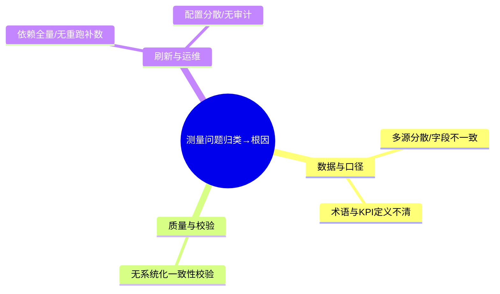
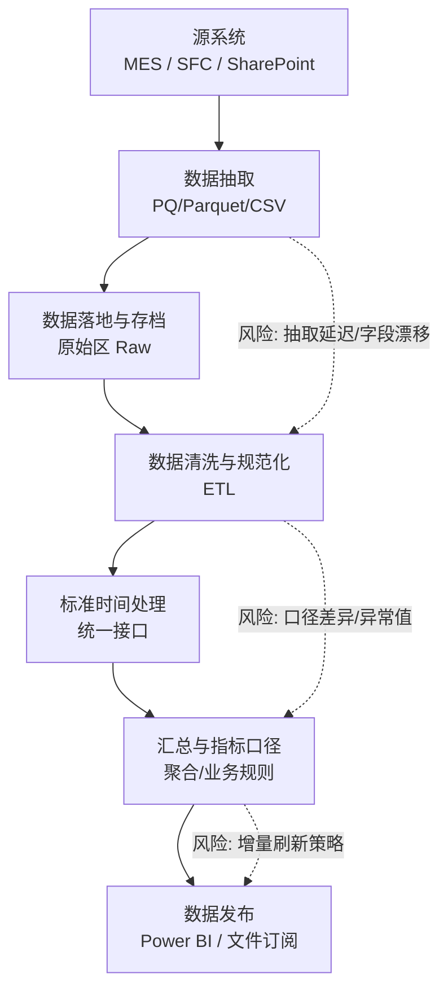
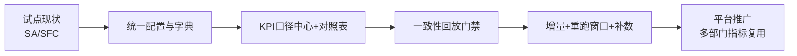

# 分析阶段（Analyze）

本页基于测量阶段的问题清单，进行平台级问题分析与方案设计，并明确验证路径与优先级。SA/SFC 仍作为试点验证域，但结论面向全平台复用。

---

## 0. 概述（范围与定位）

- 目标：对测量阶段发现的问题进行归因分析，提出可复用的“平台级解决方案”。  
- 范围：仅讨论“问题与解决方案”的匹配关系与验证思路；不包含执行计划、责任人、时间表等内容（放在“改进阶段”）。  
- 输出：问题分类、As-Is 风险点、问题→方案表、验证路径、风险与对策、数据说明文档要求。

---

## 1. 问题到根因的归类

---

## 2. 现状流程与风险点（As-Is）

要点：多源异构、口径差异、异常与缺失处理、发布前缺少一致性回放门禁。

---

## 3. 可行方案清单（仅问题→方案，不含执行计划）

| 序号 | 问题 | 方案 | 关键动作 | 成功标准 |
| --- | --- | --- | --- | --- |
| 1 | 多源分散/字段不一致 | 建立“统一配置中心+字典表”，规范字段、维度、主键 | 统一产品/工序/设备等字典，字段映射规则入库并版本化 | 跨表映射命中率=100%，跨域字段无歧义 |
| 2 | 术语与KPI定义不清晰 | 建立“数据平台说明书”，标准化数据口径 | 口径定义与DAX/ETL对应关系表；明确KPI字段的定义和计算公式 | 样本期ETL vs DAX 误差≤0.5% |
| 3 | 无系统化一致性校验 | 引入“聚合后一致性回放”与自动对账 | 回放样本集；异常阈值与拦截策略；周度质量报告 | 发布前零阻断通过；异常闭环时效<2天 |
| 4 | 刷新缓慢，数据占用庞大 | 采用“增量+重跑窗口+补数清单” | 最近N天窗口、异常补数、失败自动重试+告警 | 失败率<1%，平均耗时下降50%+ |
| 5 | 配置分散/无审计 | 配置集中化与版本控制，支持环境覆盖 | 主配置+环境覆盖；审计日志与变更记录 | 线上配置可追溯、可回滚 |

---

## 6. 验证路径与里程碑（试点→平台）

- P1：完成产品/工序/设备字典与字段映射规则；配置集中化。  
- P2：发布KPI口径中心，建立DAX与ETL口径对应。  
- P3：将“样本期回放”接入发布门禁，异常自动阻断并提供明细。  
- P4：落地增量与重跑策略，形成运行手册与SLA。  

---

## 7. 风险与对策

- 历史数据映射缺口大 → 制定逐批补录清单；设过渡映射规则并标记来源。  
- 跨部门口径争议 → 设评审流程与变更窗口，更新“口径中心”并通知。  
- 资源限制 → 以试点优先，先搭建“最小可用平台能力”，再扩域。  

---

## 8. 数据说明文档（电子说明书）作为治理措施

目标：以标准化“电子说明书”固化方案说明、培训材料与变更记录，形成可追溯的字段与KPI权威来源（Single Source of Truth）。本章节为解决“术语与KPI定义不清晰”的核心抓手。

范围：字段字典、来源与刷新、数据结构与粒度、计算方法（含DAX/SQL/ETL）、质量校验、变更记录与评审、SLA与告警。模板参考 `kpi/kpi-specification.md` 与 `reference/dictionary.md`。

---

## 9. 关联与下一步

- 下一步进入“改进阶段”，据此实施配置治理、口径中心、一致性回放与增量策略；执行细节（里程碑、责任、工期）均在“改进阶段”说明。 
