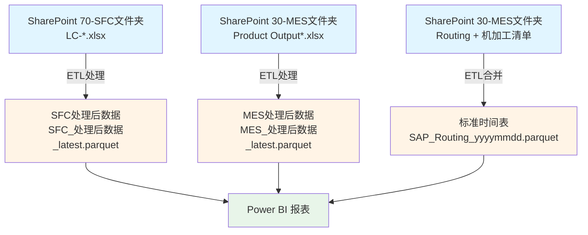
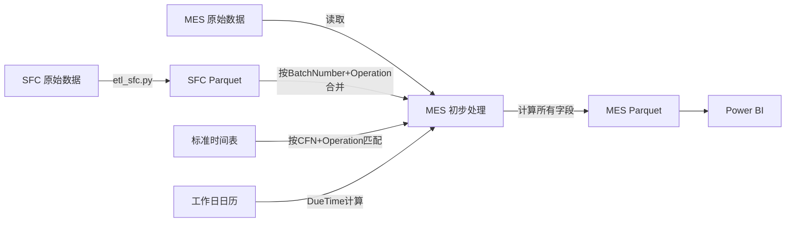
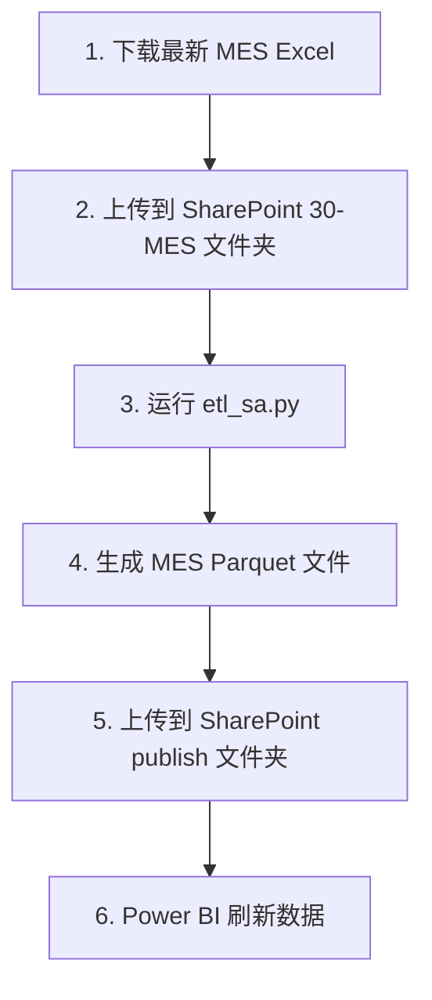
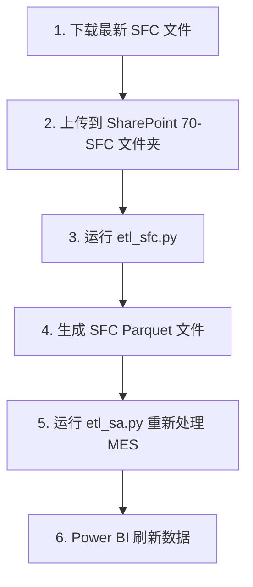
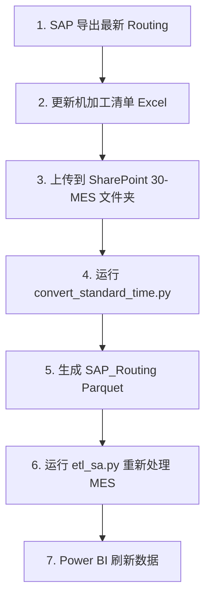

# SA 指标数据源说明

本页面详细介绍 SA 指标计算所需的数据来源、更新频率、存储位置和数据关联关系。

---

## 1. 数据源概览

SA 指标基于三大核心数据源：



---

## 2. 核心数据源详细说明

### 2.1 SFC 批次报工记录

#### 基本信息

| 项目 | 说明 |
|------|------|
| **Power Query 文件** | `e4_批次报工记录_SFC.pq` |
| **原始数据位置** | SharePoint `70-SFC` 文件夹 |
| **原始文件格式** | `LC-yyyymmddhhmmss.csv` 或 Excel |
| **处理后文件** | `SFC_处理后数据_latest.parquet` |
| **处理后位置** | SharePoint `30-MES导出数据/publish` 文件夹 |
| **ETL 脚本** | `etl_sfc.py` |
| **更新频率** | 手动触发 ETL 脚本 |

#### 主要字段

- 批次号（BatchNumber）
- 产品号（CFN）
- 工序号（Operation）
- **Check In 时间**（Checkin_SFC）⭐
- 报工时间（TrackOutTime）
- 产出数量（TrackOutQuantity）
- 报废数量（ScrapQuantity）
- Check In 人员、报工人员

#### 主要用途

!!! success "SFC 数据用途"
    - 提供 **Check In 时间**（Checkin_SFC）- PT 计算的关键字段
    - 补充 MES 数据的报工记录
    - 提供报废数量信息

---

### 2.2 MES 批次报工记录

#### 基本信息

| 项目 | 说明 |
|------|------|
| **Power Query 文件** | `e2_批次报工记录_MES.pq` |
| **原始数据位置** | SharePoint `30-MES` 文件夹 |
| **原始文件格式** | `Product Output -CZM -FY26.xlsx` |
| **处理后文件** | `MES_处理后数据_latest.parquet` |
| **处理后位置** | SharePoint `30-MES导出数据/publish` 文件夹 |
| **ETL 脚本** | `etl_sa.py` |
| **更新频率** | 手动触发 ETL 脚本 |

#### 主要字段

- 批次号（BatchNumber）
- 产品号（CFN）
- 生产订单（ProductionOrder）
- 工序号（Operation）
- 工序名称（Operation description）
- 生产区域（ProductionArea）
- 工艺路线（Group）
- 机台号（machine）
- **进入工序时间**（EnterStepTime）
- **工序投入时间**（TrackInTime）
- **报工时间**（TrackOutTime）
- 投入数量（StepInQuantity）
- 产出数量（TrackOutQuantity）
- VSM、ERP代码、产品描述

#### 主要用途

!!! success "MES 数据用途"
    - **核心生产数据**，包含工序报工、时间记录、数量信息
    - 所有 SA 计算字段已在 ETL 中完成（LT、PT、ST、DueTime、CompletionStatus）
    - Power BI 中直接读取，无需二次计算

#### 数据增强

MES 数据在 ETL 阶段会：

1. **合并 SFC 的 Checkin_SFC**（按 BatchNumber + Operation 匹配）
2. **匹配标准时间参数**（按 CFN + Operation 匹配）
3. **计算所有 SA 指标字段**

---

### 2.3 产品标准时间表

#### 基本信息

| 项目 | 说明 |
|------|------|
| **Power Query 文件** | `e3_产品标准时间.pq` |
| **原始数据位置** | SharePoint `30-MES` 文件夹 |
| **原始文件** | `1303 Routing及机加工产品清单.xlsx` |
| **处理后文件** | `SAP_Routing_yyyymmdd.parquet` |
| **处理后位置** | SharePoint `30-MES导出数据/publish` 文件夹 |
| **ETL 脚本** | `convert_standard_time.py` |
| **更新频率** | SAP 标准时间更新时 |

#### 合并逻辑

```python
# 从两个 Sheet 合并
Routing表 = pd.read_excel(file, sheet_name='1303 Routing')
机加工清单 = pd.read_excel(file, sheet_name='1303机加工清单')

# 按 CFN + Operation 合并
标准时间表 = pd.merge(
    Routing表[['CFN', 'Operation', 'Machine', 'Labor', 'Quantity']],
    机加工清单[['CFN', 'Operation', 'OEE', 'Setup Time (h)']],
    on=['CFN', 'Operation'],
    how='left'
)

# 计算单件时间（秒）
标准时间表['EH_machine(s)'] = 标准时间表['Machine'] / 标准时间表['Quantity']
标准时间表['EH_labor(s)'] = 标准时间表['Labor'] / 标准时间表['Quantity']
```

#### 主要字段

- 产品号（CFN）
- 工序号（Operation）
- **单件机器时间**（EH_machine(s)）- 秒
- **单件人工时间**（EH_labor(s)）- 秒
- **设备综合效率**（OEE）- 0-1 之间
- **调试时间**（Setup Time (h)）- 小时

#### 主要用途

!!! success "标准时间表用途"
    - 提供 **标准时间计算参数**（机器时间、人工时间、OEE、调试时间）
    - 用于计算 **ST(d)**（标准时间）和 **DueTime**（应完工时间）

---

## 3. 辅助数据源

### 3.1 工作日日历表

| 项目 | 说明 |
|------|------|
| **文件名** | `日历工作日表.csv` |
| **生成脚本** | `generate_calendar.py` |
| **存储位置** | ETL 脚本同级目录 |
| **更新频率** | 年度更新 |

#### 字段说明

| 字段名 | 数据类型 | 说明 | 示例 |
|--------|----------|------|------|
| 日期 | Date | 日期 | 2025-01-01 |
| 星期几 | Text | 周几 | 星期三 |
| 是否工作日 | Boolean | True/False | False |
| 节假日名称 | Text | 节假日名称 | 元旦 |

#### 主要用途

!!! success "日历表用途"
    - **DueTime 计算**：跳过非工作日（周末和法定节假日）
    - **Weekend(d) 计算**：统计非工作日天数

---

## 4. 数据关联关系

### 4.1 数据合并流程



### 4.2 关键匹配规则

#### SFC 与 MES 合并

```python
# 匹配键：BatchNumber + Operation
合并字段 = ['BatchNumber', 'Operation']

# 合并方式：左连接（以 MES 为主）
mes_df = mes_df.merge(
    sfc_df[['BatchNumber', 'Operation', 'Checkin_SFC']],
    on=合并字段,
    how='left'
)
```

#### 标准时间表匹配

```python
# 匹配键：CFN + Operation
匹配字段 = ['CFN', 'Operation']

# 匹配方式：左连接（保留所有 MES 记录）
mes_df = mes_df.merge(
    routing_df[['CFN', 'Operation', 'EH_machine(s)', 'EH_labor(s)', 'OEE', 'Setup Time (h)']],
    on=匹配字段,
    how='left'
)
```

---

## 5. 数据存储格式

### 5.1 为什么使用 Parquet 格式？

| 特性 | Parquet | Excel/CSV |
|------|---------|-----------|
| **文件大小** | 小（高压缩率） | 大 |
| **读取速度** | 快 | 慢 |
| **数据类型保留** | 精确保留 | 易丢失 |
| **Power BI 支持** | ✅ 原生支持 | ✅ 支持但慢 |
| **增量刷新** | ✅ 适合 | ❌ 不适合 |

!!! tip "Parquet 优势"
    - 文件大小减少 **70-90%**
    - Power BI 加载速度提升 **5-10 倍**
    - 精确保留数据类型（日期、数字、布尔值）

### 5.2 文件命名规范

```
MES_处理后数据_latest.parquet       # 最新数据
MES_处理后数据_20250110.parquet     # 历史备份（按日期）

SFC_处理后数据_latest.parquet       # 最新数据
SFC_处理后数据_20250110.parquet     # 历史备份

SAP_Routing_20250105.parquet         # 标准时间（按更新日期）
```

---

## 6. 数据更新流程

### 6.1 日常更新流程



### 6.2 SFC 数据更新流程



### 6.3 标准时间更新流程



---

## 7. 数据质量监控

### 7.1 ETL 日志

每次 ETL 运行会生成日志文件：

```
logs/
├── etl_sa.log          # MES 处理日志
├── etl_sfc.log         # SFC 处理日志
└── manifest.csv        # 处理记录清单
```

### 7.2 数据质量检查

ETL 脚本会自动检查：

- ✅ 必填字段完整性
- ✅ 数据类型正确性
- ✅ 时间逻辑合理性
- ✅ 数量非负性
- ✅ OEE 范围（0-1）

---

## 相关链接

- [字段说明](field-specification.md) - 查看所有字段定义
- [ETL 处理流程](../etl/etl-sa.md) - 了解数据处理细节
- [配置说明](../etl/configuration.md) - 修改 ETL 配置
- [数据更新流程](../guide/data-update.md) - 详细操作指南

