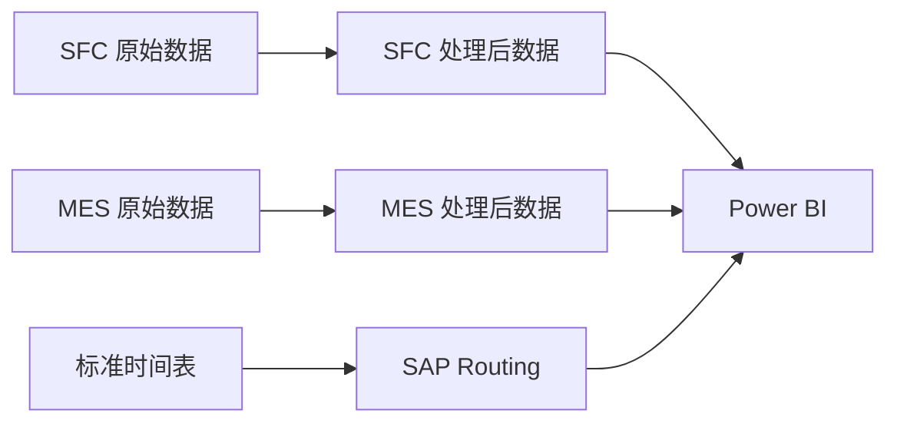

# SA - 计划达成率

**Schedule Adherence（SA）** 是供应链 KPI 体系中的核心指标，用于衡量生产是否按照既定生产计划执行。

!!! info "指标归属"
    SA 指标属于 **[供应链部门 KPI](../kpi/supply-chain.md)** 体系，是评估生产计划执行情况的关键指标。

---

## 什么是 SA 指标？

### 官方定义

!!! quote "英文原文"
    Schedule Adherence is a metric revealing whether or not production is adhering to the scheduled operating plan. The metric is defined as a percentage of output over demand. Schedule Adherence plays an important role in production performance.

!!! info "中文解读"
    Schedule Adherence（计划达成率）是衡量生产是否按照既定生产计划执行的重要指标。该指标通常以"产出/需求"的百分比来表示，反映了生产实际完成情况与计划之间的吻合程度。计划达成率在生产绩效中起着重要作用。

---

## 核心概念

### 计算公式

SA 指标的基本计算公式：

\[
SA(\%) = \frac{\text{按期完成的批次数}}{\text{总批次数}} \times 100\%
\]

### 判断标准

单个批次的 SA 状态判断：

- **按期（OnTime）**：实际完工时间 ≤ 应完工时间
- **逾期（Overdue）**：实际完工时间 > 应完工时间

其中：
- **实际完工时间**：TrackOutTime（工序报工时间）
- **应完工时间**：DueTime = TrackInTime + ST(d) + Weekend(d)

---

## 数据体系

### 三大数据源

1. **SFC 批次报工记录**：提供 Check In 时间
2. **MES 批次报工记录**：核心生产数据
3. **产品标准时间**：计划参数（标准时间、OEE 等）

---

## 快速导航

- :material-calculator: **[计算方法与定义](calculation-definition.md)**

    详细的 SA 指标计算逻辑、公式推导和业务规则

- :material-table: **[字段说明](field-specification.md)**

    完整的数据字段定义、类型、示例和计算规则

- :material-database: **[数据源说明](data-sources.md)**

    数据来源、更新频率、关联关系和数据流

- :material-chart-line: **[计算示例](examples.md)**

    实际案例演示 SA 指标的计算过程

---

## 关键字段速查

| 字段名 | 说明 | 作用 |
|--------|------|------|
| **BatchNumber** | 批次号 | 唯一标识一个生产批次 |
| **Operation** | 工序号 | 标识具体工序 |
| **TrackOutTime** | 报工时间 | 实际完工时间 |
| **DueTime** | 应完工时间 | 计划完工时间 |
| **ST(d)** | 标准时间 | 理论加工时间 |
| **CompletionStatus** | 完工状态 | OnTime/Overdue |

---

## 重要说明

!!! warning "数据处理注意事项"
    - SA 指标已在 ETL 阶段完成所有计算
    - Power BI 中直接读取 Parquet 文件，无需二次计算
    - 建议使用增量刷新优化 Power BI 性能

!!! tip "最佳实践"
    - 定期更新标准时间表（SAP Routing）
    - 关注逾期批次的原因分析
    - 结合 OEE、Setup Time 优化生产计划

---

## 相关资源

- [ETL 处理流程](../etl/etl-sa.md)
- [Power Query 代码](../pq/mes-records.md)
- [常见问题](../guide/faq.md)

