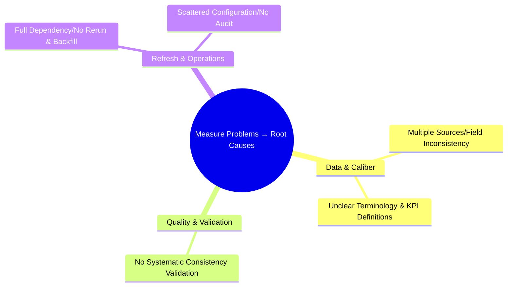
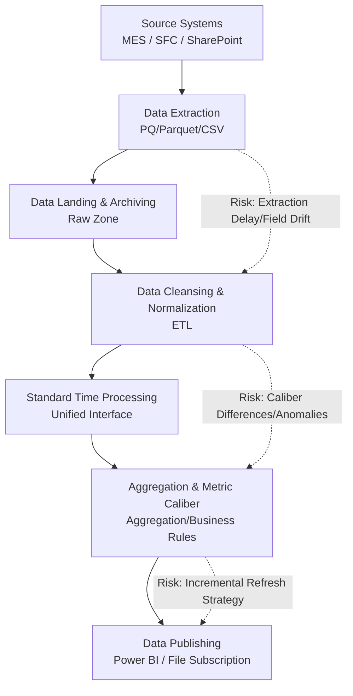
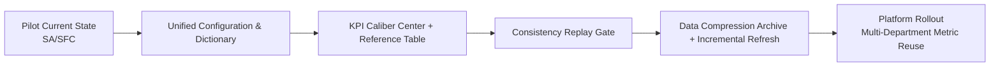

# Analyze Phase

This page conducts platform-level problem analysis and solution design based on the problem list from the Measure phase, and clarifies verification paths and priorities. SA/SFC remains the pilot validation domain, but conclusions are reusable across the entire platform.

---

## 0. Overview (Scope and Positioning)

- **Objective**: Conduct root cause analysis of problems identified in the Measure phase and propose reusable "platform-level solutions".
- **Scope**: Only discusses the matching relationship between "problems and solutions" and verification approaches; does not include execution plans, responsibilities, timelines, etc. (covered in the "Improve phase").
- **Output**: Problem classification, As-Is risk points, problem→solution table, verification paths, risks and countermeasures, data documentation requirements.

---

## 1. Problem to Root Cause Classification

---

## 2. Current Process and Risk Points (As-Is)

Key Points: Multi-source heterogeneity, caliber differences, anomaly and missing value handling, lack of consistency replay gate before publishing.

---

## 3. Feasible Solution List

| No. | Problem | Solution |
| --- | --- | --- |
| 1 | Multiple Sources/Field Inconsistency | **Solution**: Establish "Unified Configuration Center + Dictionary Tables" to standardize fields, dimensions, and primary keys **Key Actions**: Unify product/process/equipment dictionaries; store field mapping rules with versioning |
| 2 | Unclear Terminology & KPI Definitions | **Solution**: Establish "Data Platform Documentation" to standardize data calibers **Key Actions**: Caliber definitions and DAX/ETL correspondence table; clarify KPI field definitions and calculation formulas |
| 3 | No Systematic Consistency Validation | **Solution**: Introduce "Post-Aggregation Consistency Replay" and automatic reconciliation **Key Actions**: Replay sample sets; anomaly thresholds and blocking strategies; weekly quality reports |
| 4 | Slow Refresh, Always Full Refresh | **Solution**: Adopt data compression archiving and incremental refresh methods **Key Actions**: Complete data processing offline, then submit to Power BI for display |
| 5 | Scattered Configuration/No Audit for Report Changes | **Solution**: Configuration centralization and version control, support environment overrides **Key Actions**: Master configuration + environment overrides; audit logs and change records |

---

## 6. Verification Path and Milestones (Pilot → Platform)

- **P1**: Complete product/process/equipment dictionaries and field mapping rules; configuration centralization.
- **P2**: Publish KPI Caliber Center, establish DAX and ETL caliber correspondence.
- **P3**: Integrate "sample period replay" into publishing gate, automatically block anomalies and provide details.
- **P4**: Implement data compression archiving and incremental refresh strategies, complete offline data processing and submit to Power BI for display, form operation manual and SLA.

---

## 7. Risks and Countermeasures

- **Large gaps in historical data mapping** → Develop batch-by-batch backfill list; set transitional mapping rules and mark sources.
- **Cross-department caliber disputes** → Establish review process and change window, update "Caliber Center" and notify.
- **Resource constraints** → Prioritize pilot, first build "minimum viable platform capability", then expand scope.

---

## 8. Data Documentation (Electronic Manual) as Governance Measure

**Objective**: Use standardized "electronic manual" to solidify solution descriptions, training materials, and change records, forming a traceable authoritative source for fields and KPIs (Single Source of Truth). This section is the core lever for solving "unclear terminology and KPI definitions".

**Scope**: Field dictionary, sources and refresh, data structure and granularity, calculation methods (including DAX/SQL/ETL), quality validation, change records and review, SLA and alerts. Template references: `kpi/kpi-specification.md` and `reference/dictionary.md`.

---

## 9. Related Content and Next Steps

- Next step: Enter "Improve phase" to implement configuration governance, caliber center, consistency replay, and incremental strategies; execution details (milestones, responsibilities, timelines) are all described in the "Improve phase".

