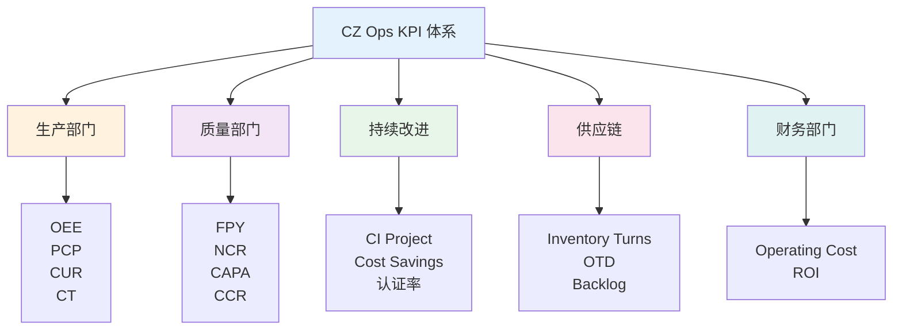

# CZ Ops KPI 指标体系

本章节介绍 CZ Ops 数字化数据平台的完整 KPI 指标体系，包括供应链、生产、质量、持续改进等多个维度的关键绩效指标。

---

## 📊 KPI 体系架构

---

## 🎯 KPI 详细说明

### 🚚 供应链 KPI

衡量库存管理、交付准时性、生产计划达成的关键指标。

| 序号 | KPI 名称 | 英文名称 | 单位 | 目标值 | 实施状态 | 详细说明 |
|------|----------|----------|------|--------|----------|----------|
| 1 | **SA - 计划达成率** | **Schedule Adherence** | **%** | **≥ 95%** | ✅ **已实施** | [SA 指标完整文档](sa.md) |
| 2 | 库存周转率 | Inventory Turns | 次/年 | ≥ 6 | 🔄 规划中 | [供应链 KPI 说明](supply-chain.md) |
| 3 | 准时交付率 | On-Time Delivery (OTD) | % | ≥ 95% | 🔄 规划中 | [供应链 KPI 说明](supply-chain.md) |
| 4 | 积压订单 | Backlog | 金额/周数 | 控制在合理范围 | 🔄 规划中 | [供应链 KPI 说明](supply-chain.md) |
| 5 | 总库存 | Total Inventory | 金额 | 持续优化 | 🔄 规划中 | [供应链 KPI 说明](supply-chain.md) |
| 6 | 供应商绩效 | Supplier Performance | 评分 | ≥ 90% | 🔄 规划中 | [供应链 KPI 说明](supply-chain.md) |
| 7 | 采购成本节约 | Procurement Savings | 金额 | 年度目标 | 🔄 规划中 | [供应链 KPI 说明](supply-chain.md) |

---

### 🏭 生产部门 KPI

衡量生产效率、产能利用和制造成本的关键指标。

| 序号 | KPI 名称 | 英文名称 | 单位 | 目标值 | 实施状态 | 详细说明 |
|------|----------|----------|------|--------|----------|----------|
| 8 | OEE - 设备综合效率 | Overall Equipment Effectiveness | % | ≥ 85% | 🔄 规划中 | [生产 KPI 说明](production.md) |
| 9 | PCP - 生产计划完成率 | Production Completion Percentage | % | ≥ 95% | 🔄 规划中 | [生产 KPI 说明](production.md) |
| 10 | CUR - 产能利用率 | Capacity Utilization Rate | % | ≥ 80% | 🔄 规划中 | [生产 KPI 说明](production.md) |
| 11 | CT - 生产周期时间 | Cycle Time | 时间 | 持续改进 | 🔄 规划中 | [生产 KPI 说明](production.md) |
| 12 | 制造差异 | Mfg Variances | % | ≤ 5% | 🔄 规划中 | [生产 KPI 说明](production.md) |
| 13 | 期间费用 | Period Expense | 金额 | 预算内 | 🔄 规划中 | [生产 KPI 说明](production.md) |
| 14 | 人工效率 | Labor Efficiency | % | ≥ 90% | 🔄 规划中 | [生产 KPI 说明](production.md) |

---

### 🛡️ 质量部门 KPI

衡量产品质量、过程控制和质量改进的关键指标。

| 序号 | KPI 名称 | 英文名称 | 单位 | 目标值 | 实施状态 | 详细说明 |
|------|----------|----------|------|--------|----------|----------|
| 15 | FPY - 一次合格率 | First Pass Yield | % | ≥ 98% | 🔄 规划中 | [质量 KPI 说明](quality.md) |
| 16 | NCR - 不合格品率 | Non-Conformance Rate | % | ≤ 2% | 🔄 规划中 | [质量 KPI 说明](quality.md) |
| 17 | CAPA 完成率 | CAPA Completion Rate | % | ≥ 95% | 🔄 规划中 | [质量 KPI 说明](quality.md) |
| 18 | 客户投诉率 | Customer Complaint Rate (CCR) | % | ≤ 0.5% | 🔄 规划中 | [质量 KPI 说明](quality.md) |
| 19 | 返工率 | Rework Rate | % | ≤ 3% | 🔄 规划中 | [质量 KPI 说明](quality.md) |
| 20 | 过程能力指数 | Process Capability (Cp/Cpk) | 指标 | Cpk ≥ 1.33 | 🔄 规划中 | [质量 KPI 说明](quality.md) |

---

### 📈 持续改进 KPI

衡量改善活动、成本节约和员工发展的关键指标。

| 序号 | KPI 名称 | 英文名称 | 单位 | 目标值 | 实施状态 | 详细说明 |
|------|----------|----------|------|--------|----------|----------|
| 21 | 改善项目完成率 | CI Project Completion Rate | % | ≥ 90% | 🔄 规划中 | [持续改进 KPI 说明](ci.md) |
| 22 | 成本节约 | Cost Savings | 金额 | 年度目标 | 🔄 规划中 | [持续改进 KPI 说明](ci.md) |
| 23 | 员工参与度 | Employee Engagement | % | ≥ 80% | 🔄 规划中 | [持续改进 KPI 说明](ci.md) |
| 24 | 项目周期时间 | Project Cycle Time | 时间 | 持续改进 | 🔄 规划中 | [持续改进 KPI 说明](ci.md) |
| 25 | 投资回报率 | ROI | % | ≥ 150% | 🔄 规划中 | [持续改进 KPI 说明](ci.md) |
| 26 | 创新提案数 | Innovation Proposals | 个 | 持续增长 | 🔄 规划中 | [持续改进 KPI 说明](ci.md) |
| 27 | 标准化率 | Standardization Rate | % | ≥ 85% | 🔄 规划中 | [持续改进 KPI 说明](ci.md) |

---

## 📊 KPI 使用建议

### 仪表板设计

1. **高层管理看板**
   - 关注部门级 KPI 汇总
   - 月度/季度趋势
   - 目标达成情况

2. **运营管理看板**
   - 关注日常运营 KPI
   - 异常预警
   - 根因分析

3. **专项分析看板**
   - 深入单个 KPI
   - 多维度钻取
   - 对标分析

### 🎯 目标设定

- 基于历史数据设定合理目标
- 考虑行业标杆值
- 分阶段设定改进目标

### 📈 持续改进

- 定期回顾 KPI 表现
- 识别改进机会
- 跟踪改进措施效果

---

## 🔗 相关资源

- [SA 指标](sa.md) - 计划达成率详细说明
- [数据更新流程](../guide/data-update.md) - 了解如何更新数据
- [常见问题](../guide/faq.md) - KPI 相关常见问题

---

## 📋 使用说明

- 如需了解某个指标的**计算公式、字段定义、数据来源和报表展示**，请点击表格中"详细说明"链接。
- SA 指标作为当前已实施的核心指标，提供最完整的示例文档，可作为其他 KPI 设计的参考模板。
- 本页面提供**完整的 KPI 指标总览和导航**，指标的技术细节以各自页面为准。
