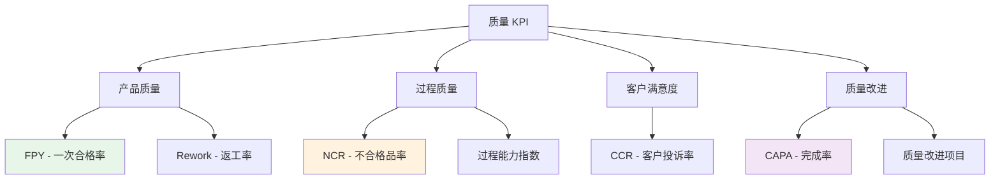

# 质量部门 KPI

质量部门关键绩效指标体系，衡量产品质量、过程控制和质量改进效果。

---

## 📊 质量 KPI 体系

---

## ⭐ 核心指标详解

### 1. FPY - 一次合格率 (First Pass Yield)

**📋 计划中**

**定义：** 产品在生产过程中首次检验即合格的比例

**计算公式：**

\[
FPY(\%) = \frac{\text{首次检验合格数量}}{\text{总检验数量}} \times 100\%
\]

**目标值：** ≥ 98%

**数据来源：** 质量管理系统、检测系统

**更新频率：** 每日

---

### 2. NCR - 不合格品率 (Non-Conformance Rate)

**📋 计划中**

**定义：** 不符合质量要求的产品比例

**计算公式：**

\[
NCR(\%) = \frac{\text{不合格品数量}}{\text{总生产数量}} \times 100\%
\]

**目标值：** ≤ 2%

**数据来源：** 质量管理系统、检测系统

**更新频率：** 每日

---

### 3. CAPA - 纠正预防措施完成率

**📋 计划中**

**定义：** 按时完成的纠正和预防措施比例

**计算公式：**

\[
CAPA(\%) = \frac{\text{按时完成的CAPA数量}}{\text{总CAPA数量}} \times 100\%
\]

**目标值：** ≥ 95%

**数据来源：** 质量管理系统、CAPA跟踪系统

**更新频率：** 每周

---

### 4. CCR - 客户投诉率 (Customer Complaint Rate)

**📋 计划中**

**定义：** 客户投诉数量占总出货量的比例

**计算公式：**

\[
CCR(\%) = \frac{\text{客户投诉数量}}{\text{总出货批次}} \times 100\%
\]

**目标值：** ≤ 0.5%

**数据来源：** 客户服务系统、质量管理系统

**更新频率：** 每月

---

### 5. Rework - 返工率

**📋 计划中**

**定义：** 需要返工的产品比例

**计算公式：**

\[
Rework(\%) = \frac{\text{返工产品数量}}{\text{总生产数量}} \times 100\%
\]

**目标值：** ≤ 3%

**数据来源：** 生产系统、质量管理系统

**更新频率：** 每日

---

### 6. Process Capability - 过程能力指数

**📋 计划中**

**定义：** 衡量过程满足规格要求的能力

**主要指标：**
- **Cp** - 过程能力指数
- **Cpk** - 过程能力指数（考虑中心偏移）

**目标值：** Cpk ≥ 1.33

**数据来源：** 质量管理系统、SPC系统

**更新频率：** 每周

---

## 📈 KPI 使用建议

### 1. 质量监控体系

**日常监控：**
- 生产线实时质量数据采集
- 关键工序质量控制点监控
- 异常情况及时预警

**周期性分析：**
- 日质量报表分析
- 周质量趋势评估
- 月质量绩效回顾

### 2. 质量改进流程

**问题识别：**
- 通过NCR和CCR识别质量问题
- 分析根本原因
- 制定改进措施

**措施实施：**
- 建立CAPA跟踪机制
- 定期评估措施效果
- 标准化成功经验

### 3. 质量成本管理

**预防成本：**
- 质量培训
- 过程控制
- 质量规划

**鉴定成本：**
- 检验测试
- 质量审核
- 设备校准

**失败成本：**
- 内部失败：返工、报废
- 外部失败：客户投诉、保修

---

## 🔗 相关链接

- [KPI 指标体系概述](index.md)
- [供应链部门 KPI](supply-chain.md)
- [生产部门 KPI](production.md)
- [持续改进 KPI](ci.md)
- [SA 指标](../kpi/sa.md)

---

## 📋 实施计划

质量部门KPI将分阶段实施：

1. **第一阶段**：FPY和NCR系统建设
2. **第二阶段**：CAPA和CCR跟踪系统
3. **第三阶段**：过程能力分析和质量成本管理

每个阶段都将参照SA指标建立完整的文档体系和数据处理流程。

