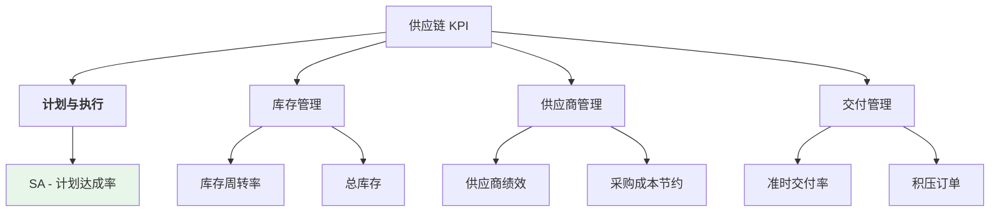

# 供应链部门 KPI

供应链部门关键绩效指标体系，衡量库存管理、交付准时性、生产计划达成等供应链运营效率。

---

## 📊 供应链 KPI 体系

---

## ⭐ 核心指标详解

### 1. SA - 计划达成率 (Schedule Adherence)

**✅ 已实施 - 数据平台核心指标**

**定义：** 衡量生产是否按照既定生产计划执行的关键指标

**计算公式：**

\[
SA(\%) = \frac{\text{按期完成的批次数}}{\text{总批次数}} \times 100\%
\]

**判断标准：**
- **按期（OnTime）**：实际完工时间 ≤ 应完工时间
- **逾期（Overdue）**：实际完工时间 > 应完工时间

**目标值：** ≥ 95%

**数据来源：** MES 系统、SFC 系统、标准时间表

**详细说明：** 👉 **[SA 指标完整文档](sa.md)**

---

### 2. Inventory Turns - 库存周转率

**🔄 计划中**

**定义：** 一定时期内库存周转的次数

**计算公式：**

\[
\text{Inventory Turns} = \frac{\text{销售成本}}{\text{平均库存}}
\]

**目标值：** ≥ 6 次/年

**数据来源：** ERP 系统

---

### 3. OTD - 准时交付率

**🔄 计划中**

**定义：** 按时交付的订单数量与总订单数量的比率

**计算公式：**

\[
OTD(\%) = \frac{\text{按时交付订单}}{\text{总订单数量}} \times 100\%
\]

**目标值：** ≥ 95%

**数据来源：** ERP 系统、订单管理系统

---

### 4. Procurement Savings - 采购成本节约

**🔄 计划中**

**定义：** 通过采购优化实现的成本节约金额

**目标值：** 年度目标

**数据来源：** ERP 采购模块

---

### 5. Supplier Performance - 供应商绩效

**🔄 计划中**

**定义：** 供应商在质量、交付、价格等方面的综合表现

**评估维度：**
- 质量合格率
- 准时交付率
- 价格竞争力
- 响应速度

**目标值：** ≥ 90%

**数据来源：** 供应商管理系统

---

### 6. Backlog - 积压订单

**🔄 计划中**

**定义：** 未完成订单的总价值和总周数

**指标：**
- Backlog ($M) - 积压订单金额
- Backlog Weeks - 积压订单周数

**目标值：** 控制在合理范围内

**数据来源：** ERP 系统

---

### 7. Total Inventory - 总库存

**🔄 计划中**

**定义：** 在制品、成品和原材料的总价值

**目标值：** 持续优化

**数据来源：** ERP 库存模块

---

## 📈 KPI 使用建议

### 1. SA 指标（已实施）

**监控维度：**
- 按日/周/月统计 SA 达成率
- 按工序分析逾期原因
- 按产品线对比表现
- 按生产区域评估

**改进措施：**
- 优化标准时间设定
- 提升 OEE（设备综合效率）
- 减少换批时间
- 改善生产计划准确性

**相关资源：**
- [SA 计算方法](sa.md#-计算方法与定义)
- [SA 字段说明](sa.md#-字段说明)
- [SA 数据源](sa.md#-数据源说明)
- [SA 计算示例](sa.md#-计算示例)

---

### 2. 未来指标规划

其他供应链 KPI 将陆续实施，每个指标都将参照 SA 指标建立：
- ✅ 完整的计算方法文档
- ✅ 详细的字段说明
- ✅ 数据源和 ETL 流程
- ✅ Power BI 可视化报表

---

## 🔗 相关链接

- [SA - 计划达成率详细说明](sa.md)
- [KPI 指标体系概述](index.md)
- [生产部门 KPI](production.md)
- [质量部门 KPI](quality.md)

