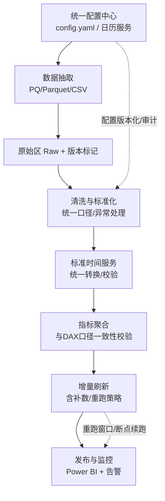
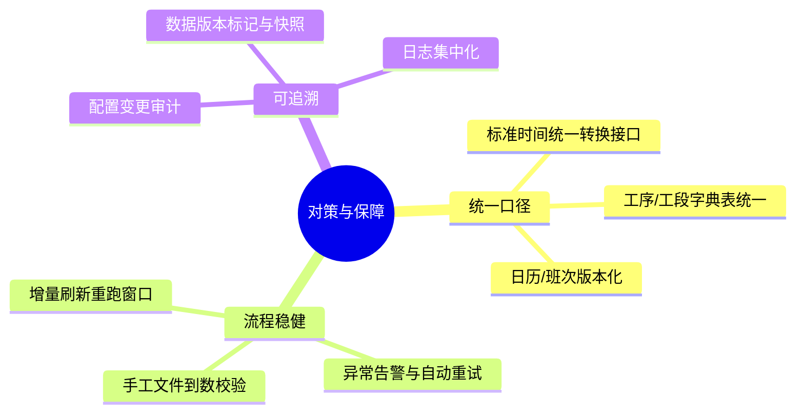
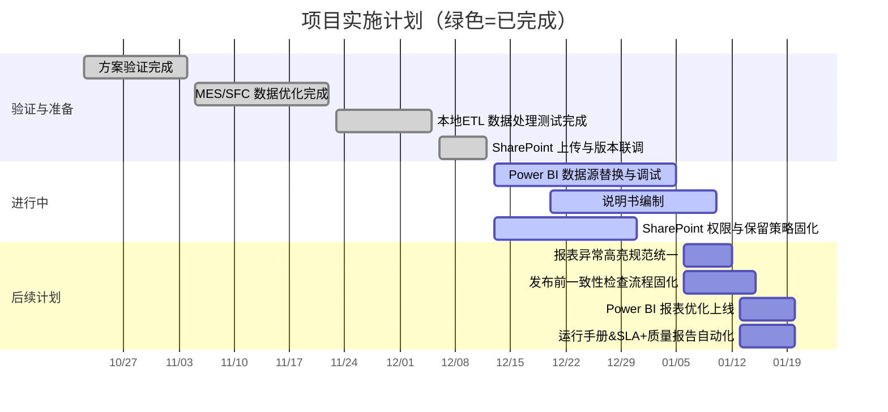

# 改进阶段（Improve）

本阶段在平台视角下落地对策，确保可复用、可追溯、可运维。SA/SFC 为试点域，其机制将复用到各部门指标。

## 目标
- 统一口径与治理：配置中心、日历服务、标准时间接口、字典表。
- 稳健刷新：增量重跑窗口、补数机制、异常自动重试与告警。
- 一致性保障：聚合后“一致性回放”作为发布前校验点。

---

## 当前测试进展

- 方案验证完成：按分析阶段确定的方案完成整体验证。
- 本地处理验证完成：已完成 MES 与 SFC 两个来源的清洗与本地 ETL 流程测试。
- 刷新方式切换中：Power BI 正在替换为“本地 ETL → SharePoint（版本可追溯/可恢复）→ Parquet 数据源”。
- 说明书编制中：正在整理 ETL 与报表联动的说明文档。
- 报表状态：Power BI 报表尚未完成优化上线。

## 关键措施
- 配置治理与版本化：主配置 + 环境覆盖，变更审计与回滚。
- 日历与班次服务：脚本生成 + 规则统一，跨日/节假日一致口径。
- 标准时间统一接口：ETL 统一调用并记录校验日志。
- 监控与可观测：任务耗时、记录数、异常摘要与通知。

---

## 实施流程（本轮方案）

## 关联技术产出
- 进展总览与路线：`project/progress.md`

---

## To-Be 流程（优化后）

关键变化：配置与日历纳入版本控制；聚合后增加一致性校验点；增量支持重跑窗口与补数。

---

## 前后对比（处理方式与性能）

> 详细参考：ETL 文档“数据格式选择与性能优化”（`etl/index.md`）。

| 维度 | 之前（旧） | 现在（新） |
| --- | --- | --- |
| 数据来源方式 | Power BI 直连系统输出表 | 本地 ETL 处理 → 上传 SharePoint → Power BI 读取 |
| 处理位置 | 报表端 | 数据端（ETL 脚本） |
| 数据格式 | Excel/CSV | Parquet（列式、压缩） |
| 刷新策略 | 以全量为主 | 增量为主（支持重跑窗口/补数） |
| 文件体积 | 大（CSV 体积大） | 小（Parquet 压缩后通常减少 84-90%） |
| 读取性能 | 慢 | 快（读取速度提升约 90-95%） |
| 报表刷新 | 受限、易超时 | 稳定、可每日多次刷新 |

说明：体积与性能提升区间引用 `etl/index.md` 的实测结果，用于量化改进成效的量级参考。

---

## 对策方向（鱼骨）

---

## 具体措施（可落地）

- 配置治理
  - 整合配置为“主配置 + 环境覆盖”；建立版本与变更记录。
  - 将日历（工作日/班次/节假日）脚本化生成为统一表。
- 口径统一
  - 标准时间通过统一接口转换，并在 ETL 内统一调用。
  - 建立工序/工段字典表，定期校验异常值并生成报告。
- 刷新稳健
  - 增量刷新加入“重跑窗口”（最近 N 天）与“补数清单”；失败自动重试并告警。
  - 发布前后对样本集进行“DAX 一致性回放”，误差超阈值阻断发布。
- 监控与可观测
  - 统一日志格式与指标；失败/延迟告警，附一键重跑指引。

---

## 预期成效与衡量

- 刷新稳定性：作业失败率 < 1%，平均耗时下降 20%+。
- 数据一致性：与 DAX 定义抽样比对误差 ≤ 0.5%。
- 维护效率：配置改动可追溯、可回滚，减少脚本化变更风险。

---

## 项目实施计划

- ✅ 绿色表示已完成阶段；⚙️ 表示进行中；📅 表示未开始的计划任务。
- 时间轴基于当前排期，后续可按周更新。

