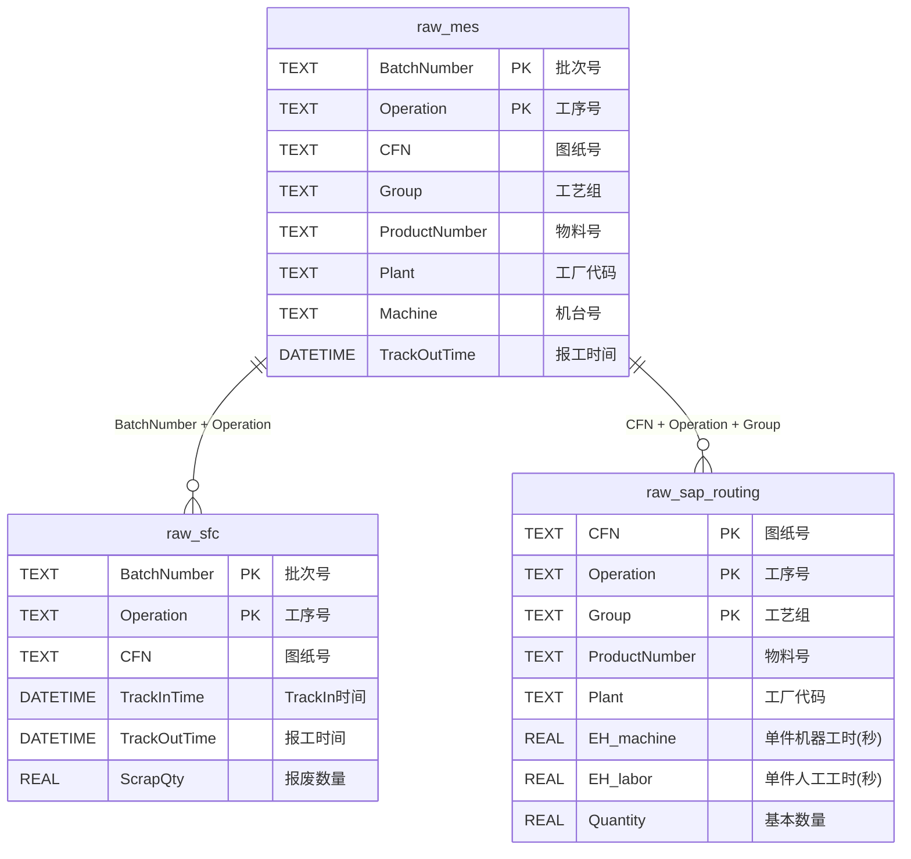

# 数据架构设计

本文档描述 MDDAP V2 数据平台的数据库架构，包括表结构、视图定义和表间关系。

## 架构概述

采用 **ODS原始层 + DWD计算层** 分层架构：

- **ODS层（原始层）**：存储从各数据源导入的原始数据，保持数据原貌
- **DWD层（计算层）**：通过视图实现计算逻辑，不存储冗余数据

```
┌─────────────────────────────────────────────────────────┐
│                    数据源层                              │
├─────────────┬─────────────┬─────────────────────────────┤
│  MES Excel  │  SFC Excel  │  SAP Routing Excel          │
└──────┬──────┴──────┬──────┴──────────────┬──────────────┘
       │             │                      │
       ▼             ▼                      ▼
┌─────────────────────────────────────────────────────────┐
│                    ODS 原始层                            │
├─────────────┬─────────────┬─────────────────────────────┤
│  raw_mes    │  raw_sfc    │  raw_sap_routing            │
└──────┬──────┴──────┬──────┴──────────────┬──────────────┘
       │             │                      │
       └─────────────┼──────────────────────┘
                     ▼
┌─────────────────────────────────────────────────────────┐
│                    DWD 计算层                            │
├─────────────────────────────────────────────────────────┤
│              v_mes_metrics (计算视图)                    │
│         LT(d) / PT(d) / ST(d) / IsSetup                 │
└─────────────────────────────────────────────────────────┘
```

---

## 表间关联关系



### 关联键说明

| 关联关系 | 关联键 | 用途 |
|---------|--------|------|
| raw_mes ↔ raw_sfc | `BatchNumber` + `Operation` | 获取 TrackInTime 用于 LT 计算 |
| raw_mes ↔ raw_sap_routing | `CFN` + `Operation` + `Group` | 获取 EH_machine/EH_labor 用于 ST 计算 |

---

## ODS 原始层表结构

### raw_mes（MES批次产出）

| 字段名 | 数据类型 | 说明 |
|--------|---------|------|
| id | INTEGER | 主键（自增） |
| BatchNumber | TEXT | 批次号 |
| Operation | TEXT | 工序号 |
| Machine | TEXT | 机台号（从Resource提取） |
| EnterStepTime | DATETIME | 进入工序时间 |
| TrackInTime | DATETIME | TrackIn时间 |
| TrackOutTime | DATETIME | 报工时间 |
| Plant | TEXT | 工厂代码（原ERPCode） |
| Product_Desc | TEXT | 产品描述 |
| ProductNumber | TEXT | 物料号（M开头代码） |
| CFN | TEXT | 图纸号（Customer Facing Number） |
| ProductionOrder | TEXT | 生产订单号 |
| OperationDesc | TEXT | 工序描述 |
| Group | TEXT | 工艺组（从LogicalFlowPath提取） |
| StepInQuantity | REAL | 进入工序数量 |
| TrackOutQuantity | REAL | 报工数量 |
| TrackOutOperator | TEXT | 报工人 |
| factory_name | TEXT | 工厂名称 |
| VSM | TEXT | 价值流 |
| source_file | TEXT | 源文件名 |
| record_hash | TEXT | 记录哈希（去重用，UNIQUE） |

### raw_sfc（SFC批次报工）

| 字段名 | 数据类型 | 说明 |
|--------|---------|------|
| id | INTEGER | 主键（自增） |
| BatchNumber | TEXT | 批次号 |
| Operation | TEXT | 工序号 |
| OperationDesc | TEXT | 工序描述 |
| Machine | TEXT | 机台号 |
| CFN | TEXT | 图纸号 |
| TrackInTime | DATETIME | TrackIn时间（原CheckinTime） |
| TrackOutTime | DATETIME | 报工时间 |
| EnterStepTime | DATETIME | 上道工序报工时间 |
| TrackOutQty | REAL | 合格数量 |
| ScrapQty | REAL | 报废数量 |
| TrackInOperator | TEXT | 开工人 |
| TrackOutOperator | TEXT | 报工人 |
| source_file | TEXT | 源文件名 |
| record_hash | TEXT | 记录哈希（去重用，UNIQUE） |

### raw_sap_routing（SAP工艺路线）

| 字段名 | 数据类型 | 说明 |
|--------|---------|------|
| id | INTEGER | 主键（自增） |
| ProductNumber | TEXT | 物料号（M开头代码） |
| CFN | TEXT | 图纸号（Customer Facing Number） |
| Plant | TEXT | 工厂代码 |
| Operation | TEXT | 工序号 |
| WorkCenter | TEXT | 工作中心 |
| OperationDesc | TEXT | 工序描述 |
| StandardTime | REAL | 标准时间 |
| SetupTime | REAL | 调试时间（小时） |
| OEE | REAL | OEE系数 |
| EH_machine | REAL | 单件机器工时（秒） |
| EH_labor | REAL | 单件人工工时（秒） |
| Quantity | REAL | 基本数量 |
| Group | TEXT | 工艺组 |
| factory_code | TEXT | 工厂代码 |
| source_file | TEXT | 源文件名 |
| record_hash | TEXT | 记录哈希（去重用，UNIQUE） |

---

## DWD 计算层视图

### v_mes_metrics

计算视图，关联三张原始表并计算 LT/PT/ST 指标。

#### 输出字段

| 字段名 | 来源 | 说明 |
|--------|------|------|
| id | raw_mes | 记录ID |
| BatchNumber | raw_mes | 批次号 |
| Operation | raw_mes | 工序号 |
| Machine | raw_mes | 机台号 |
| TrackOutDate | 计算 | 报工日期 |
| Plant | raw_mes | 工厂代码 |
| ProductNumber | raw_mes | 物料号 |
| CFN | raw_mes | 图纸号 |
| Group | raw_mes | 工艺组 |
| TrackOutOperator | raw_mes | 报工人 |
| **IsSetup** | 计算 | 是否换型（Yes/No） |
| SetupTime | raw_sap_routing | 调试时间（小时） |
| OEE | raw_sap_routing | OEE系数 |
| EH_machine | raw_sap_routing | 单件机器工时（秒） |
| EH_labor | raw_sap_routing | 单件人工工时（秒） |
| TrackIn_SFC | raw_sfc | SFC TrackIn时间 |
| ScrapQty | raw_sfc | 报废数量 |
| PreviousBatchEndTime | 计算 | 上一批次结束时间 |
| **LT(d)** | 计算 | 实际加工时间（天） |
| **PT(d)** | 计算 | 实际加工时间（天） |
| **ST(d)** | 计算 | 理论加工时间（天） |

---

## 数据库文件位置

| 环境 | 路径 |
|------|------|
| V2数据库 | `data_pipelines/database/mddap_v2.db` |
| Schema定义 | `data_pipelines/database/schema/init_schema_v2.sql` |

---

## 相关文档

- [字段映射详情](../../reference/data-dictionary/field-mapping.md)
- [计算逻辑说明](../../reference/data-dictionary/calculation-logic.md)
- [ETL架构](etl-architecture.md)
