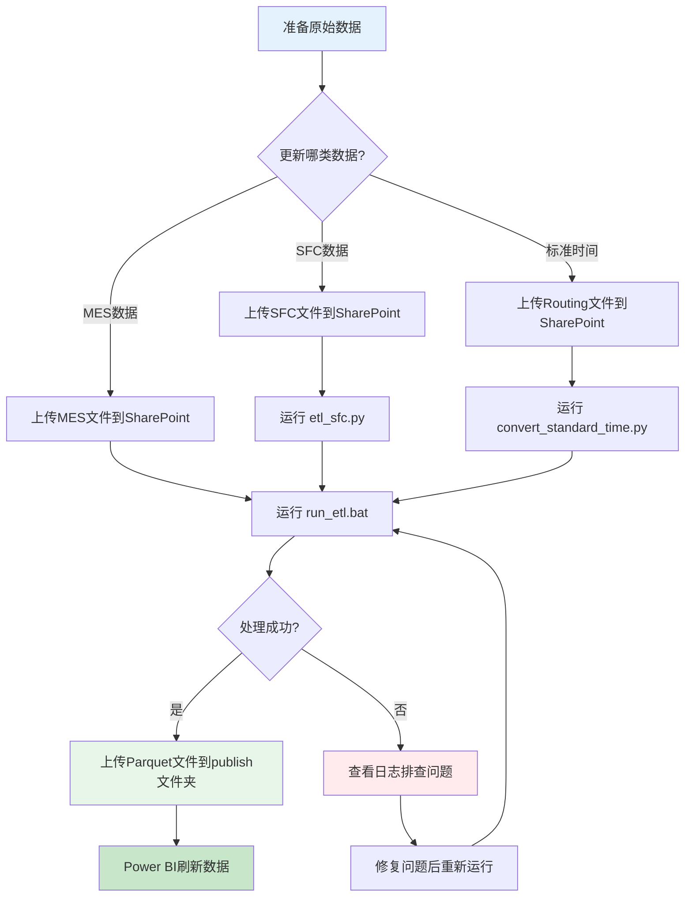

# 数据更新流程

本文档详细说明如何更新数据平台的数据。

---

## 更新流程概览



---

## 1. MES 数据更新（常规）

### 1.1 准备数据

从 MES 系统导出最新数据：

- 文件名格式：`Product Output -CZM -FY26.xlsx`
- 包含字段：BatchNumber、CFN、Operation、TrackOutTime 等
- 确保数据完整性

### 1.2 上传到 SharePoint

1. 打开 SharePoint
2. 进入文件夹：`30-MES导出数据/30-MES`
3. 上传 Excel 文件
4. 确认上传成功

!!! warning "注意"
    如果文件夹中已有同名文件，请选择覆盖或重命名。

### 1.3 运行 ETL 脚本

#### 方法 1：使用批处理文件（推荐）

```batch
# 双击运行
10-SA指标/13-SA数据清洗/run_etl.bat
```

#### 方法 2：命令行运行

```bash
cd 10-SA指标/13-SA数据清洗
python etl_sa.py
```

### 1.4 检查处理结果

#### 查看控制台输出

```
========================================
  SA数据ETL处理 - 开始
========================================

[1/10] 加载配置文件...
✓ 配置加载成功

[2/10] 读取MES原始数据...
✓ 读取 123,456 条记录

[3/10] 合并SFC数据...
✓ 合并 Checkin_SFC 字段

[4/10] 匹配标准时间参数...
✓ 匹配 98.5% 的记录

[5/10] 计算LT、PT、ST...
✓ 计算完成

[6/10] 计算DueTime...
✓ 基于工作日日历计算完成

[7/10] 判断CompletionStatus...
✓ SA状态计算完成

[8/10] 数据质量检查...
✓ 通过质量检查

[9/10] 保存Parquet文件...
✓ 保存为: MES_处理后数据_20250110.parquet

[10/10] 完成!
========================================
  处理成功！
  - 输入记录: 123,456
  - 输出记录: 123,456
  - 处理时间: 3分52秒
========================================
```

#### 查看日志文件

```bash
# 查看日志
logs/etl_sa.log
```

日志示例：

```
2025-01-10 10:30:15 - INFO - ETL处理开始
2025-01-10 10:30:16 - INFO - 读取MES数据: 123,456 条
2025-01-10 10:30:45 - INFO - 合并SFC数据: 匹配 85,234 条
2025-01-10 10:32:10 - INFO - 计算SA指标完成
2025-01-10 10:34:07 - INFO - 保存Parquet文件成功
2025-01-10 10:34:07 - INFO - ETL处理完成
```

### 1.5 上传处理后文件

1. 找到生成的 Parquet 文件
   ```
   10-SA指标/13-SA数据清洗/publish/MES_处理后数据_latest.parquet
   ```

2. 上传到 SharePoint
   - 路径：`30-MES导出数据/publish/`
   - 文件名：`MES_处理后数据_latest.parquet`

!!! tip "建议"
    保留日期备份：`MES_处理后数据_20250110.parquet`

### 1.6 刷新 Power BI

1. 打开 Power BI Desktop 或 Power BI Service
2. 点击 **刷新** 按钮
3. 等待刷新完成（通常 1-3 分钟）
4. 验证数据更新

---

## 2. SFC 数据更新

### 2.1 准备数据

从 SFC 系统导出：

- 文件名格式：`LC-yyyymmddhhmmss.csv`
- 包含 Check In 时间等关键信息

### 2.2 上传到 SharePoint

```
路径：70-SFC/
```

### 2.3 运行 SFC ETL

```bash
cd 10-SA指标/13-SA数据清洗
python etl_sfc.py
```

或双击：`run_all_etl.bat`（会依次处理 SFC 和 MES）

### 2.4 处理结果

生成文件：

```
publish/SFC_处理后数据_latest.parquet
```

### 2.5 重新处理 MES

!!! important "重要"
    SFC 数据更新后，**必须重新运行 MES ETL**，因为 MES 需要合并 SFC 的 Checkin_SFC 字段。

```bash
python etl_sa.py
```

---

## 3. 标准时间更新

### 3.1 准备数据

更新 Excel 文件：

- 文件名：`1303 Routing及机加工产品清单.xlsx`
- 包含两个 Sheet：
  - `1303 Routing`：Machine、Labor 时间
  - `1303机加工清单`：OEE、Setup Time

### 3.2 上传到 SharePoint

```
路径：30-MES导出数据/30-MES/
```

### 3.3 运行转换脚本

```bash
cd 10-SA指标/13-SA数据清洗
python convert_standard_time.py
```

或双击：`convert_standard_time.bat`

### 3.4 处理结果

生成文件：

```
publish/SAP_Routing_20250110.parquet
```

### 3.5 重新处理 MES

!!! important "重要"
    标准时间更新后，**必须重新运行 MES ETL**，以匹配最新的标准时间参数。

```bash
python etl_sa.py
```

---

## 4. 增量更新 vs 全量更新

### 4.1 增量更新（推荐）

**适用场景：**
- 日常数据更新
- 只更新最近数据（如最近 7 天）

**优点：**
- 处理速度快
- 资源消耗少

**配置方法：**

编辑 `config/config.yaml`：

```yaml
# 增量更新设置
incremental_update: true
incremental_days: 7  # 更新最近7天

# 或指定日期范围
start_date: "2025-01-01"
end_date: "2025-01-10"
```

### 4.2 全量更新

**适用场景：**
- 初次加载
- 标准时间或 SFC 数据更新后
- 历史数据修正

**配置方法：**

```yaml
incremental_update: false
```

---

## 5. 更新频率建议

| 数据类型 | 建议频率 | 说明 |
|----------|----------|------|
| MES 数据 | 每日/每周 | 根据业务需求 |
| SFC 数据 | 每周/每月 | 更新较少 |
| 标准时间 | 按需更新 | SAP Routing 变更时 |
| 工作日日历 | 每年初 | 更新下一年度日历 |

---

## 6. 批量更新流程

如果需要更新所有数据：

### 6.1 使用一键更新脚本

```bash
# 双击运行
run_all_etl.bat
```

脚本会依次执行：

1. `etl_sfc.py` - 处理 SFC 数据
2. `etl_sa.py` - 处理 MES 数据（合并 SFC）
3. 生成所有 Parquet 文件

### 6.2 手动批量更新

```bash
# 1. 更新标准时间
python convert_standard_time.py

# 2. 处理 SFC
python etl_sfc.py

# 3. 处理 MES
python etl_sa.py

# 4. 上传所有 Parquet 文件到 SharePoint

# 5. 刷新 Power BI
```

---

## 7. 验证数据更新

### 7.1 检查 Parquet 文件

```python
import pandas as pd

# 读取处理后数据
df = pd.read_parquet('publish/MES_处理后数据_latest.parquet')

# 检查记录数
print(f"总记录数: {len(df)}")

# 检查日期范围
print(f"最早日期: {df['TrackOutDate'].min()}")
print(f"最晚日期: {df['TrackOutDate'].max()}")

# 检查SA状态
print(f"按期批次: {(df['CompletionStatus']=='OnTime').sum()}")
print(f"逾期批次: {(df['CompletionStatus']=='Overdue').sum()}")
```

### 7.2 检查 Power BI

- 查看最新日期的数据
- 验证 SA 达成率
- 检查异常值

---

## 8. 常见问题

### 问题 1：ETL 运行失败

**排查步骤：**

1. 查看错误信息
2. 检查日志文件：`logs/etl_sa.log`
3. 参考：[故障排查指南](troubleshooting.md)

### 问题 2：Power BI 刷新失败

**排查步骤：**

1. 检查 Parquet 文件是否存在
2. 检查 SharePoint 权限
3. 检查 Power Query 连接路径

### 问题 3：数据不一致

**排查步骤：**

1. 确认使用的是 `_latest.parquet` 文件
2. 检查 Power BI 刷新时间
3. 对比 Parquet 文件和 Power BI 中的记录数

---

## 9. 自动化更新（进阶）

### 9.1 使用 Windows 任务计划程序

1. 打开 **任务计划程序**
2. 创建基本任务
3. 设置触发器（如每天凌晨 2:00）
4. 操作：运行 `run_etl.bat`

### 9.2 使用 Python 定时任务

```python
import schedule
import time

def run_etl():
    os.system('python etl_sa.py')

# 每天凌晨 2:00 运行
schedule.every().day.at("02:00").do(run_etl)

while True:
    schedule.run_pending()
    time.sleep(60)
```

---

## 10. 最佳实践

### 10.1 数据更新前

- ✅ 备份当前数据
- ✅ 检查原始数据质量
- ✅ 确认 SharePoint 连接

### 10.2 数据更新中

- ✅ 监控 ETL 进度
- ✅ 查看日志输出
- ✅ 不要中断处理

### 10.3 数据更新后

- ✅ 验证 Parquet 文件
- ✅ 测试 Power BI 刷新
- ✅ 检查数据质量
- ✅ 记录更新日志

---

## 相关链接

- [ETL 处理流程](../etl/etl-process.md)
- [配置说明](../etl/configuration.md)
- [故障排查](troubleshooting.md)
- [常见问题](faq.md)

