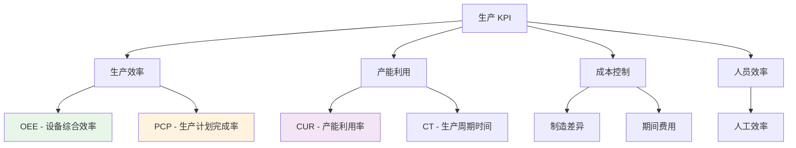

# 生产部门 KPI

生产部门关键绩效指标体系，衡量生产效率、产能利用和制造成本控制效果。

---

## 📊 生产 KPI 体系

---

## ⭐ 核心指标详解

### 1. OEE - 设备综合效率 (Overall Equipment Effectiveness)

**📋 计划中**

**定义：** 衡量设备实际生产能力相对于理论生产能力的比率

**计算公式：**

\[
OEE = \text{时间稼动率} \times \text{性能稼动率} \times \text{良品率}
\]

其中：
- **时间稼动率** = 实际运行时间 / 计划生产时间
- **性能稼动率** = (实际产量 × 标准周期时间) / 实际运行时间
- **良品率** = 合格品数量 / 总产量

**目标值：** ≥ 85%

**数据来源：** MES系统、设备监控系统

**更新频率：** 每日

---

### 2. PCP - 生产计划完成率 (Production Completion Percentage)

**📋 计划中**

**定义：** 实际完成的生产计划数量与计划生产数量的比率

**计算公式：**

\[
PCP(\%) = \frac{\text{实际完成数量}}{\text{计划生产数量}} \times 100\%
\]

**目标值：** ≥ 95%

**数据来源：** MES系统、生产计划系统

**更新频率：** 每日

---

### 3. CUR - 产能利用率 (Capacity Utilization Rate)

**📋 计划中**

**定义：** 实际产出与理论最大产能的比率

**计算公式：**

\[
CUR(\%) = \frac{\text{实际产出}}{\text{理论最大产能}} \times 100\%
\]

**目标值：** ≥ 80%

**数据来源：** MES系统、产能规划系统

**更新频率：** 每周

---

### 4. CT - 生产周期时间 (Cycle Time)

**📋 计划中**

**定义：** 从原材料投入开始到成品产出所需的总时间

**计算公式：**

\[
CT = \text{完工时间} - \text{投料时间}
\]

**目标值：** 持续改进

**数据来源：** MES系统、生产跟踪系统

**更新频率：** 持续监控

**与 SA 指标关系：** CT 与 LT(Lead Time) 概念类似，都是衡量生产效率的重要指标

---

### 5. Mfg Variances - 制造差异

**📋 计划中**

**定义：** 不包括采购价格差异和非重点支出的制造差异

**计算公式：**

\[
\text{Mfg Variances}(\%) = \frac{\text{实际制造成本} - \text{标准制造成本}}{\text{标准制造成本}} \times 100\%
\]

**目标值：** ≤ 5%

**数据来源：** ERP系统、成本核算系统

**更新频率：** 每月

---

### 6. Period Expense - 期间费用

**📋 计划中**

**定义：** 包括SOGL、闲置设施、制造支持OPS01和人工分配的费用

**包含项目：**
- SOGL（销售、一般及管理费用）
- 闲置设施费用
- 制造支持OPS01
- 人工分配费用

**目标值：** 预算内

**数据来源：** ERP财务模块、成本管理系统

**更新频率：** 每月

---

### 7. Labor Efficiency - 人工效率

**📋 计划中**

**定义：** 产出工时与员工实际出勤时间的比值

**计算公式：**

\[
\text{Labor Efficiency}(\%) = \frac{\text{产出工时}}{\text{实际出勤时间}} \times 100\%
\]

其中：
- **产出工时** = 实际产量 × 标准工时
- **实际出勤时间** = 员工出勤小时数

**目标值：** ≥ 90%

**数据来源：** MES系统、考勤系统

**更新频率：** 每周

---

## 📈 KPI 使用建议

### 1. 生产效率监控

**实时监控：**
- 设备运行状态跟踪
- 生产进度实时更新
- 异常情况及时预警

**日常分析：**
- OEE三大要素分析
- 生产计划达成情况
- 产能利用率评估

### 2. 成本控制管理

**制造成本控制：**
- 标准成本制定与更新
- 实际成本跟踪分析
- 差异原因分析

**期间费用优化：**
- 固定成本结构优化
- 变动成本控制
- 费用预算执行监控

### 3. 人员效率提升

**效率评估：**
- 个人与团队效率分析
- 标准工时优化
- 技能培训效果评估

**激励机制：**
- 效率目标设定
- 绩效考核体系
- 改进建议奖励

---

## 🔗 相关链接

- [KPI 指标体系概述](index.md)
- [供应链部门 KPI](supply-chain.md)
- [质量部门 KPI](quality.md)
- [持续改进 KPI](ci.md)
- [SA 指标](../kpi/sa.md)

---

## 📋 实施计划

生产部门KPI将分阶段实施：

1. **第一阶段**：OEE和PCP系统建设
2. **第二阶段**：CUR和CT跟踪分析
3. **第三阶段**：成本控制和人工效率管理

每个阶段都将参照SA指标建立完整的文档体系和数据处理流程。

