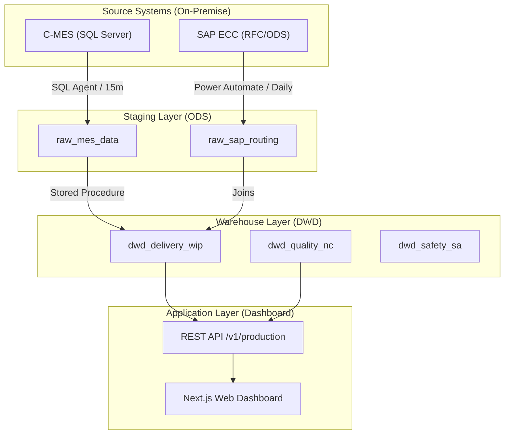
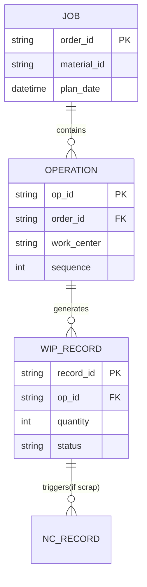

# 03 数据层规范与字典 (Data Schema & Dictionary)

本页面记录了 `mddap_v2` 数据库中所有表的详细定义。文档已全面覆盖 **ODS**（原始数据）、**DIM**（维度）、**DWS**（汇总）及 **Meta**（元数据）层。

## 0. 执行摘要 (Executive Summary)
`mddap_v2` 数据库采用分层架构设计，共包含 **43** 张核心基表，遵循每日增量采集与全量清洗的 ETL 逻辑。数据生命周期由 Python Collector 启动，经过 SQL Server 存储过程转换，最终服务于实时看板。

### 架构层级概览
| 层级 | 数量 | 描述 |
| --- | --- | --- |
| **Layer 1: ODS** | 13 | 源系统报表原始快照 (MES/SFC/SAP/Planner) |
| **Layer 2: DIM** | 13 | 基础档案与逻辑判定配置 |
| **Layer 3: DWS** | 4 | 存储 KPI 指标与实时分析聚合 |
| **Layer 4: Meta** | 6 | 系统日志与数据质量指标 |
| **Layer 5: Staging** | 7 | 底层转换中间存根 |

#### 全球 ETL 数据流 (Data Pipeline Panorama)

> [!NOTE]
> 整个数据链路遵循 **Medtronic Enterprise Data Standard**，采用典型的三层分发架构，确保数据从生产终端到看板显示的实时性与一致性。

#### WIP 核心实体关联规则 (WIP Entity Relationship)

---

## 目录 (Table of Contents)
1. [ODS 层 (原始数据表)](#1-ods-层-原始数据表)
2. [DIM 层 (维度映射表)](#2-dim-层-维度映射表)
3. [DWS/分析层 (汇总与快照)](#3-dws-分析层-汇总与快照)
4. [工程与元数据 (System & Metadata)](#4-工程与元数据-system--metadata)
5. [中间与临时表 (Staging & Temp)](#5-中间与临时表-staging--temp)

---

## 1. ODS 层 (原始数据表)

ODS 层存储从各个业务系统（MES, SFC, SAP, Planner）直接抓取的原始快照。

### 1.1 WIP (在制品) 模块
#### `raw_mes_wip_cmes` (C-MES WIP)
> **数据来源**: C-MES 系统平库导出 (.xlsx)  
> **字段总数**: 30  
> **更新频次**: 每日 10:00 / 22:00  
> **主要用途**: WIP 实时看板核心源，监控工单停留时长与瓶颈。

| 列名 | 类型 | 说明 | 示例数据 |
| --- | --- | --- | --- |
| `id` | int | 自增 ID | 888538 |
| `snapshot_date` | date | 快照日期 | 2026-02-01 |
| `source_file` | nvarchar | 来源文件名 | CMES_WIP_CKH_20260201.xlsx |
| `created_at` | datetime2 | 入库时间 | 2026-02-01 12:35:21 |
| `updated_at` | datetime2 | 更新时间 | 2026-02-01 12:35:21 |
| `ERPCode` | float | ERP 编码 | NULL |
| `ProductionOrder` | float | 生产订单号 | 123456 |
| `MaterialName` | nvarchar | 物料名称 | 手工清洗 |
| `OrderType` | nvarchar | 订单类型 | ZM01 |
| `POState` | nvarchar | 订单状态 | Released |
| `ERPProdSupervisor` | nvarchar | 生产主管 | NULL |
| `ERPMRPController` | float | MRP 控制器 | 140 |
| `ProductNumber` | nvarchar | 产品号 | K25J5010 |
| `DrawingProductNumber` | nvarchar | 图纸号 | NULL |
| `ProductDescription` | nvarchar | 产品描述 | Manual cleaning |
| `ProductionVersion` | nvarchar | 生产版本 | 1 |
| `ParentOrder` | float | 父订单号 | NULL |
| `OnHold` | nvarchar | 挂起状态 | No |
| `MaterialQty` | float | 物料数量 | 60.0 |
| `Unit` | nvarchar | 单位 | PC |
| `OrderQty` | float | 订单总数 | 100.0 |
| `Step` | nvarchar | 工序步骤 | M028 |
| `TrackInDate` | datetime2 | 签入日期 | 2026-01-30 09:15:56 |
| `TrackOutDate` | datetime2 | 签出日期 | 2026-01-30 09:15:56 |
| `DateEnteredStep` | datetime2 | 进入工序日期 | 2026-01-30 |
| `LastProcessedTime` | datetime2 | 最后处理时间 | NULL |
| `MaterialState` | nvarchar | 物料状态 | Queued |
| `POUniversalState` | nvarchar | 订单全局状态 | Active |
| `MaterialUniversalState` | nvarchar | 物料全局状态 | Active |
| `downloaded_at` | datetime2 | 下载时间 | 2026-02-01 |

#### `raw_sfc_wip_czm` (CZM SFC WIP)
> **数据来源**: CZM SFC 系统平库导出 (.xlsx)  
> **字段总数**: 24  
> **更新频次**: 每日 10:00 / 22:00  
> **主要用途**: 实时监控 CZM 厂区的 WIP 状态、工序停留时长及流转进度。

| 列名 | 类型 | 说明 | 示例数据 |
| --- | --- | --- | --- |
| `id` | int | 自增 ID | 13 |
| `product_type` | nvarchar | 产品类型 | 器械 |
| `flow_card_no` | nvarchar | 流程卡号 | 230966392 |
| `material_code` | nvarchar | 物料代码 | M054328C001 |
| `product_no` | nvarchar | 产品编号 | M054328C001 |
| `product_name` | nvarchar | 产品名称 | INSULATION HOUSING |
| `batch_no` | nvarchar | 批次号 | K25C5062 |
| `machine_no` | nvarchar | 机台号 | NULL |
| `batch_start_time` | nvarchar | 批次开始时间 | 2025-04-03 18:32:49 |
| `current_operation_no` | nvarchar | 当前工序号 | NULL |
| `current_operation_name` | nvarchar | 当前工序名 | 终检 |
| `operation_status` | nvarchar | 工序状态 | 待开工 |
| `planned_qty` | int | 计划数量 | 50 |
| `qualified_qty` | float | 在制数量 | 13.0 |
| `prev_end_time` | nvarchar | 前序结束时间 | 2025-04-29 05:41:01 |
| `current_start_time` | nvarchar | 本序开始时间 | NULL |
| `check_in` | nvarchar | 签入标识 | NULL |
| `check_in_time` | nvarchar | 签入时间 | NULL |
| `wait_hours` | float | 等待时长(h) | 3002.32 |
| `standard_lt` | float | 标准 LT | NULL |
| `frozen` | float | 冻结状态 | NULL |
| `snapshot_date` | nvarchar | 快照日期 | 2025-09-01 |
| `source_file` | nvarchar | 来源文件名 | WIP-20250901080001.xlsx |
| `created_at` | datetime2 | 入库时间 | 2025-12-14 12:58:37 |

#### `raw_sap_gi_9997` (SAP 发货明细)
> **数据来源**: SAP 系统发料记录导出 (.XLSX)  
> **字段总数**: 26  
> **更新频次**: 每日同步  
> **主要用途**: 记录 9997 工厂的发料明细，包括物料、数量、成本中心及关联凭证。

| 列名 | 类型 | 说明 | 示例数据 |
| --- | --- | --- | --- |
| `id` | int | 自增 ID | 1 |
| `PostingDate` | nvarchar | 过账日期 | 2026-01-07 |
| `source_file` | nvarchar | 来源文件名 | 9997发料记录.XLSX |
| `record_hash` | nvarchar | 哈希值 | 2ba9a2afcced... |
| `created_at` | datetime2 | 入库时间 | 2026-01-14 07:50:07 |
| `updated_at` | datetime2 | 更新时间 | 2026-01-14 07:50:07 |
| `Customer` | float | 客户编码 | NULL |
| `MaterialDocument` | float | 凭证号 | 232993011 |
| `MovementType` | nvarchar | 移动类型 | 2510 |
| `Material` | nvarchar | 物料号 | 516110.0 |
| `MaterialDesc` | nvarchar | 物料描述 | KMCORT |
| `Batch` | nvarchar | 批次号 | NULL |
| `Quantity` | float | 数量 | 1.0 |
| `BaseUnitOfMeasure` | nvarchar | 基本单位 | PC |
| `AmtInLocCur` | float | 本币金额 | NULL |
| `Currency` | nvarchar | 币种 | CNY |
| `PartnerProfitCtr` | nvarchar | 伙伴利润中心 | NULL |
| `DocumentDate` | nvarchar | 凭证日期 | 2026-01-07 |
| `DocumentHeaderText` | float | 凭证抬头文本 | NULL |
| `UserName` | nvarchar | 用户名 | ZHANGH31 |
| `Plant` | nvarchar | 工厂代码 | 9997 |
| `StorageLocation` | nvarchar | 存储地点 | NULL |
| `PurchaseOrder` | float | 采购订单 | NULL |
| `OrderNumber` | nvarchar | 订单号 | NULL |
| `Reference` | nvarchar | 参考号 | NULL |
| `downloaded_at` | nvarchar | 下载时间 | 2026-01-14 |

### 1.2 Quality & Production (生产与质量)
#### `raw_mes` (C-MES 生产明细)
> **数据来源**: C-MES 历史过数报表导出  
> **字段总数**: 23  
> **更新频次**: 每日 3:00 (增量采集)  
> **主要用途**: 核心生产实绩表，记录批次在各工序的签入、签出、报废实绩及关联产品信息。

| 列名 | 类型 | 说明 | 示例数据 |
| --- | --- | --- | --- |
| `id` | int | 自增 ID | 1 |
| `BatchNumber` | nvarchar | 批次号 | K25J5010 |
| `Operation` | nvarchar | 工序代码 | 140 |
| `Machine` | nvarchar | 机台编号 | M028 |
| `EnterStepTime` | datetime | 进入工序时间 | 2026-01-09 12:35:46 |
| `TrackInTime` | datetime | 签入时间 | 2026-01-09 15:15:03 |
| `TrackOutTime` | datetime | 签出时间 | 2026-01-09 15:44:33 |
| `Plant` | nvarchar | 工厂代码 | CZM |
| `Product_Desc` | nvarchar | 产品描述 | Manual cleaning |
| `ProductNumber` | nvarchar | 产品号 | K25J5010 |
| `CFN` | nvarchar | 客户件号 | K25J5010 |
| `ProductionOrder` | int | 生产订单号 | NULL |
| `OperationDesc` | nvarchar | 工序描述 | Manual cleaning |
| `Group` | nvarchar | 生产组 | NULL |
| `StepInQuantity` | real | 进入数量 | 100.0 |
| `TrackOutQuantity` | real | 签出数量 | 100.0 |
| `TrackOutOperator` | nvarchar | 签出人 | CZ06 |
| `factory_name` | nvarchar | 厂区名称 | NULL |
| `VSM` | nvarchar | VSM 归属 | 手工清洗 |
| `source_file` | nvarchar | 来源文件名 | Manual_Cleaning_20260109.xlsx |
| `record_hash` | nvarchar | 哈希值 | b37cad9f7... |
| `created_at` | datetime | 入库时间 | 2026-01-11 21:16:44 |
| `updated_at` | datetime | 更新时间 | 2026-01-11 21:16:44 |

#### `raw_sap_routing` (SAP 工艺路线)
> **数据来源**: SAP 系统工艺路线导出 (CA03)  
> **字段总数**: 19  
> **更新频次**: 每周更新 / 随产品变更同步  
> **主要用途**: 定义产品的标准工序、标准工时 (Standard Time) 及理论 OEE，是效率计算的基准。

| 列名 | 类型 | 说明 | 示例数据 |
| --- | --- | --- | --- |
| `id` | int | 自增 ID | 250625 |
| `ProductNumber` | nvarchar | 产品号 | 36136000-02 |
| `CFN` | nvarchar | CFN 编号 | 36136000-02 |
| `Plant` | nvarchar | 工厂代码 | 1303 |
| `Operation` | nvarchar | 工序号 | 10 |
| `WorkCenter` | nvarchar | 工作中心 | KSL08-07 |
| `OperationDesc` | nvarchar | 工序描述 | 纵切车 |
| `StandardTime` | real | 标准工时 (min) | 16.1 |
| `SetupTime` | real | 换产时间 (min) | NULL |
| `OEE` | decimal | 理论 OEE | 0.77 |
| `EH_machine` | real | 机器工时 (EH) | 966.0 |
| `EH_labor` | real | 人工工时 (EH) | 368.0 |
| `Quantity` | real | 基准数量 | 1.0 |
| `Group` | nvarchar | 工艺组 | 50267539 |
| `factory_code` | nvarchar | 厂区代码 | NULL |
| `source_file` | nvarchar | 来源文件名 | 50267539_10_1303.xlsx |
| `record_hash` | nvarchar | 哈希值 | a1b2c3d4... |
| `created_at` | datetime | 入库时间 | 2026-01-12 19:09:42 |
| `updated_at` | datetime | 更新时间 | 2026-01-12 19:09:42 |

#### `raw_sfc` (CZM SFC 生产明细)
> **数据来源**: SFC 报表系统导出 (.xlsx)  
> **字段总数**: 17  
> **更新频次**: 每日 8:00 / 20:00  
> **主要用途**: 记录主要工序外的辅助生产实绩，补充 SFC 体系下的产量与报废数据。

| 列名 | 类型 | 说明 | 示例数据 |
| --- | --- | --- | --- |
| `id` | int | 自增 ID | 1 |
| `BatchNumber` | nvarchar | 批次号 | K25M4107 |
| `Operation` | nvarchar | 工序代码 | NULL |
| `OperationDesc` | nvarchar | 工序描述 | 终检 |
| `Machine` | nvarchar | 机台编号 | NULL |
| `CFN` | nvarchar | 客户件号 | 55850014535-02 |
| `TrackInTime` | datetime | 签入时间 | NULL |
| `TrackOutTime` | datetime | 签出时间 | 2025-12-19 13:15:48 |
| `EnterStepTime` | datetime | 进入工序时间 | 2025-12-19 11:50:44 |
| `TrackOutQty` | real | 签出数量 | 100.0 |
| `ScrapQty` | real | 报废数量 | 0.0 |
| `TrackInOperator` | nvarchar | 签入人员 | NULL |
| `TrackOutOperator` | nvarchar | 签出人员 | CZ06 |
| `source_file` | nvarchar | 来源文件名 | SFC_Export_20251219.xlsx |
| `record_hash` | nvarchar | 哈希值 | a1b2c3d4... |
| `created_at` | datetime | 入库时间 | 2026-01-11 21:22:55 |
| `updated_at` | datetime | 更新时间 | 2026-01-11 21:22:55 |

#### `raw_sfc_inspection` (SFC 检验记录)
> **数据来源**: SFC 检验工作站记录 (.xlsx)  
> **字段总数**: 15  
> **更新频次**: 每日同步  
> **主要用途**: 记录送检合格率 (FPY) 及检验员绩效，包括合格数与报废数。

| 列名 | 类型 | 说明 | 示例数据 |
| --- | --- | --- | --- |
| `id` | int | 自增 ID | 1 |
| `BatchNumber` | nvarchar | 批次号 | K24H5046 |
| `SerialNumber` | real | 序列号 | NULL |
| `Operation` | nvarchar | 工序代码 | A30 |
| `OperationDesc` | nvarchar | 工序描述 | 电火花（外协） |
| `Team` | nvarchar | 团队 | NULL |
| `Machine` | nvarchar | 机台 | NULL |
| `InspectionResult` | nvarchar | 检验结果 | NULL |
| `PassQty` | int | 合格数量 | 90 |
| `ScrapQty` | int | 报废数量 | 0 |
| `Operator` | nvarchar | 检验员 | NULL |
| `ReportDate` | datetime | 报告日期 | 2024-10-24 10:28:01 |
| `record_hash` | nvarchar | 哈希值 | e8812... |
| `created_at` | datetime | 入库时间 | 2025-12-14 14:12:05 |
| `updated_at` | datetime | 更新时间 | 2025-12-14 14:12:05 |

#### `raw_sfc_nc` (SFC 不良明细)
> **数据来源**: SFC 不良报表导出  
> **字段总数**: 22  
> **更新频次**: 每日 3:00  
> **主要用途**: 记录非一致性 (Non-Conformance) 事件，包括不良原因、位置及采取措施。

| 列名 | 类型 | 说明 | 示例数据 |
| --- | --- | --- | --- |
| `id` | int | 自增 ID | 1 |
| `inspection_type` | nvarchar | 检验类型 | 过程检验 |
| `batch_no` | nvarchar | 批次号 | K24H5046 |
| `product_no` | nvarchar | 产品编号 | 6550043 |
| `product_type` | nvarchar | 产品类型 | 器械 |
| `machine_no` | nvarchar | 机台号 | NULL |
| `operation_no` | nvarchar | 工序号 | NULL |
| `operation_name` | nvarchar | 工序名称 | NULL |
| `operation_status` | nvarchar | 工序状态 | 完工 |
| `product_sn` | nvarchar | 产品 SN | NULL |
| `feature_code` | nvarchar | 特征代码 | NULL |
| `feature_name` | nvarchar | 特征名称 | R0.25 |
| `inspection_method` | nvarchar | 检验方法 | 目测 |
| `nc_reason` | nvarchar | 不良原因 | 供应商自 |
| `action_taken` | nvarchar | 处置措施 | NULL |
| `nc_qty` | int | 不良数量 | NULL |
| `recorder` | nvarchar | 记录人 | NULL |
| `record_time` | nvarchar | 记录时间 | NULL |
| `nc_description` | nvarchar | 不良描述 | NULL |
| `source_file` | nvarchar | 来源文件名 | 001.xlsx |
| `created_at` | datetime2 | 入库时间 | 2025-12-14 |
| `record_hash` | nvarchar | 哈希值 | 10280... |

#### `raw_sfc_repair` (SFC 维修记录)
> **数据来源**: SFC 维修工作站 (Workstation)  
> **字段总数**: 29  
> **更新频次**: 每日 3:00  
> **主要用途**: 记录设备故障停机 (Downtime)、维修过程及验证进度，用于设备效率 (OEE) 分析。

| 列名 | 类型 | 说明 | 示例数据 |
| --- | --- | --- | --- |
| `id` | int | 自增 ID | 1 |
| `seq_no` | int | 序号 | 1 |
| `plant` | int | 工厂代码 | 1303 |
| `order_no` | int | 维修工单号 | NULL |
| `tech_id` | nvarchar | 技术 ID | CZM_M028 |
| `tech_object_desc` | nvarchar | 设备描述 | 研磨机 |
| `actual_order_date` | nvarchar | 报修日期 | 2025-11-11 |
| `basic_start_time` | nvarchar | 基础开始时间 | NULL |
| `reference_date` | nvarchar | 参考日期 | NULL |
| `reference_time` | nvarchar | 参考时间 | NULL |
| `failure_desc` | nvarchar | 故障描述 | 间隙塞尺过窄 |
| `repair_personnel` | nvarchar | 维修人员 | 宗斌 |
| `repair_start_time` | nvarchar | 维修开始时间 | NULL |
| `repair_finish_time` | nvarchar | 维修结束时间 | NULL |
| `fault_cause` | nvarchar | 故障原因 | 磨损 |
| `repair_contents` | nvarchar | 维修内容 | 调整间隙 |
| `replacement_parts` | nvarchar | 更换零件 | NULL |
| `down_status` | nvarchar | 停机状态 | Stopped |
| `downtime_hours` | float | 停机时长(h) | 2.5 |
| `repair_duration_hours` | float | 维修时长(h) | 1.8 |
| `maintenance_mode` | nvarchar | 维修模式 | CM |
| `fault_symptom` | nvarchar | 故障现象 | NULL |
| `verification_no` | nvarchar | 验证单号 | NULL |
| `confirm_personnel` | nvarchar | 确认人员 | NULL |
| `confirm_date` | nvarchar | 确认日期 | NULL |
| `confirm_time` | nvarchar | 确认时间 | NULL |
| `updated_at` | datetime2 | 更新时间 | 2026-01-11 |
| `source_file` | nvarchar | 来源文件名 | REPAIR_202511.xlsx |
| `created_at` | datetime2 | 入库时间 | 2026-01-11 |

#### `raw_indirect_material_transactions` (间接物料流水)
> **数据来源**: 自动售货机 (Auto-Vending) 系统导出  
> **字段总数**: 16  
> **更新频次**: 每日 3:00  
> **主要用途**: 追踪刀具、辅助物料的领用流水，用于成本控制。

| 列名 | 类型 | 说明 | 示例数据 |
| --- | --- | --- | --- |
| `id` | int | 自增 ID | 1 |
| `StartTime` | datetime2 | 交易开始时间 | 2024-04-24 09:59:26 |
| `EndTime` | datetime2 | 交易结束时间 | 2024-04-24 10:00:18 |
| `ItemNumber` | nvarchar | 物料号 | DZ-CDF1101-26 |
| `ItemDescription` | nvarchar | 物料描述 | 刀座CDF1101-26 |
| `ItemGroup` | nvarchar | 物料组 | 刀座 |
| `JobNumber` | nvarchar | 工单号 | NULL |
| `BatchNumber` | nvarchar | 批次号 | NULL |
| `OperationNumber` | nvarchar | 工序号 | NULL |
| `Location` | nvarchar | 设备库位 | A-12 |
| `Quantity` | float | 领用数量 | 1.0 |
| `EmployeeName` | nvarchar | 员工姓名 | 潘华侨 |
| `MachineNumber` | nvarchar | 关联机台 | M028 |
| `record_hash` | nvarchar | 哈希值 | fec9ad... |
| `created_at` | datetime2 | 入库时间 | 2026-02-03 |
| `updated_at` | datetime2 | 更新时间 | 2026-02-03 |

#### `safety_green_cross_log` (安全十字架日志)
> **数据来源**: 生产管理系统前端录入  
> **字段总数**: 5  
> **更新频次**: 实时  
> **主要用途**: 记录每日安全状态 (Safe/Incident)，用于生成安全十字架看板。

| 列名 | 类型 | 说明 | 示例数据 |
| --- | --- | --- | --- |
| `date` | date | 安全日期 | 2026-01-01 |
| `status` | nvarchar | 安全状态 | Safe |
| `updated_at` | datetime | 更新时间 | 2026-02-01 21:28:53 |
| `incident_details` | nvarchar | 事故细节 | NULL |
| `marked_by` | nvarchar | 标记人 | NULL |

#### `raw_sfc_nc` (SFC 不合格记录)
> **数据来源**: SFC NC 模块  
> **更新频次**: 每日 8:00 / 20:00  
> **主要用途**: 记录生产过程中的不合格 (Non-Conformance) 事件及其原因分类。

| 列名 | 类型 | 说明 | 示例数据 |
| --- | --- | --- | --- |
| `batch_no` | nvarchar | 批次号 | K25J5010 |
| `product_no` | nvarchar | 产品号 | K25C |
| `nc_reason` | nvarchar | NC 原因 | 尺寸超差 |
| `nc_qty` | int | NC 数量 | 5 |
| `recorder` | nvarchar | 记录人 | 潘华侨 |
| `record_time` | nvarchar | 记录时间 | 2026-02-03 |

#### `raw_sap_labor_hours` (SAP 工时明细)
> **数据来源**: SAP 系统报表导出 (CO03/CO11N 过数记录)  
> **字段总数**: 26  
> **更新频次**: 每日 3:00  
> **主要用途**: 记录各工单、各工序的实操作工工时与机器工时，用于计算生产效率与人力偏差。

| 列名 | 类型 | 说明 | 示例数据 |
| --- | --- | --- | --- |
| `id` | int | 自增 ID | 1 |
| `Plant` | nvarchar | 工厂代码 | 1303 |
| `WorkCenter` | nvarchar | 工作中心 | 1303/OSP-CH |
| `WorkCenterDesc` | nvarchar | 工作中心描述 | NULL |
| `CostCenter` | nvarchar | 成本中心 | NULL |
| `CostCenterDesc` | nvarchar | 成本中心描述 | NULL |
| `Material` | nvarchar | 物料号 | NULL |
| `MaterialDesc` | nvarchar | 物料描述 | NULL |
| `MaterialType` | nvarchar | 物料类型 | NULL |
| `MRPController` | nvarchar | MRP 控制器 | NULL |
| `MRPControllerDesc` | nvarchar | MRP 说明 | NULL |
| `ProductionScheduler` | nvarchar | 生产调度员 | NULL |
| `ProductionSchedulerDesc` | nvarchar | 调度员描述 | CZ OPS |
| `OrderNumber` | bigint | 生产订单号 | 22267750 |
| `OrderType` | nvarchar | 订单类型 | ZM01 |
| `OrderTypeDesc` | nvarchar | 订单类型描述 | NULL |
| `Operation` | int | 工序号 | 80 |
| `OperationDesc` | nvarchar | 工序描述 | 镀铬（外协） |
| `PostingDate` | nvarchar | 过账日期 | 2021-09-14 |
| `EarnedLaborUnit` | nvarchar | 工时单位 | Hour |
| `MachineTime` | float | 机器工时 | 0.0 |
| `EarnedLaborTime` | float | 人工工时 | 0.0 |
| `ActualQuantity` | float | 实际完成数 | 54648.0 |
| `ActualScrapQty` | float | 实际报废数 | 43056.0 |
| `TargetQuantity` | float | 目标数量 | 99360.0 |
| `record_hash` | nvarchar | 哈希值 | NULL |

#### `raw_calendar` (工厂原始日历)
> **数据来源**: 外部日历配置表  
> **更新频次**: 每年一次 (12月预置)  
> **主要用途**: 判定工作日 (Standard Day) 与非工作日，支持 MTD 逻辑。

| 列名 | 类型 | 说明 | 示例数据 |
| --- | --- | --- | --- |
| `CalendarDate` | date | 日期 | 2026-01-01 |
| `status` | nvarchar | 状态 | Safe |
| `updated_at` | datetime | 更新时间 | 2026-02-01 |
| `IsWorkday` | int | 是否工作日 (1/0) |
| `Year` | int | 年份 |
| `Month` | int | 月份 |
| `WeekOfYear` | int | 周序 |

---

## 2. DIM 层 (维度映射表)
用于支持多维度分析、报表聚合及逻辑增强。

#### `dim_area_mapping` (区域归属映射)
> **数据来源**: 手工维护配置文件  
> **字段总数**: 4  
> **更新频次**: 按需更新  
> **主要用途**: 将各 VSM 的工序映射到具体的物理区域 (Area) 及工厂。

| 列名 | 类型 | 说明 | 示例数据 |
| --- | --- | --- | --- |
| `id` | int | 自增 ID | 1 |
| `area` | nvarchar | 物理区域 | 车削&磨削 |
| `factory` | nvarchar | 工厂代码 | TG |
| `created_at` | datetime2 | 创建时间 | 2025-12-16 08:29:04 |

#### `dim_calendar` (工厂日历维度)
> **数据来源**: 财务/工厂日历逻辑生成  
> **字段总数**: 13  
> **更新频次**: 年度更新  
> **主要用途**: 提供标准、财务及周维度的日期映射，支持复杂的周期对比分析。

| 列名 | 类型 | 说明 | 示例数据 |
| --- | --- | --- | --- |
| `date` | nvarchar | 日期 (YYYY-MM-DD) | 2020-04-25 |
| `weekday` | nvarchar | 星期 (英文) | Saturday |
| `weekday_cn` | nvarchar | 星期 (中文) | 星期六 |
| `calendar_week` | int | 日历周数 | 17 |
| `fiscal_week` | int | 财务周数 | 1 |
| `fiscal_week_label` | nvarchar | 财务周标签 | W1 |
| `fiscal_month` | nvarchar | 财务月份 | FY21 M01 |
| `fiscal_quarter` | nvarchar | 财务季度 | MAY Q1 |
| `fiscal_year` | nvarchar | 财务年度 | FY21 |
| `fiscal_month_short` | nvarchar | 财务月简写 | May |
| `is_workday` | int | 是否为工作日 | 0 |
| `holiday_name` | nvarchar | 节假日名称 | NULL |
| `created_at` | datetime2 | 创建时间 | NULL |

#### `dim_plant` (工厂基础信息)
> **数据来源**: 组织架构定义配置  
> **字段总数**: 3  
> **更新频次**: 静态  
> **主要用途**: 存储工厂代码、工厂名称及其所属业务单元 (Business Unit) 的映射关系。

| 列名 | 类型 | 说明 | 示例数据 |
| --- | --- | --- | --- |
| `plant_code` | nvarchar | 工厂代码 | 1303 |
| `plant_name` | nvarchar | 工厂名称 | 常州医疗运营 (CZ Ops) |
| `business_unit` | nvarchar | 业务单元 | China Operations |

#### `dim_production_targets` (生产目标配置)
> **数据来源**: 计划部门 Excel 导入  
> **字段总数**: 4  
> **更新频次**: 每月同步  
> **主要用途**: 记录每日 Earned Hours 目标值，支持工厂效率 KPI 的达成率分析。

| 列名 | 类型 | 说明 | 示例数据 |
| --- | --- | --- | --- |
| `Date` | date | 生效日期 | 2024-04-27 |
| `target_eh_9997` | float | 9997 目标 EH | 1075.0 |
| `target_eh_1303` | float | 1303 目标 EH | 4413.7 |
| `is_workday` | int | 是否为工作日 | 1 |

#### `dim_workcenter_mapping` (工作中心映射)
> **数据来源**: SAP 系统导出配置  
> **字段总数**: 5  
> **更新频次**: 按需更新  
> **主要用途**: 将 SAP 工作中心映射到具体的成本中心与分析区域。

| 列名 | 类型 | 说明 | 示例数据 |
| --- | --- | --- | --- |
| `id` | int | 自增 ID | 1 |
| `work_center` | nvarchar | 工作中心代码 | B01-04 |
| `cost_center` | nvarchar | 成本中心 | 742805 |
| `area` | nvarchar | 物理区域 | Instrument |
| `created_at` | datetime2 | 创建时间 | 2025-12-16 |

#### `dim_operation_cleaning_rule` (工序清洗规则)
> **数据来源**: 数据清洗逻辑配置  
> **字段总数**: 4  
> **更新频次**: 静态  
> **主要用途**: 定义工序名称的标准化逻辑，消除原始数据中的杂质符号。

| 列名 | 类型 | 说明 | 示例数据 |
| --- | --- | --- | --- |
| `id` | int | 自增 ID | 1 |
| `original_operation` | nvarchar | 原始工序名 | # |
| `cleaned_operation` | nvarchar | 标准名 | # |
| `created_at` | datetime2 | 创建时间 | 2025-12-16 |

#### `dim_operation_mapping` (工序属性映射)
> **数据来源**: 工艺路线附属配置  
> **字段总数**: 8  
> **更新频次**: 随新工艺上线更新  
> **主要用途**: 定义工序的显示名称、标准 Lead Time 及所属业务集群。

| 列名 | 类型 | 说明 | 示例数据 |
| --- | --- | --- | --- |
| `id` | int | 自增 ID | 1 |
| `operation_name` | nvarchar | 原始名 | 五轴磨 |
| `display_name` | nvarchar | 显示名 | 五轴磨 |
| `standard_routing` | nvarchar | 工艺组 | A-五轴磨 |
| `area` | nvarchar | 物理区域 | 车削&磨削 |
| `lead_time` | float | 标准 LT | 7.0 |
| `erp_code` | nvarchar | ERP 代码 | 1303 |
| `created_at` | datetime | 创建时间 | 2026-02-01 |

#### `planned_labor_hours` (计划工时配置)
> **数据来源**: HR 与生产部门计划表  
> **字段总数**: 9  
> **更新频次**: 每日 5:00  
> **主要用途**: 记录各厂区每日计划人力投入，用于效率差异 (Variance) 分析。

| 列名 | 类型 | 说明 | 示例数据 |
| --- | --- | --- | --- |
| `id` | int | 自增 ID | 1 |
| `plan_date` | nvarchar | 计划日期 | 2026-02-03 |
| `cz_planned_hours` | float | 常州计划工时 | 120.0 |
| `kh_planned_hours` | float | 其他计划工时 | 0.0 |
| `source_file` | nvarchar | 来源文件名 | Plan_202602.xlsx |
| `created_at` | datetime2 | 入库时间 | 2026-02-03 |
| `updated_at` | datetime2 | 更新时间 | 2026-02-03 |
| `is_cz_workday` | int | 是否工作日 | 1 |
| `is_kh_workday` | int | 是否工作日 | 1 |

#### `planner_task_labels` (Planner 标签映射)
| 列名 | 类型 | 说明 |
| --- | --- | --- |
| `OriginalLabel` | nvarchar | 原始标签 |
| `CleanedLabel` | nvarchar | 标准化标签 |
| `IsExcluded` | nvarchar | 是否排除分析 |

#### `KPI_Definition` (KPI 母表定义)
> **数据来源**: 业务逻辑与年度目标配置表  
> **更新频次**: 年度/季度更新  
> **主要用途**: 定义所有 KPI 的计算逻辑、年度目标值及统计单位。

| 列名 | 类型 | 说明 | 示例数据 |
| --- | --- | --- | --- |
| `Name` | nvarchar | 指标名称 | Lead_Time |
| `Description` | nvarchar | 计算逻辑 | Avg Mfg Lead Time |
| `TargetValue` | float | 目标值 | 24.0 |
| `Unit` | nvarchar | 单位 | Hours |

#### `TriggerCaseRegistry` (异常触发登记)
> **数据来源**: 实时看板触发器与手动登记  
> **更新频次**: 实时  
> **主要用途**: 记录各层级 Tier 会议中产生的异常 (Trigger Case) 及其闭环状态。

| 列名 | 类型 | 说明 | 示例数据 |
| --- | --- | --- | --- |
| `TriggerType` | nvarchar | 触发类型 | Lead Time Alert |
| `Status` | nvarchar | 状态 | 已完成 |
| `Source` | nvarchar | 来源 | Tier 3 Dash |
| `Notes` | nvarchar | 备注 | 研磨产线异常 |
| `OpenedAt` | nvarchar | 开启时间 | 2026-02-07 |

#### `dim_workcenter_mapping` (工作中心映射)
> **数据来源**: SAP 系统工作组配置  
> **更新频次**: 静态  
> **主要用途**: 将工作中心映射到具体的成本中心与区域。

| 列名 | 类型 | 说明 | 示例数据 |
| --- | --- | --- | --- |
| `work_center` | nvarchar | 工作中心 | B01-04 |
| `cost_center` | nvarchar | 成本中心 | 742805 |
| `area` | nvarchar | 归属区域 | Instrument |
| `created_at` | datetime2 | 创建时间 | 2025-12-16 |

---

## 3. DWS/分析层 (汇总与快照)
存储已计算好的指标快照或供报表直连的视图。

#### `mes_metrics_snapshot_a` / `mes_metrics_snapshot_b` (生产指标快照)
> **数据来源**: 存储过程计算生成  
> **字段总数**: 36  
> **更新频次**: 每小时/每日更新  
> **主要用途**: 核心 DWS 层表，存储全量清洗、关联后的生产快照，支持效率、Lead Time 及 OEE 分析。

| 列名 | 类型 | 说明 | 示例数据 |
| --- | --- | --- | --- |
| `id` | int | 自增 ID | 123 |
| `BatchNumber` | nvarchar | 批次号 | K25J5010 |
| `Operation` | nvarchar | 工序 | 140 |
| `machine` | nvarchar | 机台 | M028 |
| `Machine(#)` | int | 机台数量 | 1 |
| `EnterStepTime` | datetime2 | 进入时间 | 2026-01-09 12:35 |
| `TrackInTime` | datetime2 | 签入时间 | 2026-01-09 15:15 |
| `TrackOutTime` | datetime2 | 签出时间 | 2026-01-09 15:44 |
| `TrackOutDate` | date | 签出日期 | 2026-01-09 |
| `CFN` | nvarchar | 客户物料号 | K25J5010 |
| `ProductionOrder` | int | 生产订单号 | 33333 |
| `Operation description` | nvarchar | 工序描述 | Manual cleaning |
| `Group` | nvarchar | 归属组别 | NULL |
| `StepInQuantity` | float | 签入数量 | 60.0 |
| `TrackOutQuantity` | float | 签出数量 | 60.0 |
| `TrackOutOperator` | nvarchar | 签出员工 | Operator_A |
| `Setup` | nvarchar | 设置状态 | NULL |
| `Setup Time (h)` | float | 设置时长(h) | 0.5 |
| `OEE` | float | 综合设备效率 | 0.85 |
| `EH_machine` | float | 机器工时(h) | 3.0 |
| `EH_labor` | float | 人员工时(h) | 3.0 |
| `factory_name` | nvarchar | 工厂名称 | Changzhou |
| `VSM` | nvarchar | VSM 分类 | VSM_A |
| `Checkin_SFC` | datetime2 | SFC 签入时间 | NULL |
| `ScrapQty` | float | 报废数量 | 0.0 |
| `PreviousBatchEndTime` | datetime2 | 前一序结束时间 | 2026-01-09 10:00:00 |
| `unit_time` | float | 单位工时 | 0.05 |
| `LT(d)` | float | Lead Time (d) | 0.1311 |
| `PT(d)` | float | Process Time (d) | 0.1250 |
| `ST(d)` | float | Standard Time (d) | 0.0271 |
| `PNW(d) ` | float | 生产非待机时间 | 0.0061 |
| `LNW(d) ` | float | 物流非待机时间 | 0.0000 |
| `CompletionStatus` | nvarchar | 完成状态 | OnTime |

#### `TriggerCaseRegistry` (预警事件注册表)
> **数据来源**: 预警引擎内部生成  
> **字段总数**: 14  
> **更新频次**: 实时  
> **主要用途**: 记录系统触发的所有预警事件，包括 A3 ID、分类、状态及关联的 Planner 任务。

| 列名 | 类型 | 说明 | 示例数据 |
| --- | --- | --- | --- |
| `A3Id` | nvarchar | A3 唯一 ID | Job_20260207... |
| `Category` | nvarchar | 事件分类 | Production |
| `TriggerType` | nvarchar | 触发类型 | Delay |
| `Source` | nvarchar | 数据源 | CMES |
| `Status` | nvarchar | 当前状态 | Open |
| `OpenedAt` | nvarchar | 开启时间 | 2026-02-07 10:00 |
| `ClosedAt` | nvarchar | 关闭时间 | NULL |
| `PlannerTaskId` | nvarchar | 关联任务 ID | pAyXY... |
| `Notes` | nvarchar | 备注信息 | NULL |
| `OriginalLevel` | nvarchar | 原始等级 | Warning |
| `OriginalDesc` | nvarchar | 原始描述 | Lead Time > 3d |
| `OriginalDetails` | nvarchar | 详细数据 | {"batch": "K25J"} |
| `OriginalValue` | nvarchar | 触发阈值 | 3.0 |
| `UpdatedAt` | datetime2 | 更新时间 | 2026-02-07 |

#### `KPI_Data` (KPI 结果存储)
> **数据来源**: KPI 计算引擎输出  
> **字段总数**: 6  
> **更新频次**: 每日 3:00  
> **主要用途**: 存储各指标的历史计算结果序列，支持趋势分析。

| 列名 | 类型 | 说明 | 示例数据 |
| --- | --- | --- | --- |
| `Id` | int | 自增 ID | 1 |
| `KPI_Id` | int | KPI 定义 ID | 1 |
| `Tag` | nvarchar | 维度/计算单位 | 常州工厂 |
| `CreatedDate` | date | 数据日期 | 2026-02-07 |
| `Progress` | float | 累计进度/实际值 | 0.85 |
| `Details` | nvarchar | 补充明细 | NULL |

#### `KPI_Definition` (KPI 业务定义)
> **数据来源**: 业务逻辑定义表  
> **字段总数**: 6  
> **更新频次**: 按需更新  
> **主要用途**: 存储各指标的计算公式、单位、目标值及频率定义。

| 列名 | 类型 | 说明 | 示例数据 |
| --- | --- | --- | --- |
| `Id` | int | KPI ID | 1 |
| `Name` | nvarchar | 指标名称 | OEE |
| `Description` | nvarchar | 业务含义 | 综合设备效率 |
| `Unit` | nvarchar | 单位 | % |
| `Target` | float | 目标值 | 0.8 |
| `Frequency` | nvarchar | 计算频次 | Hourly |

#### `planner_tasks` (Planner 任务同步表)
> **数据来源**: Microsoft Planner API  
> **字段总数**: 29  
> **更新频次**: 每 15 分钟同步  
> **主要用途**: 记录 Planner 中的任务全量元数据，包括负责人、截止日期、检查点及完成百分比。

| 列名 | 类型 | 说明 | 示例数据 |
| --- | --- | --- | --- |
| `id` | nvarchar | 任务唯一 ID | pAyXYbOn0... |
| `title` | nvarchar | 任务标题 | 报废投影议处理 |
| `status` | nvarchar | 任务状态 | 已完成 |
| `priority` | int | 优先级 | 5 |
| `percentile_complete` | float | 完成百分比 | 100.0 |
| `assignee_names` | nvarchar | 责任人 | Ge, Aiping |
| `bucket_name` | nvarchar | 分组桶 | 新问题 |
| `start_date_time` | datetime | 开始日期 | NULL |
| `due_date_time` | datetime | 截止日期 | 2025-07-09 |
| `completed_date_time` | datetime | 完成日期 | 2025-07-09 |
| `checklist_item_count` | int | 检查点总数 | 0 |
| `active_checklist_item_count` | int | 未完成检查点 | 0 |
| `plan_id` | nvarchar | Planner Plan ID | pAyXY... |
| `created_at` | datetime | 同步创建时间 | 2026-02-07 |
| `updated_at` | datetime | 同步更新时间 | 2026-02-07 |
| ... | ... | ... | (含 29 个全量字段) |

#### `planner_task_labels` (Planner 标签映射)
> **数据来源**: Planner API Labels  
> **字段总数**: 6  
> **更新频次**: 每 15 分钟同步  
> **主要用途**: 存储任务关联的标签信息及其颜色代码。

| 列名 | 类型 | 说明 | 示例数据 |
| --- | --- | --- | --- |
| `id` | int | 自增 ID | 758 |
| `task_id` | nvarchar | 关联任务 ID | pAyXY... |
| `label_name` | nvarchar | 标签名称 | 其他隐患 |
| `label_color` | nvarchar | 标签颜色 | yellow |
| `created_at` | datetime | 同步时间 | 2026-02-07 |
| `updated_at` | datetime | 更新时间 | 2026-02-07 |

---

## 4. 工程与元数据 (System & Metadata)
用于追踪数据流转状态与调度日志。

#### `etl_run_log` (ETL 运行日志)
> **数据来源**: Python ETL 引擎内部记录  
> **字段总数**: 11  
> **更新频次**: 实时写入  
> **主要用途**: 记录任务执行周期、状态、处理行数及异常堆栈信息。

| 列名 | 类型 | 说明 | 示例数据 |
| --- | --- | --- | --- |
| `run_id` | nvarchar | 运行 ID | Job_20260207 |
| `job_name` | nvarchar | 任务名 | SAP_Labor_Sync |
| `start_time` | datetime | 开始时间 | 2026-02-07 03:00 |
| `end_time` | datetime | 结束时间 | 2026-02-07 03:05 |
| `status` | nvarchar | 最终状态 | Success |
| `records_processed` | int | 处理总行数 | 1542 |
| `error_message` | nvarchar | 异常信息 | NULL |
| `machine_name` | nvarchar | 执行机器 | CZM-SERVER-01 |
| `execution_time_sec` | float | 耗时(秒) | 305.5 |
| `created_at` | datetime | 记录创建 | 2026-02-07 |
| `updated_at` | datetime | 记录更新 | 2026-02-07 |

#### `etl_file_state` (文件采集指纹表)
> **数据来源**: 数据采集引擎 (File Watcher)  
> **字段总数**: 8  
> **更新频次**: 每次扫描文件后  
> **主要用途**: 存储文件 MD5、修改时间及处理状态，确保增量同步且不漏发、不重发。

| 列名 | 类型 | 说明 | 示例数据 |
| --- | --- | --- | --- |
| `id` | int | 自增 ID | 1 |
| `etl_name` | nvarchar | ETL 标识 | CMES_WIP |
| `file_path` | nvarchar | 文件全路径 | D:\Downloads\WIP.xlsx |
| `file_mtime` | float | 修改时间戳 | 1712345678.0 |
| `file_size` | int | 文件大小(KB) | 512 |
| `processed_time` | datetime | 处理时间 | 2026-02-07 |
| `created_at` | datetime | 记录时间 | 2026-02-07 |
| `status` | nvarchar | 当前状态 | Processed |
| `records_processed` | int | 记录数 | 1542 |

#### `etl_file_state` (文件采集状态)
> **数据来源**: ETL 文件扫描引擎  
> **更新频次**: 每次扫描时更新  
> **主要用途**: 追踪原始 Excel/CSV 文件的 MD5 指纹，实现增量采集与防重复入库。

#### `mes_metrics_snapshot_b` (生产绩效快照 B)
| 列名 | 类型 | 说明 |
| --- | --- | --- |
| `BatchNumber` | nvarchar | 批次号 |
| `Operation` | nvarchar | 工序代码 |
| `TrackOutDate` | date | 产出日期 |
| `TrackOutQuantity` | float | 产出数量 |
| `LT(d)` | float | 实际 Lead Time |
| `ST(d)` | float | 标准时间 |
| `PNW(d)` | float | 纯等待时间 |

#### `meta_table_dq_daily` (数据质量评分)
| 列名 | 类型 | 说明 |
| --- | --- | --- |
| `table_name` | nvarchar | 表名 |
| `dq_score` | float | 质量总分 |
| `null_rate_max` | float | 最大空值率 |
| `dup_rate` | float | 重复率 |
| `freshness_hours` | float | 数据新鲜度 |

#### `export_partition_meta` (Parquet 导出元数据)
| 列名 | 类型 | 说明 |
| --- | --- | --- |
| `dataset` | nvarchar | 数据集名称 |
| `table_name` | nvarchar | 目标表 |
| `ym` | char | 年月分区 (YYYYMM) |
| `parquet_path` | nvarchar | 存储路径 |

#### `etl_run_state` (组件运行状态)
| 列名 | 类型 | 说明 |
| --- | --- | --- |
| `component_name` | nvarchar | 组件/模块名 |
| `last_run_at` | datetime2 | 最后运行时间 |

#### `TriggerCaseCutoff` (异常截止配置)
| 列名 | 类型 | 说明 |
| --- | --- | --- |
| `Tag` | nvarchar | 标识标签 |
| `TriggerType` | nvarchar | 触发类型 |
| `ClosedAt` | date | 截止日期 |

#### `meta_table_stats_daily` (数据统计元数据)
> **数据来源**: 数据库后台统计任务  
> **更新频次**: 每日 3:00  
> **主要用途**: 监控表增长趋势与数据新鲜度。

| 列名 | 类型 | 说明 | 示例数据 |
| --- | --- | --- | --- |
| `table_name` | nvarchar | 表名 | raw_mes |
| `row_count` | bigint | 总行数 | 542031 |
| `new_rows_today` | int | 今日新增 | 1542 |
| `last_updated` | datetime | 最后更新 | 2026-02-07 03:00 |

---

## 5. 中间与临时表 (Staging & Temp)
文件名以 `_stg_` 开头，仅供底层清洗转换脚本内部使用。

#### `_stg_raw_mes` / `_stg_raw_sfc`
这些表结构通常与对应的 `raw_` 表完全一致，作为数据入库前的临时中转。
- `_stg_raw_indirect_material_transactions`
- `_stg_raw_sap_gi_9997`
- `_stg_raw_sap_labor_hours`
- `_stg_raw_sfc_inspection`
- `_stg_raw_sfc_nc`
