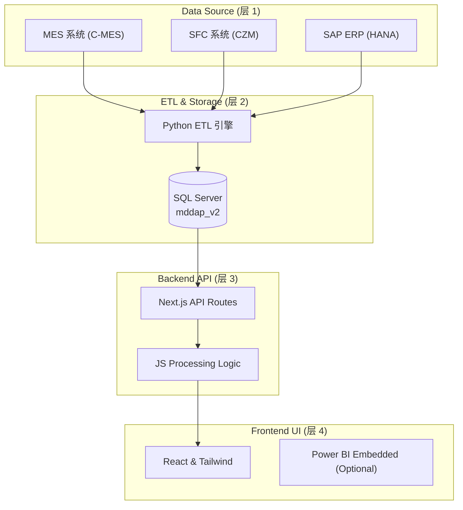

# 04 技术方案与架构 (Technical Solution)

本文档描述了 MDDAP 报表平台的整体架构、技术栈选择及核心子系统设计。

## 1. 整体架构 (System Architecture)
系统采用分层解耦设计，确保数据流的高效与稳定。

## 2. 技术栈 (Technology Stack)
- **前端 (Frontend)**: Next.js (App Router), Tailwind CSS, Lucide Icons, Recharts.
- **后端 (Backend)**: Next.js Serverless Functions, `mssql` (Node.js driver).
- **数据库 (Database)**: Microsoft SQL Server 2022.
- **数据工程 (Data Engineering)**: Python 3.10+, Pandas, Openpyxl.

## 3. 核心设计模式 (Design Patterns)
- **App-side Enrichment (应用端增强)**: 针对 SQL 性能瓶颈，采用“窄 SQL + 宽 JS”模式，将复杂的 Mapping 和计算从 DB 压力转移到 Node.js 层。
- **Dynamic Snapshots**: 自动检测并拉取最新的业务日期快照。
- **Responsive Standard**: 遵循高密度的 Dashboard 设计规范，适配各种生产环境屏幕。

## 4. 安全与权限
- **SSO 集成**: 通过 Medtronic Microsoft 账户进行鉴权。
- **Environment Isolation**: 分别建立 `.env.local` 和 `.env.production` 以隔离开发与生产配置。
