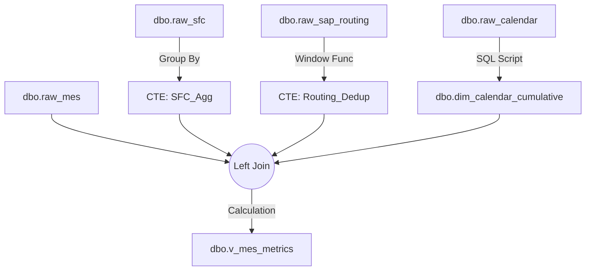

# 数据聚合与清洗规范 (ETL Specification)

本章节提供了数据平台底层处理逻辑的详细技术报告，包括文件读取规则、字段清洗映射、以及核心计算逻辑。

---

## 1. 数据源与读取规则 (Source Files)

系统通过 Python 代码 (`data_pipelines/sources/*`) 按照以下配置读取源文件。

### 1.1 MES 实际产出 (Product Output)
*   **文件路径模式**:
    *   CZM: `.../30-MES导出数据/CMES_Product_Output/CZM/CMES_Product_Output_CZM_*.xlsx`
    *   CKH: `.../30-MES导出数据/CMES_Product_Output/CKH/CMES_Product_Output_CKH_*.xlsx`
*   **文件名过滤 (Regex)**:
    *   **包含**: `_\d{6}\.xlsx$` (月度文件, 如 `_202310.xlsx`) 或 `_\d{4}Q[1-4]\.xlsx$` (季度文件)。
    *   **排除**: `_\d{4}\.xlsx$` (年度汇总文件，避免重复)。
*   **去重逻辑**:
    *   **文件级**: 检查文件 Hash，仅处理变动文件。
    *   **行级**: 保留 `RecordHash(Batch+Op+Machine+Time)` 的最新版本。

### 1.2 SFC 现场追踪 (Shop Floor Control)
*   **文件路径模式**: `.../70-SFC导出数据/批次报工汇总报表/LC-*.xlsx`
*   **读取策略**: 按文件修改时间倒序，优先处理最新文件。
*   **核心用途**: 补充 MES 缺失的 `Check In` 时间（即精确开始时间）。

### 1.3 SAP 工艺标准 (Routing & Standards)
*   **文件列表**:
    *   `1303 Routing及机加工产品清单.xlsx`
    *   `9997 Routing及机加工产品清单.xlsx`
*   **Sheet 读取逻辑**:
    *   **Routing Sheet** (e.g., `1303 Routing`): 读取标准工艺路线。
    *   **Machining Sheet** (e.g., `1303机加工清单`): 读取调试时间与特殊工时。
    *   **合并**: 程序自动将两个 Sheet 按 `CFN + Operation` 进行 Left Join 合并。

---

## 2. 字段映射与清洗字典 (Cleaning & Mapping)

以下表格详细列出了从 Excel 原始列到数据库目标字段的转换逻辑。

### 2.1 MES 字段清洗映射 (`raw_mes`)

| 原始列名 (Excel Header) | 目标字段 (Database) | 类型 | 清洗与转换逻辑 |
|:--- |:--- |:--- |:--- |
| `Material_Name` | `BatchNumber` | String | **过滤**: 剔除以 `-0\d+` 结尾的拆批记录 (Regex: `~r"-0\d+$"`). |
| `Product_Name` | `CFN` | String | - |
| `LogicalFlowPath` | `Group` | String | **提取**: 从路径字符串中提取数字序列作为 Group ID。 |
| `ERPOperation` | `Operation` | Int | 转为整数，去除小数位 (e.g. `10.0` -> `10`). |
| `Step_Name` | `OperationDesc` | String | **标准化**: 统一工序名称 (e.g. "CZM 线切割" -> "线切割"). |
| `Resource` | `Machine` | String | - |
| `DateEnteredStep` | `EnterStepTime` | DateTime | 上道工序结束时间。 |
| `First_TrackIn_Date` | `TrackInTime` | DateTime | (MES 记录的开始时间，通常不准，优先用 SFC). |
| `TrackOutDate` | `TrackOutTime` | DateTime | **核心**: 账务过账时间。 |
| `Step_In_PrimaryQuantity`| `StepInQuantity` | Int | - |
| `TrackOut_PrimaryQuantity`| `TrackOutQuantity` | Int | 良品数量。 |
| `ERPCode` | `Plant` | Int | 工厂代码 (4026/4027等). |

### 2.2 SFC 字段清洗映射 (`raw_sfc`)

| 原始列名 (Excel Header) | 目标字段 (Database) | 类型 | 备注 |
|:--- |:--- |:--- |:--- |
| `批次` | `BatchNumber` | String | 关联键。 |
| `工序号` | `Operation` | Int | 关联键。 |
| `Check In 时间` | `TrackInTime` | DateTime | **高优先级**。用于覆盖 MES 的开始时间。 |
| `报废数量` | `ScrapQty` | Int | 补充质量数据。 |

### 2.3 SAP 字段清洗映射 (`raw_sap_routing`)

| 原始列名 (Excel Header) | 目标字段 (Database) | 来源 Sheet | 逻辑 |
|:--- |:--- |:--- |:--- |
| `Material Number` | `ProductNumber` | Routing | - |
| `CFN` | `CFN` | Routing | - |
| `Operation/activity` | `Operation` | Routing | - |
| `Machine` | `EH_machine` | Routing | 单件机器工时 (秒)。 |
| `Labor` | `EH_labor` | Routing | 单件人工工时 (秒)。 |
| `调试时间` | `SetupTime` | Machining | **合并**: 从机加工清单表匹配获取。 |
| `OEE` | `OEE` | Machining | **合并**: 默认填充 0.77 (如果为空/0)。 |

---

## 3. 核心计算逻辑 (Core Logic)

数据进入 SQL Server 后，视图 `dbo.v_mes_metrics` 执行以下核心计算：

### 3.1 标准工时计算 (Standard Time)
> 文件: `etl_sap_routing_raw.py` & SQL View

*   **基础值 (StandardTime)**:
    ```python
    # 优先使用机器工时，若为0则使用人工工时，转换为小时
    StandardTime = (EH_machine if EH_machine > 0 else EH_labor) / 60.0
    ```
*   **实际标准工时 (ST Table)**:
    ```sql
    ST(d) = (
        (CASE WHEN IsSetup='Yes' THEN SetupTime ELSE 0 END) +  -- 仅首件加调试时间
        (Qty + Scrap) * StandardTime / OEE +                   -- 理论加工时间 (含OEE还原)
        Buffer (0.5 hour)                                      -- 缓冲时间
    ) / 24.0
    ```

### 3.2 周期时间计算 (Lead Time)
> 文件: `scripts/maintenance/update_view_vmesmetrics_v2.sql`

*   **StartTime 选取策略**:
    *   `LT_StartTime`: 如果是首道工序 (`0010`)，优先取 SFC 的 `TrackInTime`；否则取 `EnterStepTime`。
    *   `PT_StartTime`: 判断前一工序是否连续。如果不连续（有 Gap），取 `TrackInTime`；如果连续，取 `PreviousBatchEndTime`。

*   **非工作日扣除 (Non-Working Deduction)**:
    利用 `dim_calendar` 计算时间段内的非工作秒数 (`LNW_Sec` / `PNW_Sec`) 并从总时长中扣除。
    ```sql
    LT(d) = ( (TrackOutTime - LT_StartTime) - LNW_Sec ) / 86400
    ```

---

## 4. 输出数据结构 (Final Output)

聚合后的数据存储在 `fact_mes_metrics.parquet`，结构如下：

| 字段类别 | 包含字段 |
|:--- |:--- |
| **Identity** | `BatchNumber`, `Operation`, `ProductNumber`, `CFN`, `Plant` |
| **Time** | `TrackInTime`, `TrackOutTime`, `LT_StartTime`, `Date` |
| **Metrics** | `Qty`, `Scrap`, `ST(d)`, `LT(d)`, `PT(d)`, `OEE` |
| **Status** | `IsSetup` (Yes/No), `CompletionStatus` (OnTime/Overdue) |

---

## 5. 辅助数据与中间表 (Reference Data & Intermediate Tables)

为了支撑核心视图的高效计算，平台维护了若干辅助表和中间逻辑。

### 5.1 累积日历表 (`dbo.dim_calendar_cumulative`)
*   **来源**: `raw_calendar` (由 Python 生成)
*   **生成逻辑**: SQL 脚本 `create_dim_calendar_cumulative.sql`
*   **核心算法**:
    使用窗口函数预计算截止到每一天的**累积非工作日天数** (`CumulativeNonWorkDays`)。
    ```sql
    SUM(CASE WHEN IsWorkday = 0 THEN 1 ELSE 0 END) OVER (ORDER BY CalendarDate) as CumulativeNonWorkDays
    ```
*   **业务价值**:
    将“计算两个日期之间的非工作日”这一原本需要全表扫描 (O(N)) 的操作，转化为简单的减法运算 (O(1))：
    `NonWorkDays = End_Date.CumNW - Start_Date.CumNW`

### 5.2 路由去重逻辑 (Routing Deduplication)
*   **来源**: `raw_sap_routing`
*   **问题**: SAP 导出文件可能包含同一工序的多个版本。
*   **解决逻辑**: 在 SQL View 中使用 `ROW_NUMBER()` 分组去重。
    ```sql
    ROW_NUMBER() OVER (
        PARTITION BY CFN, Operation, Group
        ORDER BY updated_at DESC
    )
    ```
    确保系统永远只使用**最新版本**的工艺标准。

### 5.3 视图依赖关系图 (SQL Dependency)



---

## 3. 常见缩写

- **ODS**: Operational Data Store (操作数据层)
- **DWD**: Data Warehouse Detail (明细数据层)
- **KPI**: Key Performance Indicator (关键绩效指标)
- **OEE**: Overall Equipment Effectiveness (设备综合效率)
