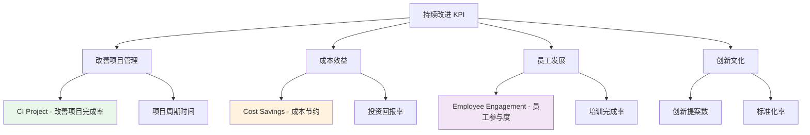

# 持续改进 KPI

持续改进部门关键绩效指标体系，衡量改善活动效果、成本节约和员工参与度。

---

## 📊 持续改进 KPI 体系

---

## ⭐ 核心指标详解

### 1. CI Project - 改善项目完成率

**📋 计划中**

**定义：** 按时完成的持续改进项目比例

**计算公式：**

\[
CI\ Project(\%) = \frac{\text{按时完成的改善项目数量}}{\text{总改善项目数量}} \times 100\%
\]

**目标值：** ≥ 90%

**数据来源：** 项目管理系统、改善活动跟踪系统

**更新频率：** 每月

---

### 2. Cost Savings - 成本节约

**📋 计划中**

**定义：** 通过持续改进活动实现的成本节约金额

**计算公式：**

\[
Cost\ Savings = \text{改进前成本} - \text{改进后成本}
\]

**目标值：** 年度目标

**数据来源：** 财务系统、成本核算系统

**更新频率：** 每季度

---

### 3. Employee Engagement - 员工参与度

**📋 计划中**

**定义：** 参与持续改进活动的员工比例

**计算公式：**

\[
Employee\ Engagement(\%) = \frac{\text{参与改善活动的员工数}}{\text{总员工数}} \times 100\%
\]

**目标值：** ≥ 80%

**数据来源：** 人力资源系统、改善活动记录

**更新频率：** 每季度

---

### 4. Project Cycle Time - 项目周期时间

**📋 计划中**

**定义：** 从改善项目立项到完成所需的平均时间

**计算公式：**

\[
Project\ Cycle\ Time = \frac{\text{所有项目完成时间总和}}{\text{项目数量}}
\]

**目标值：** 持续改进

**数据来源：** 项目管理系统

**更新频率：** 每月

---

### 5. ROI - 投资回报率

**📋 计划中**

**定义：** 改善项目投资产生的经济效益比例

**计算公式：**

\[
ROI(\%) = \frac{\text{项目收益} - \text{项目投资}}{\text{项目投资}} \times 100\%
\]

**目标值：** ≥ 150%

**数据来源：** 财务系统、项目评估系统

**更新频率：** 每季度

---

### 6. Innovation Proposals - 创新提案数

**📋 计划中**

**定义：** 员工提交的创新改善提案数量

**计算公式：**

\[
Innovation\ Proposals = \text{期间内收到的有效提案数量}
\]

**目标值：** 持续增长

**数据来源：** 创新管理系统、提案记录

**更新频率：** 每月

---

### 7. Standardization Rate - 标准化率

**📋 计划中**

**定义：** 成功标准化的改善项目比例

**计算公式：**

\[
Standardization\ Rate(\%) = \frac{\text{已标准化的改善项目数}}{\text{总完成改善项目数}} \times 100\%
\]

**目标值：** ≥ 85%

**数据来源：** 标准化管理系统、改善项目记录

**更新频率：** 每季度

---

## 📈 KPI 使用建议

### 1. 改善项目管理

**项目生命周期管理：**
- 项目立项评估和优先级排序
- 项目进度跟踪和里程碑管理
- 项目效果评估和经验总结

**跨部门协作：**
- 建立跨职能改善团队
- 定期项目评审和协调会议
- 知识共享和最佳实践推广

### 2. 成本效益分析

**成本跟踪：**
- 建立成本节约跟踪机制
- 区分直接成本和间接成本
- 长期效益评估

**效益评估：**
- 量化改善效果
- 质量提升价值评估
- 效率改善的经济影响

### 3. 员工参与激励

**参与机制：**
- 建立员工提案系统
- 设立改善奖励机制
- 组织改善活动竞赛

**能力建设：**
- 改善方法和工具培训
- 问题解决能力培养
- 团队合作技能提升

---

## 🔗 相关链接

- [KPI 指标体系概述](index.md)
- [供应链部门 KPI](supply-chain.md)
- [生产部门 KPI](production.md)
- [质量部门 KPI](quality.md)
- [SA 指标](../kpi/sa.md)

---

## 📋 实施计划

持续改进KPI将分阶段实施：

1. **第一阶段**：CI Project和Employee Engagement系统建设
2. **第二阶段**：Cost Savings跟踪和ROI分析
3. **第三阶段**：Innovation Proposals和Standardization管理

每个阶段都将参照SA指标建立完整的文档体系和数据处理流程。

