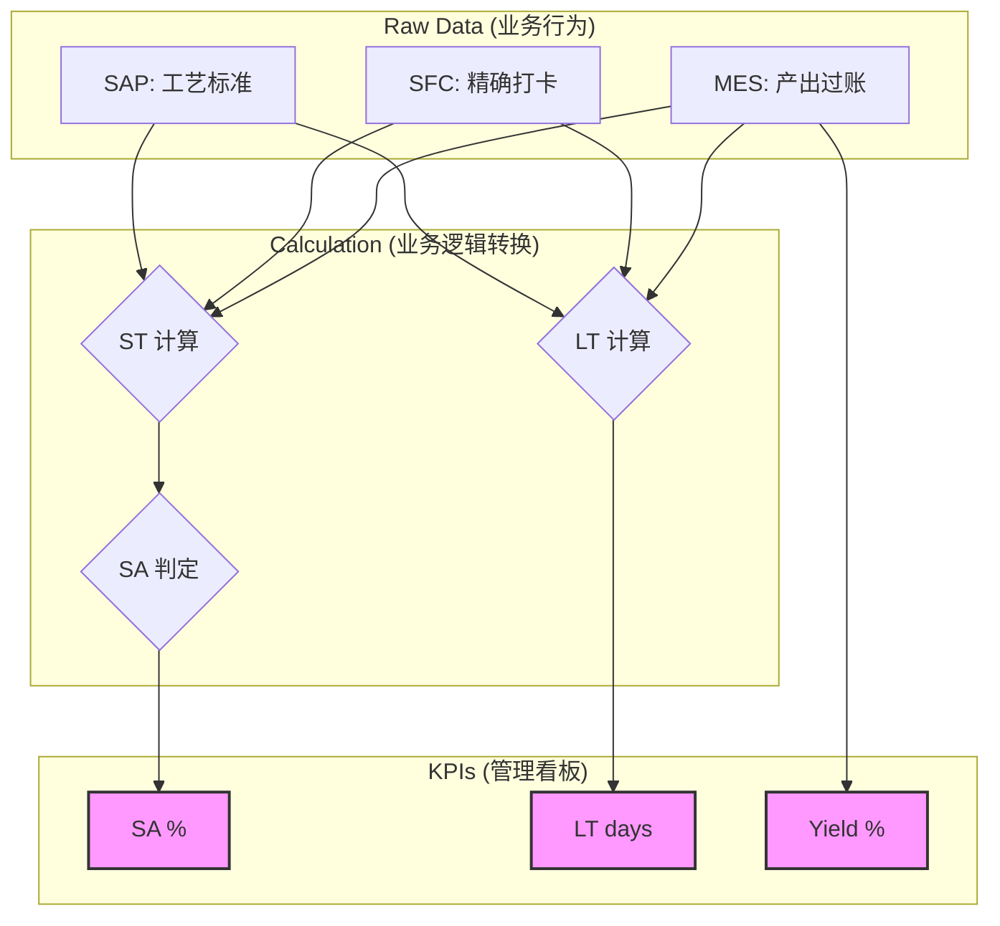

# 📖 KPI 指标字典 (Business KPI Dictionary)

> [!TIP]
> **目标**：本字典旨在消除业务部门与技术团队对数据理解的偏差。通过统一的定义、可视化的逻辑和典型的业务案例，确保所有人基于“单一事实来源”进行决策。

---

## 🏗️ 核心指标一览表

| 核心维度 | 指标名称 (KPI) | 业务价值 | 管理目标 | 典型应用场景 |
| :--- | :--- | :--- | :--- | :--- |
| **交付 (Delivery)** | [SA (计划达成率)](sa.md) | 衡量生产计划的执行刚性，识别进度偏差。 | **≥ 98%** | 每日晨会 (Tier 1) |
| **效率 (Efficiency)** | [OEE (设备综合效率)](oee.md) | 识别机台由于停机、性能下降导致的产能损失。 | **≥ 85%** | 月度运营回顾 (MOR) |
| **时效 (Velocity)** | [LT (生产周期)](cycle-time.md) | 衡量产品在车间的流转速度，识别库存积压。 | **≤ 3 天** | 瓶颈工序分析 |
| **质量 (Quality)** | [Yield (产线合格率)](quality.md) | 监控生产过程的稳定性，减少报废成本。 | **≥ 99.5%** | 质量专项改进 |

---

## 🔄 指标生成业务全景图

以下流程展示了原始业务数据是如何一步步转化为高层管理指标的：

---

## 💡 业务阅读指南

### 如何解读这些指标？
1.  **交叉验证**：如果 SA (达成率) 很高，但 LT (周期) 异常增加，可能存在“为了赶工序进度而导致中间在制品积压”的现象。
2.  **趋势重于数值**：单一的 90% 并不可怕，可怕的是连续三天的下滑。请在 Power BI 看板中关注 **Trend Line**。
3.  **根因关联**：系统已将 KPI 与 [智能监控](../monitoring/overview.md) 挂钩。当指标变色（红/黄）时，点击看板可直接跳转至 **Planner** 查看对应的根因分析报告。

---

## 📂 详细说明入口

| 分类 | 包含内容 | 链接 |
| :--- | :--- | :--- |
| **制造核心** | SA, OEE, 产量统计 | [查看详细文档](production.md) |
| **质量专项** | FPY, Rework, Scrap | [查看详细文档](quality.md) |
| **效能分析** | LT, PT, 在制品 (WIP) | [查看详细文档](supply-chain.md) |

---

## ☎️ 定义维护
指标定义的任何修正（如 ST 标准调整）需经过 **常州园区数字化治理委员会** 审核。如有疑问，请咨询业务专家。
