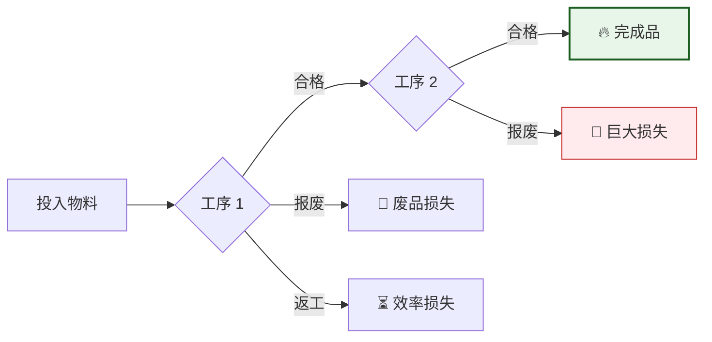

# 🛡️ 质量指标字典 (Quality KPI Dictionary)

> [!NOTE]
> **业务核心**：质量指标是生产的“红线”。它不仅衡量当前的废品损失，更反映了过程的稳定性和潜在的合规风险。

---

## 📉 业务洞察：从“废品”到“价值”

质量管理的核心是在每个环节拦截不合格品，防止其流向后续高价值工序。

---

## ⭐ 核心指标详解

### 1. FPY - 一次合格率 (First Pass Yield)
*   **业务翻译**：第一次就做对的比例。
*   **计算逻辑**：`合格品数量 / (合格品 + 报废 + 返工)`。
*   **关注点**：FPY 高意味着生产流畅，没有重复搬运和二次加工。

### 2. NCR - 不合格品率 (Non-Conformance Rate)
*   **业务翻译**：丢掉的钱占总投入的比例。
*   **计算逻辑**：`报废数量 / 投入总数`。
*   **关注点**：如果 NCR 突然升高，通常意味着机台参数、模具或原材料出现了系统性偏差。

---

## 💡 业务优化指南：质量异常怎么办？

| 观察到的现象 | 可能的原因 | 建议采取的行动 |
| :--- | :--- | :--- |
| **首件合格但批量 NCR 升** | 过程稳定性不足（Cpk 低）。 | 增加巡检频率，调整机台补偿参数。 |
| **返工率 (Rework) 升高** | 操作规范不统一或治具磨损。 | 开展操作员培训，检修相关夹具。 |
| **FPY 正常但客户投诉** | 检验标准与客户需求存在 Gap。 | 评审检验规范，加强终检 (Final Inspection)。 |

---

## 📂 数据与监控
*   **数据来源**：同步整合 MES 产出报表与 SFC 质量扣留记录。
*   **预警流程**：
    1.  **自动计算**：每日凌晨计算各工段 FPY。
    2.  **红线报警**：若 FPY 低于 95% 或报废数超过阈值，系统自动触发 [智能预警](../monitoring/triggers.md)。
    3.  **闭环分析**：在 **Planner** 中启动质量调查单。

---

## 🔗 相关链接

- [KPI 指标体系概述](index.md)
- [供应链部门 KPI](supply-chain.md)
- [生产部门 KPI](production.md)
- [持续改进 KPI](ci.md)
- [SA 指标](../kpi/sa.md)

---

## 📋 实施计划

质量部门KPI将分阶段实施：

1. **第一阶段**：FPY和NCR系统建设
2. **第二阶段**：CAPA和CCR跟踪系统
3. **第三阶段**：过程能力分析和质量成本管理

每个阶段都将参照SA指标建立完整的文档体系和数据处理流程。
