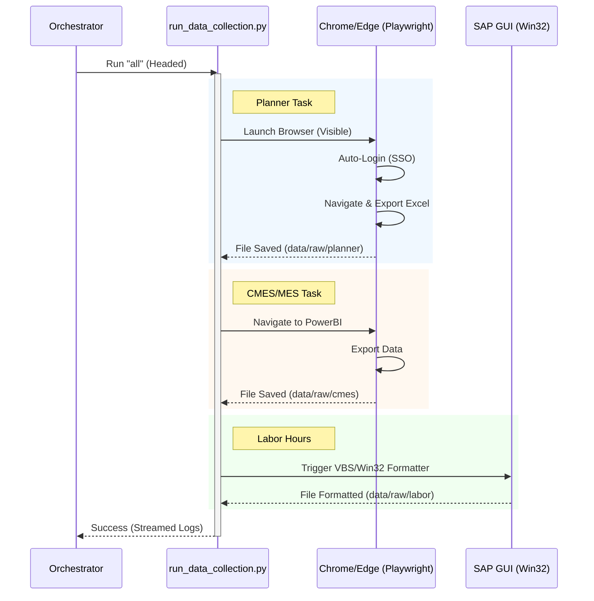
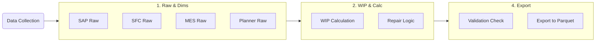

# MDDAP Automation Pipeline Roadmap & Logic

This document details the current automated execution logic for the MDDAP Data Platform (v1.5). It covers the end-to-end flow from triggering the pipeline to the final data export.

## 1. High-Level Architecture

The automation is driven by a central **Orchestrator** (`run_etl_parallel.py`) which manages the sequential execution of **Stages**, while running tasks **in parallel** within those stages (where applicable).

```mermaid
graph TD
    User([User / Operator]) -->|Click 'Run Pipeline'| Dashboard[Dashboard Console\n(pages/09_Operations.py)]
    User -->|Run Script| BatScript[refresh_parallel.bat]
    
    Dashboard -->|Subprocess Call| Orchestrator[Orchestrator\n(scripts/orchestration/run_etl_parallel.py)]
    BatScript -->|Subprocess Call| Orchestrator
    
    Orchestrator --> Stage0[Stage 0: Data Collection\n(Sequential Streaming)]
    Stage0 --> Stage1[Stage 1: Raw Data & Dimensions\n(Parallel)]
    Stage1 --> Stage2[Stage 2: WIP & Calculations\n(Parallel)]
    Stage2 --> Stage3[Stage 3: Materialized Views\n(Parallel)]
    Stage3 --> Stage4[Stage 4: Export & Validation\n(Sequential)]
```

---

## 2. Detailed Execution Flow

### Stage 0: Data Collection (Headed / Visible)
*   **Logic**: Direct execution of browser automation tasks.
*   **Mode**: **Headed** (Visible Browser) enabled by default for reliability.
*   **Logging**: Real-time streaming to the console/dashboard (no buffering).



### Stage 1-4: ETL & Export (Data Processing)
*   **Logic**: Standard Python ETL scripts converting Raw -> SQL -> Parquet.
*   **Concurrency**: Parallel Execution (`max_workers=5`).



---

## 3. Configuration & Logic Rules

### A. Headed Mode (Browser Visibility)
*   **Current Default**: `True` (Visible).
*   **Reason**: Ensures user can intervene if SSO/MFA requires manual input.
*   **Implementation**: 
    *   `run_data_collection.py`: Defaults `headless=False`.
    *   Orchestrator: Explicitly passes `--no-headless` arg.

### B. Smart Auth (Removed)
*   **Status**: **DISABLED/REMOVED**.
*   **Previous Behavior**: Tried to detect login vs. logged-in state in background.
*   **Current Behavior**: Always launches visible browser. User handles login if needed; script handles navigation if already logged in.

### C. Real-Time Logging
*   **Stage 0**: `stream_output=True` in Orchestrator. Logs appear instantly line-by-line.
*   **Stage 1-4**: `stream_output=False`. Logs are buffered and printed as a block upon task completion to prevent intermixed garbage text in parallel threads.

## 4. File Locations

| Component | Path |
| :--- | :--- |
| **Orchestrator** | `scripts/orchestration/run_etl_parallel.py` |
| **Collector** | `scripts/orchestration/run_data_collection.py` |
| **Dashboard** | `dashboard/pages/09_Operations.py` |
| **Logs** | `shared_infrastructure/logs/` |
