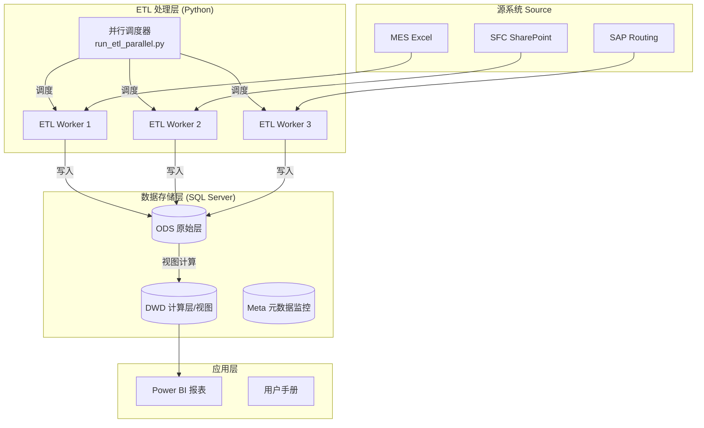

# 数据架构设计

本文档描述 MDDAP V2 数据平台的整体架构，包括数据流、数据库设计及关键组件。

## 1. 架构概览

MDDAP V2 采用 **SQL Server** 为核心存储，配合 **Python 并行调度器** 进行数据处理。



---

## 2. 数据分层设计

我们采用轻量级的 ELT 架构 (Extract-Load-Transform)，重运算在数据库视图层完成。

| 层级 | 英文 | 说明 |
|:-----|:-----|:-----|
| **ODS 原始层** | Operational Data Store | 几乎原样存储 Excel/CSV 源数据。表名通常以 `raw_` 开头 (如 `raw_mes`)。 |
| **DWD 明细层** | Data Warehouse Detail | 通过 SQL View 实现业务逻辑清洗和关联。表名通常以 `v_` 开头 (如 `v_mes_metrics`)。 |
| **Meta 监控层** | Metadata | 存储数据量统计、健康度检查结果。 (如 `meta_table_stats`)。 |

---

## 3. 核心表结构

### 3.1 ODS 层 (Raw Tables)

#### `raw_mes` (MES 产出)
存储 `Product Output` 文件的所有列。
- **Primary Keys**: 无 (堆表)，通常通过 `record_hash` 去重。
- **关键字段**: `BatchNumber`, `Operation`, `TrackOutTime`.

#### `raw_sfc` (SFC 报工)
存储 SFC 系统的 CheckIn/CheckOut 时间。
- **用途**: 校准 MES 的开始时间，计算准确的 LT。

### 3.2 DWD 层 (Views)

#### `v_mes_metrics` (核心指标视图)
这是 Power BI 使用的主表。它动态关联了 MES, SFC 和 SAP Routing 表。

**包含逻辑**:
- **LT Calculation**: `TrackOutTime - MAX(SFC_TrackIn, Previous_TrackOut)`.
- **ST Calculation**: `(SetupTime + Qty * UnitTime) / OEE`.
- **CompletionStatus**: 对比 `TrackOutTime` 与 `DueTime`。

---

## 4. 技术栈

- **数据库**: Microsoft SQL Server
- **ETL 语言**: Python 3.12 (Pandas, PyODBC)
- **调度**: Python `concurrent.futures` (多进程)
- **配置**: YAML (`config/config.yaml`)

## 5. 数据库连接

生产环境使用以下连接字符串配置 (通过环境变量或 Config 注入)：

```yaml
database:
  driver: "ODBC Driver 17 for SQL Server"
  server: "YourServerAddress"
  database: "MDDAP_V2"
  trusted_connection: "yes"  # 使用 Windows 身份验证
```
