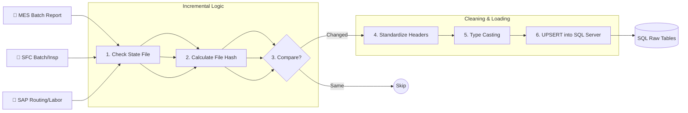

# ETL Process Roadmap & Architecture

此文档详细展示了从**原始数据清洗**到**最终输出 Parquet** 的核心数据流转过程。

## 🗺️ 总体全景图 (High Level)

```mermaid
graph TD
    subgraph "1. Ingestion (采集)"
        RawFiles[📂 Raw Excel/CSV<br/>(Planner, MES, SFC, SAP)]
    end

    subgraph "2. Processing (处理)"
        HashCheck{⚡ Incremental Check<br/>(Hash/MTime)}
        Cleaning[🧹 Python ETL Scripts<br/>(Clean & Normalize)]
        SQL[(🛢️ SQL Server<br/>Data Warehouse)]
        Snapshots[📸 Materialized Views<br/>(Optimization)]
    end

    subgraph "3. Export (输出)"
        Exporter[📤 Exporter Script<br/>(export_core_to_a1.py)]
        Parquet[📦 Partitioned Parquet<br/>(Target for Power BI)]
    end

    RawFiles --> HashCheck
    HashCheck -- New/Changed --> Cleaning
    HashCheck -- No Change --> End((Skip))
    Cleaning --> SQL
    SQL --> Snapshots
    Snapshots --> Exporter
    SQL --> Exporter
    Exporter --> Parquet
```

---

## 🔍 详细数据流转 (Detailed Data Flow)

### 阶段 1: 原始数据处理 (Raw to SQL)

每个数据源都有独立的 ETL 脚本负责清洗和入库。



### 阶段 2: 维度与指标计算 (Enrichment)

数据入库后，进行关联计算和快照生成。

```mermaid
flowchart TD
    SQL_Raw[(SQL Raw Tables)]
    
    subgraph "2.1 Dimensions"
        Calendar[Calendar Dim]
        OpsMap[Operation Mapping]
    end
    
    subgraph "2.2 WIP & Metrics"
        WIP_Calc[WIP Calculation<br/>(MES & SFC)]
        Views[SQL Views<br/>(v_mes_metrics)]
    end
    
    subgraph "2.3 Materialization"
        RefreshScript[🔄 _refresh_mes_metrics.py]
        SnapshotA[Table: snapshot_a]
        SnapshotB[Table: snapshot_b]
        Synonym[Synonym: current_snapshot]
    end
    
    SQL_Raw --> Calendar & OpsMap
    SQL_Raw --> WIP_Calc
    SQL_Raw --> Views
    
    Views --> RefreshScript
    RefreshScript -- Clean & Fill --> SnapshotA
    RefreshScript -- Switch/Swap --> SnapshotB
    SnapshotA & SnapshotB -.-> Synonym
```

### 阶段 3: 最终导出 (Export to Parquet)

为了给 Power BI 提供高性能读取，我们将 SQL 数据导出为 **Partitioned Parquet** 文件。

```mermaid
graph TD
    Synonym[(SQL Data / Snapshots)]
    
    subgraph "Export Process (export_core_to_a1.py)"
        Reader[1. Read via ODBC]
        Transformer[2. Transform (Pandas)]
        Partitioner[3. Partition Logic<br/>(Year/Month)]
        Writer[4. Write Parquet]
    end
    
    Folder[📂 Output Folder<br/>(A1_ETL_Output)]
    PBI[📊 Power BI]
    
    Synonym --> Reader
    Reader --> Transformer
    Transformer --> Partitioner
    Partitioner --> Writer
    Writer --> Folder
    Folder --> PBI
```

## 🗝️ 关键动作说明 (Key Actions)

| 步骤 | 动作 (Action) | 负责脚本 | 说明 |
| :--- | :--- | :--- | :--- |
| **0. 采集** | **Data Collection** | `run_data_collection.py` | 智能爬虫从 Planner/CMES 获取最新 Excel。 |
| **1. 增量检查** | **Hashing** | `etl_utils.py` | 获取文件的 `mtime` 和 `size`，与 `state.json` 对比，决定是否跳过。 |
| **2. 清洗** | **Normalization** | `etl_*.py` | 统一列名（如 `BatchID` vs `Batch_No`），修复日期格式，处理空值。 |
| **3. 入库** | **Upsert** | `db_utils.py` | 使用 SQL `MERGE` 或 `DELETE+INSERT` 确保数据库中最新的数据。 |
| **4. 计算** | **Materialize** | `_refresh_*.py` | 对于复杂的聚合查询，预先计算并存入物理表，避免 PBI 查询超时。 |
| **5. 导出** | **Parquet Export** | `export_core_to_a1.py` | 将 SQL 数据按年月分片导出为 Parquet，每个文件极小且带压缩。 |

---
*本文档由 MDDAP 对话助手自动生成。*
