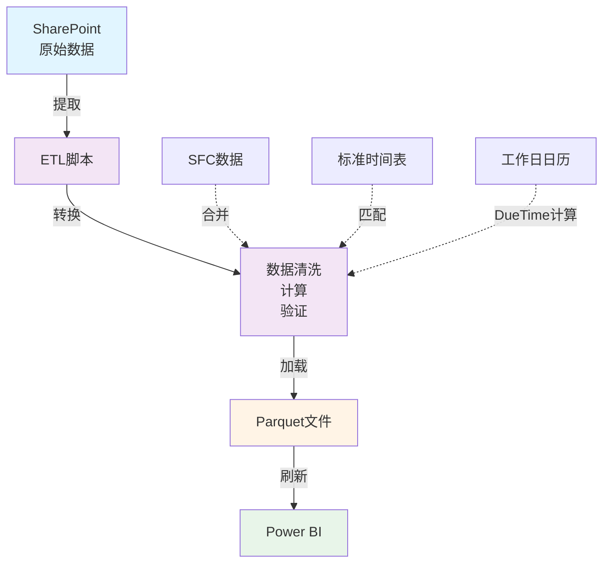
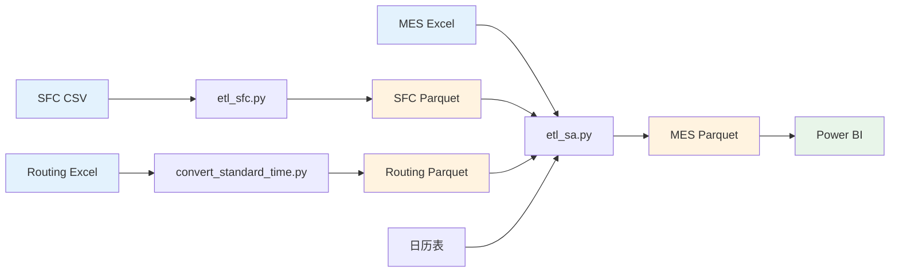

# 数据处理概述

本章节介绍数据平台的 ETL（Extract, Transform, Load）处理流程。

---

## ETL 流程架构



---

## 核心 ETL 脚本

### 1. SA 数据清洗（主流程）

**脚本：** `etl_sa.py`

**功能：**
- 读取 MES 原始数据
- 合并 SFC 的 Checkin_SFC
- 匹配标准时间参数
- 计算所有 SA 指标字段
- 生成 Parquet 文件

**输入：**
- MES Excel 文件
- SFC Parquet 文件（已处理）
- 标准时间 Parquet 文件
- 工作日日历 CSV

**输出：**
- `MES_处理后数据_latest.parquet`

📖 [详细说明](etl-sa.md)

---

### 2. SFC 数据清洗

**脚本：** `etl_sfc.py`

**功能：**
- 读取 SFC 原始数据
- 数据清洗和标准化
- 去重和验证
- 生成 Parquet 文件

**输入：**
- SFC CSV/Excel 文件（LC-*.csv）

**输出：**
- `SFC_处理后数据_latest.parquet`

📖 [详细说明](etl-sfc.md)

---

### 3. 标准时间转换

**脚本：** `convert_standard_time.py`

**功能：**
- 合并 Routing 表和机加工清单
- 计算单件时间（秒）
- 生成标准时间 Parquet

**输入：**
- `1303 Routing及机加工产品清单.xlsx`
  - Sheet 1: 1303 Routing
  - Sheet 2: 1303机加工清单

**输出：**
- `SAP_Routing_yyyymmdd.parquet`

📖 [详细说明](standard-time.md)

---

### 4. 工作日日历生成

**脚本：** `generate_calendar.py`

**功能：**
- 生成指定年份的日历
- 标记工作日和节假日
- 支持自定义节假日

**输入：**
- 年份参数

**输出：**
- `日历工作日表.csv`

---

## ETL 运行方式

### 方式 1：批处理文件（推荐）

```batch
# 单独运行
run_etl.bat           # 仅MES
convert_standard_time.bat  # 标准时间

# 批量运行
run_all_etl.bat       # SFC + MES
```

### 方式 2：Python 命令

```bash
# 标准时间
python convert_standard_time.py

# SFC数据
python etl_sfc.py

# MES数据
python etl_sa.py
```

### 方式 3：配置参数运行

```bash
# 增量更新（最近7天）
python etl_sa.py --incremental --days 7

# 指定日期范围
python etl_sa.py --start-date 2025-01-01 --end-date 2025-01-31

# 使用自定义配置
python etl_sa.py --config custom_config.yaml
```

---

## 数据流向

### 完整数据流



---

## 主要处理步骤

### MES 数据处理（etl_sa.py）

1. ⬇️ **加载配置** - 读取 `config.yaml`
2. 📖 **读取原始数据** - MES Excel
3. 🔄 **合并 SFC** - 按 BatchNumber + Operation 匹配
4. 🔗 **匹配标准时间** - 按 CFN + Operation 匹配
5. 📊 **计算 LT/PT** - Lead Time 和 Process Time
6. 📐 **计算 ST** - 标准时间
7. 📅 **计算 DueTime** - 基于工作日日历
8. ✅ **判断 SA 状态** - OnTime/Overdue
9. 🔍 **数据质量检查** - 验证必填字段、数据类型
10. 💾 **保存 Parquet** - 输出处理后数据

---

## 配置管理

### 配置文件位置

```
10-SA指标/13-SA数据清洗/config/
├── config.yaml       # MES配置
└── config_sfc.yaml   # SFC配置
```

### 主要配置项

```yaml
# 数据路径
paths:
  input_folder: "SharePoint路径/30-MES"
  output_folder: "SharePoint路径/30-MES导出数据/publish"
  sfc_data: "SFC_处理后数据_latest.parquet"
  routing_data: "SAP_Routing_*.parquet"

# 处理参数
processing:
  default_oee: 0.77
  setup_time_buffer: 0.5
  daily_work_hours: 24  # 24小时连续生产

# 增量更新
incremental:
  enabled: false
  days: 7
```

📖 [配置详细说明](configuration.md)

---

## 日志和监控

### 日志文件

```
logs/
├── etl_sa.log        # MES处理日志
├── etl_sfc.log       # SFC处理日志
└── manifest.csv      # 处理清单
```

### 日志内容

```
2025-01-10 10:30:15 - INFO - ETL处理开始
2025-01-10 10:30:16 - INFO - 读取MES数据: 123,456 条
2025-01-10 10:30:45 - INFO - 合并SFC数据: 匹配 85,234 条
2025-01-10 10:32:10 - WARNING - 缺失标准时间: 234 条记录
2025-01-10 10:34:07 - INFO - 保存Parquet文件成功
2025-01-10 10:34:07 - INFO - ETL处理完成
```

---

## 数据质量保证

### 自动检查项

- ✅ 必填字段完整性
- ✅ 数据类型正确性
- ✅ 时间逻辑合理性
- ✅ 数量非负性
- ✅ OEE 范围（0-1）
- ✅ 日期有效性

### 质量报告

ETL 完成后会生成质量报告：

```
数据质量报告
====================
总记录数: 123,456
有效记录: 123,222 (99.81%)
异常记录: 234 (0.19%)

异常类型统计:
- 缺失Checkin_SFC: 15,234 (12.34%)
- 缺失标准时间: 234 (0.19%)
- 时间逻辑异常: 0 (0.00%)
```

---

## 数据格式选择与性能优化

### 为什么使用 Parquet 格式？

本项目采用 **Parquet 格式**作为处理后数据的存储格式，相比传统的 Excel/CSV 格式，性能提升显著。

#### 性能对比（实测数据）

| 数据量 | Excel/CSV 读取时间 | Parquet 读取时间 | **性能提升** | 文件大小对比 |
|--------|------------------|-----------------|------------|-------------|
| 10万行 | ~30秒 | ~3秒 | **🚀 提升 90%** | CSV: 50MB / Parquet: 5-8MB (**减少 84-90%**) |
| 50万行 | ~2分钟 | ~8秒 | **🚀 提升 93%** | CSV: 250MB / Parquet: 25-40MB (**减少 84-90%**) |
| 100万行 | ~5分钟 | ~15秒 | **🚀 提升 95%** | CSV: 500MB / Parquet: 50-80MB (**减少 84-90%**) |

#### 核心优势

!!! success "Parquet 格式优势"
    - ✅ **读取速度提升 90-95%**：列式存储，Power BI 加载速度提升 **5-10 倍**
    - ✅ **文件大小减少 84-90%**：高压缩率，节省存储空间和上传时间
    - ✅ **数据类型精确保留**：自动保留日期、数字、文本等类型，无需重新转换
    - ✅ **Power BI 原生支持**：无需额外配置，直接读取
    - ✅ **适合大数据场景**：处理百万级数据性能优秀

#### 格式对比详情

| 特性 | Parquet ⭐⭐⭐⭐⭐ | CSV ⭐⭐⭐ | Excel ⭐⭐ |
|------|-----------------|---------|----------|
| **读取速度** | 极快（10-100倍于CSV） | 慢 | 最慢 |
| **文件大小** | 小（压缩率70-90%） | 大 | 很大 |
| **数据类型保留** | ✅ 精确保留 | ❌ 全部文本 | ⚠️ 部分保留 |
| **Power BI 支持** | ✅ 原生支持 | ✅ 支持但慢 | ✅ 支持但很慢 |
| **增量刷新** | ✅ 适合 | ❌ 不适合 | ❌ 不适合 |
| **人工查看** | ❌ 需工具 | ✅ Excel可打开 | ✅ Excel可打开 |

#### 实施成果

!!! tip "项目成果"
    通过采用 Parquet 格式，本项目实现了：
    
    - 📊 **数据处理速度提升 90-95%**
    - 💾 **存储空间节省 84-90%**
    - ⚡ **Power BI 刷新时间缩短 80-90%**
    - 🔄 **支持每日多次刷新**（之前受限于性能，只能每日1-2次）

---

## 性能优化

### 处理速度（基于 Parquet 格式）

| 数据量 | 预估时间 | 建议 |
|--------|----------|------|
| < 1万条 | 1-2 分钟 | 全量更新 |
| 1-10万条 | 3-5 分钟 | 全量/增量均可 |
| 10-50万条 | 10-20 分钟 | 建议增量更新 |
| > 50万条 | 30+ 分钟 | 必须增量更新 |

!!! note "注意"
    以上时间基于 Parquet 格式。如果使用 Excel/CSV 格式，处理时间将增加 **5-10 倍**。

### 优化建议

1. **使用 Parquet 格式** - 核心优化，性能提升 90-95%
2. **使用增量更新** - 仅处理最近数据
3. **并行处理** - 启用多核处理
4. **优化配置** - 调整 chunk_size
5. **清理历史数据** - 定期归档

---

## 快速开始

### 首次运行

```bash
# 1. 安装依赖
pip install -r requirements.txt

# 2. 配置路径
# 编辑 config/config.yaml

# 3. 生成日历
python generate_calendar.py --year 2025 --year 2026

# 4. 处理标准时间
python convert_standard_time.py

# 5. 处理SFC
python etl_sfc.py

# 6. 处理MES
python etl_sa.py
```

### 日常更新

```bash
# 一键更新（推荐）
run_all_etl.bat

# 或手动更新
python etl_sa.py
```

---

## 相关资源

- [SA 数据清洗](etl-sa.md)
- [SFC 数据清洗](etl-sfc.md)
- [配置说明](configuration.md)
- **[ETL 流程详解](../developer/etl-process.md)**: 全局 ETL 逻辑说明。
- [数据更新流程](../guide/data-update.md)
- **[常见问题排查](../developer/ops/troubleshooting.md)**: 故障诊断指南。
