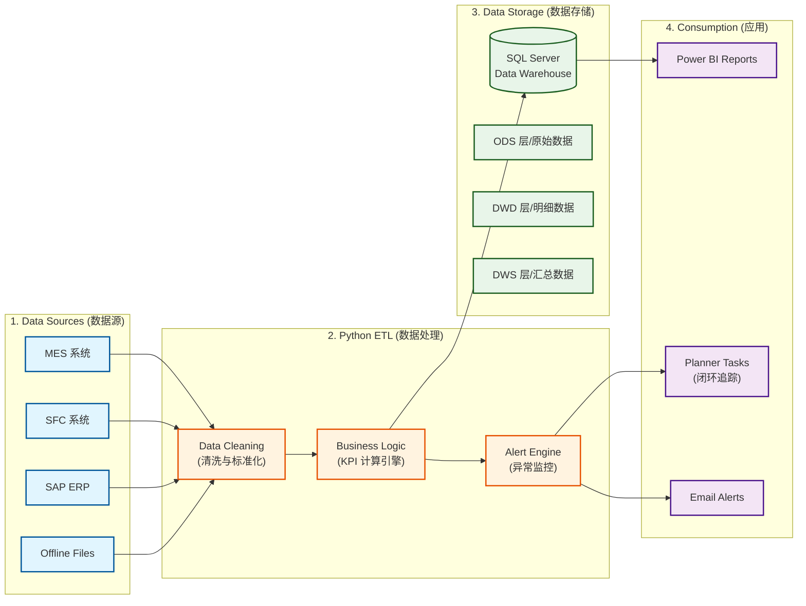

# 常州园区数据报表平台

欢迎使用 **常州园区数据报表平台**！这是一个集成了数据采集、清洗、监控与可视化的综合性数据解决方案。

---

## 🌟 核心功能概览

本项目(MDDAP)实现了从**原始数据获取**到**报表展示**的全链路自动化，主要包含以下四大模块：

### 1. 自动化采集 (Data Collection)
*   **智能爬虫**：使用 Headless Browser (Playwright) 模拟用户登录，自动从 **Microsoft Planner** 和 **CMES (Power BI)** 下载最新的生产报表和任务数据。
*   **智能验证**：具备“Smart Auth”功能，自动检测 Token 是否过期。如果过期，会弹窗提示手动登录，平时则静默运行。
*   **SAP 集成**：处理和格式化 SAP 导出的工时和路由数据。

### 2. ETL 数据清洗与入库 (ETL Pipeline)
*   **多源异构整合**：将来自不同来源（MES 系统、SFC 现场控制、SAP ERP、Planner 任务）的 Excel/CSV 数据统一清洗。
*   **增量处理**：通过文件指纹（Hash/MTime）识别变化，只处理新文件，极大提高了每日运行效率。
*   **核心计算**：
    *   **WIP 计算**：计算产线在制品数量。
    *   **工时/效率**：计算 SAP 标准工时与实际产出的对比。
    *   **Calendar/Shift**：统一对齐工厂日历和班次。

### 3. 数据仓库与指标计算 (Data Warehousing)
*   **SQL Server 存储**：所有清洗后的数据存入 SQL Server (`mddap_v2`)。
*   **物化视图 (Materialized Views)**：针对复杂的 MES 指标（如产量、一次合格率、OEE），预先计算并存储快照（Snapshots），解决实时查询慢的问题。
*   **业务领域建模**：包含生产 (Production)、质量 (Quality)、财务 (Finance)、EHS (Safety) 等分领域的业务逻辑映射。

### 4. 编排与输出 (Orchestration & Output)
*   **并行编排**：使用 `run_etl_parallel.py` 并行执行多个 ETL 任务，显著缩短运行时间。
*   **Power BI 供数**：将最终的清洗数据（Curated Data）导出为 **Parquet** 格式（高性能）或 Excel，供 Power BI 直接读取展示。
*   **自动化运维**：具备日志自动清理、错误重试和健康检查机制。

---

## 🏗️ 平台架构与技术路线

本平台采用现代化的数据工程架构，将分散孤立的业务数据转化为可信赖的决策依据。

### 🔁 数据处理全流程

我们的数据之旅经历了以下关键阶段：

1.  **数据采集 (Ingestion)**: 
    *   通过 Python 脚本自动从 MES、SFC、SAP 等系统提取原始数据。
    *   支持处理 Excel 手工账表，打破数据孤岛。

2.  **清洗与聚合 (Cleaning & Aggregation)**:
    *   **标准化**: 统一不同来源的字段命名（如 `Material`, `Batch`）。
    *   **聚合**: 将工单级、批次级数据关联，形成完整的生产履历。
    *   **逻辑计算**: 内置 SA (计划达成率)、ST (标准工时) 等核心算法，确保指标一致性。

3.  **存储与服务 (Storage)**:
    *   数据最终存储于 **SQL Server** 数据仓库中。
    *   分层架构 (ODS/DWD/DWS) 确保了数据的追溯性和查询效率。

4.  **应用与展现 (Visualization)**:
    *   **Power BI**: 直连 SQL Server，提供高性能的交互式报表。
    *   **智能监控**: 异常数据（如工时偏差、生产超期）自动触发预警，推送到 Planner 进行闭环管理。

---

## 🌟 核心价值

*   **单一事实来源 (Single Source of Truth)**: 消除 Excel 满天飞的现状，所有部门基于同一套数据说话。
*   **自动化 (Automation)**: 全流程无人值守运行，不仅解放人力，更消除了人为统计误差。
*   **闭环管理 (Closed Loop)**: 不仅仅是“看”数据，更通过监控引擎驱动问题的“解决”。

---

## 🚀 快速开始 (Quick Start)

为了更高效地获取所需信息，请根据您的角色选择对应的文档入口：

### 📖 [用户手册 (User Guide)](business/kpi/index.md)
*针对：业务分析师、管理人员*
*   **KPI 字典**: 查看 [SA (计划达成率)](business/kpi/sa.md)、[质量与生产](business/kpi/quality.md) 等指标的严谨定义与算法。
*   **数据源定义**: 了解 [原始数据来源于哪些系统](business/data-definitions.md) 以及更新频率。
*   **报表导航**: 学习如何使用 [Power BI 交互式看板](reports/guides/index.md)。

### 🛠️ [运维手册 (Operations Manual)](developer/ops/index.md)
*针对：系统管理员、项目运维人员*
*   **一键刷新**: [日常生产数据刷新流程](developer/ops/operations.md) 说明。
*   **异常诊断**: [常见故障排查 (Troubleshooting)](developer/ops/troubleshooting.md) 与 [FAQ](developer/ops/faq.md)。
*   **迁移与备份**: [系统环境迁移指南](MIGRATION_GUIDE.md)。
*   **监控看板**: [监控系统如何生效](monitoring/overview.md) 及其 [预警规则](monitoring/triggers.md)。

### 💻 [技术文档 (Developer Guide)](developer/data-architecture.md)
*针对：数据工程师、Python 开发人员*
*   **系统架构**: 深入了解 [Data Warehouse 架构设计](developer/data-architecture.md)。
*   **核心逻辑**: 掌握 [ETL 流程详解](developer/etl-process.md) 与 [并行编排调度架构](developer/orchestrator.md)。
*   **开发规范**: 遵循 [代码编写规范](developer/standards/index.md) 与 [Power Query 开发指南](developer/pq/index.md)。

---

## 📞 支持与联系

如有任何问题，请联系数据平台负责人：**黄凯 (kai.huang2@medtronic.com)**
