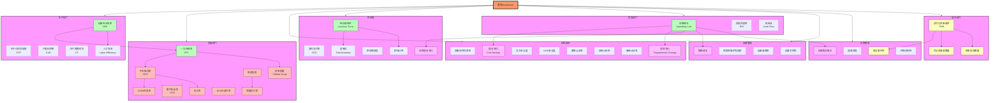

```mermaid
flowchart TB
    %% 定义主要类别
    classDef department fill:#f9f,stroke:#333,stroke-width:2px
    classDef kpi fill:#bbf,stroke:#333,stroke-width:1px
    classDef core fill:#bfb,stroke:#333,stroke-width:1px
    classDef quality fill:#fbb,stroke:#333,stroke-width:1px
    classDef cost fill:#fbf,stroke:#333,stroke-width:1px
    classDef safety fill:#ffb,stroke:#333,stroke-width:1px
    classDef main fill:#f96,stroke:#333,stroke-width:4px

    %% 主标签
    Dashboard[数据Dashboard]

    %% 核心指标
    OEE[设备综合效率<br>OEE]
    FPY[一次合格率<br>FPY]
    TRIR[总可记录事故率<br>TRIR]
    Inventory[库存周转率<br>Inventory Turns]
    Cost[运营成本<br>Operating Cost]

    %% 生产相关指标
    subgraph Production[生产部门]
        OEE
        PCP[生产计划完成率<br>PCP]
        CUR[产能利用率<br>CUR]
        CT[生产周期时间<br>CT]
        LE[人工效率<br>Labor Efficiency]
    end

    %% 质量相关指标
    subgraph Quality[质量部门]
        FPY
        NCR[不合格品率<br>NCR]
        CAPA[CAPA完成率]
        CCR[客户投诉率<br>CCR]
        Rework[返工率]
        NCMR[NCMR减少率]
        ME[制造逃逸]
        BE[重大逃逸]
        YS[良率报废<br>Yielded Scrap]
    end

    %% 持续改进相关指标
    subgraph CI[持续改进]
        CIP[改善项目完成率]
        CS[成本节约<br>Cost Savings]
        EE[员工参与度]
        OHS[OHS参与度]
        YB[黄带认证率]
        GB[绿带认证率]
        BB[黑带认证率]
        PS[项目节约<br>Programmatic Savings]
    end

    %% 供应链相关指标
    subgraph SC[供应链]
        Inventory
        OTD[准时交付率<br>OTD]
        PCS[采购成本节约]
        SP[供应商绩效]
        Backlog[积压订单]
        TI[总库存<br>Total Inventory]
    end

    %% 财务相关指标
    subgraph Finance[财务部门]
        Cost
        ROI[投资回报率<br>ROI]
        CF[现金流<br>Cash Flow]
        BE[预算执行率]
    end

    %% 设备管理相关指标
    subgraph Equipment[设备管理]
        EA[设备可用率]
        PMC[预防性维护完成率]
        EF[设备故障率]
        MC[维修成本]
    end

    %% 设施管理相关指标
    subgraph Facilities[设施管理]
        EC[能源消耗]
        FMC[设施维护成本]
        SI[安全事件率]
        EC2[环境合规性]
    end

    %% 安全相关指标
    subgraph Safety[安全部门]
        TRIR
        RI[可记录事故数量]
        HF[隐患发现数量]
    end

    %% 定义关联关系
    Dashboard --> Production
    Dashboard --> Quality
    Dashboard --> CI
    Dashboard --> SC
    Dashboard --> Finance
    Dashboard --> Equipment
    Dashboard --> Facilities
    Dashboard --> Safety

    OEE --> FPY
    OEE --> LE
    FPY --> NCR
    FPY --> YS
    NCR --> CAPA
    NCR --> Rework
    ME --> BE
    TRIR --> SI
    TRIR --> RI
    TRIR --> HF
    Inventory --> TI
    Inventory --> Backlog
    Cost --> CS
    Cost --> PS
    Cost --> PCS
    Cost --> MC
    Cost --> FMC

    %% 应用样式
    class Dashboard main
    class Production,Quality,CI,SC,Finance,Equipment,Facilities,Safety department
    class OEE,FPY,TRIR,Inventory,Cost core
    class NCR,CAPA,CCR,Rework,NCMR,ME,BE,YS quality
    class CS,PS,PCS,MC,FMC cost
    class TRIR,RI,HF,SI safety
``` 