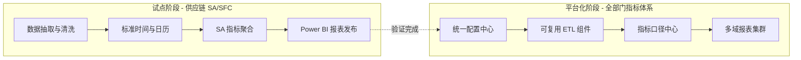

# 项目进展总览

CZ Ops 数字化数据平台项目进展概览。

---

## 一页图（Mermaid）

---

## 里程碑与状态

### ✅ 已完成
- **试点验证**：供应链 SA/SFC 报表结构与口径验证
- **分析阶段**：根因定位与量化比对
- **改进阶段**：统一口径、增量机制设计

### 进行中
- **统一配置中心**：配置管理、日历服务、字典表
- **ETL 组件优化**：增量重跑、补数、监控机制
- **指标口径中心**：跨部门统一定义

### 计划中
- **多域报表扩展**：生产、质量、持续改进指标
- **监控告警系统**：自动化运维
- **用户培训体系**：操作指南与最佳实践

---

## 上下级关系与文档结构建议

- 顶层：平台与治理（配置中心、日历服务、字典表、指标口径中心、监控与告警）
- 中层：通用 ETL 能力（抽取、清洗、标准化、增量/补数、发布、一致性回放）
- 底层：部门/域 KPI（供应链、生产、质量、CI…），每个域均复用通用能力与统一口径

导航已按上述结构组织：
- 项目管理：定义、实施、分析、改进、进展总览、会议纪要
- KPI 指标体系：跨域汇总与各域说明（供应链/生产/质量/CI）
- 数据处理 ETL：通用流程、SA/SFC 清洗、标准时间、配置说明
- Power Query 代码：各源的实现与增量方案
