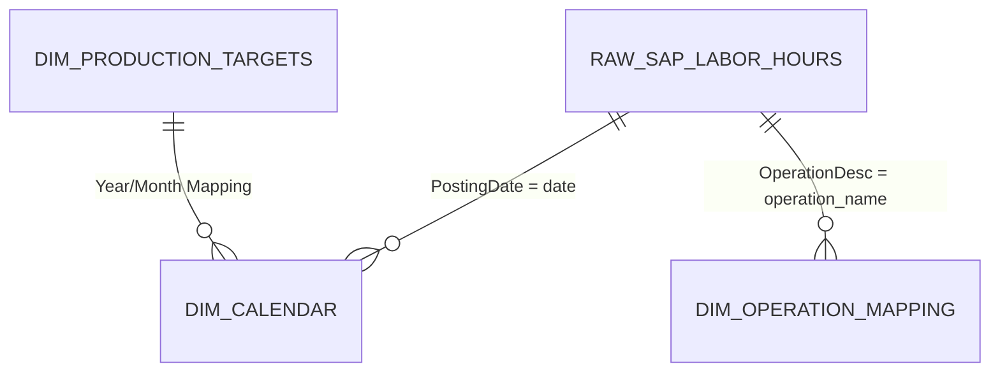

# Labor EH Analysis (工时分析) 数据架构定义

本文档梳理了支撑工时分析报表所需的底层数据库表、关键字段及其业务逻辑关联。

## 1. 核心数据表 (Core Tables)

### 1.1 事实表：SAP 工时明细 (`raw_sap_labor_hours`)
这是报表的基础，存储从 SAP 系统抽取的原始报工数据。
- **PostingDate**: 记账日期 (PK - 关联日历)。
- **OrderNumber**: 生产订单号。
- **Material**: 物料编码/产品编码。
- **MaterialDesc**: 物料描述。
- **MaterialType**: 物料类型 (如: ZFRT)。
- **Operation**: 工序编号 (数字，如: 10, 20)。
- **OperationDesc**: 工序名称 (文本，如: '清洗', '五轴磨' - **关联关键字段**)。
- **EarnedLaborTime**: 挣值工时 (核心计算字段)。
- **Unit**: 工时单位 (如: H/Min)。
- **WorkerID**: (建议增加) 报工人员 ID，用于人力统计。

### 1.2 维度表：财历维度 (`dim_calendar`)
用于实现复杂的财年、财月、财周过滤及工作日计算。
- **date**: 自然日期 (PK)。
- **fiscal_year**: 财年 (如: FY26)。
- **fiscal_month**: 财月 (如: FY26 M01 May)。
- **fiscal_week**: 财周 (1-53)。
- **fiscal_quarter**: 财季。
- **is_workday**: 是否为工作日 (1/0)。
- **is_holiday**: 是否为节假日。

### 1.3 维度表：工序-区域映射 (`dim_operation_mapping`)
用于将离散的工序 ID 归类到具体的生产车间/区域。
- **operation_name**: 工序名称/ID (nvarchar)。
- **area**: 所属生产区域 (如: 五轴、CNC、包装)。
- **department**: (建议增加) 所属部门。
- **plant**: 工厂代码 (如: 2311)。

### 1.4 配置表：计划生产工时 (Target EH) 与工作日 (`dim_production_targets`)
- **来源**: Excel `C:\Users\huangk14\OneDrive - Medtronic PLC\General - CZ OPS生产每日产出登记\01-常州园区每日计划工时.xlsx`
- **逻辑**: 每月更新。表中工时为空值对应日期视为“非工作日”。
- **字段**:
    - **Date**: 日期 (PK)。
    - **target_eh_9997**: 康辉运营计划工时。
    - **target_eh_1303**: 常州运营计划工时。
    - **is_workday**: (计算字段) 若两工厂工时均为空则为 0，否则为 1。

### 1.5 维度表：工厂信息映射 (`dim_plant`)
- **plant_code**: 工厂代码 (如: 9997, 1303) (PK)。
- **plant_name**: 工厂全称 (如: 康辉工厂, 常州医疗运营)。
- **business_unit**: 所属业务单元。

---

## 2. 关键字段关系映射 (ER Mapping)

## 3. 计算与处理口径 (Calculated Fields)

1.  **统计工作日**: 
    `SELECT COUNT(*) FROM dim_calendar WHERE is_workday = 1 AND date BETWEEN Start AND End`
2.  **累计工时 (Total EH)**: 
    `SUM(EarnedLaborTime)`
3.  **平均日工时**: 
    `SUM(EarnedLaborTime) / [统计工作日]`
4.  **进度 (Progress %)**: 
    `[已累计值] / [周期目标值]`

---

## 4. 业务逻辑确认 (Business Logic Confirmations)
- **产品类型 (Product Type)**: 使用 `MRPControllerDesc` 进行区分（如：1303/INS 代表器械）。将配合 `dim_product_group_mapping` 实现。
- **工厂范围**: 报表需同时支持 **9997 (康辉工厂)** 和 **1303 (常州医疗运营)**。
- **效率热力图**: 由于前端仅有日期数据，热力图展示维度固定为 **日期 / 星期**。
