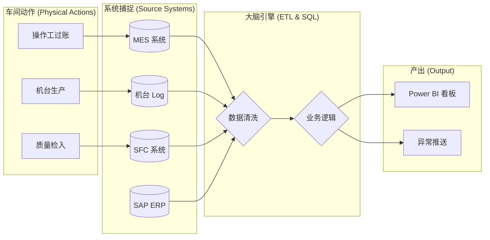

# 📂 数字化数据源全景图 (Data Source Panorama)

> [!IMPORTANT]
> **致业务负责人**：本页面旨在帮助您理解，您的生产操作是如何通过各系统（MES, SAP, SFC）最终汇总并在报表上呈现的。了解数据的流转，有助于更准确地分析异常原因。

---

## 🌐 数据流转总览 (The Big Picture)

从“车间操作”到“管理指标”的数字化旅程：

---

## 📦 数据源深度解析

### 1. MES 生产执行系统 (核心产出)
*   **业务含义**：记录“谁、在什么时候、哪个机台、生产了多少良品”。
*   **关键变换逻辑**：
    *   **拆批过滤**：自动剔除技术性的“子批次”记录，确保不重复计算产量。
    *   **工厂对应**：将 4026/4027 代码自动翻译为“常州中心”或“常州外销”。
*   **对您的影响**：如果报账时间延迟（Back-dated），会导致当日 SA 达成率下降。

### 2. SAP 资源库 (基准与标准)
*   **业务含义**：定义了产品的“标准工时 (ST)”和“推荐工艺路线”。
*   **关键变换逻辑**：
    *   **动态合并**：将 Routing（人工工时）与 Machining（调试时间）自动合并，计算出最科学的 `Target Time`。
    *   **OEE 还原**：自动应用 OEE 修正系数（默认 0.77），将“实验室产能”转化为“车间可达成产能”。
*   **对您的影响**：如果 SAP 中的 ST 设置不准，看板上的“效率”和“达成率”将失去参考价值。

### 3. SFC 现场追踪 (精确节拍)
*   **业务含义**：捕捉最为精确的 `Check In`（开工）时间。
*   **关键变换逻辑**：
    *   **时间覆盖**：系统会自动用 SFC 的精确时间覆盖 MES 的近似时间，用于计算高精度的 [生产周期 Lead Time](kpi/cycle-time.md)。
*   **对您的影响**：只有在 SFC 及时打卡，才能在看板上看到真实的等待时间和生产瓶颈。

---

## 📊 数据源健康度清单

| 数据源 | 采集方式 | 更新周期 | 业务负责人 | 数据健康度定义 |
| :--- | :--- | :--- | :--- | :--- |
| **MES** | 自动爬取 (Monthly/Quarterly) | 每日凌晨 02:00 | 生产经理 | 无缺失的过账记录，批次号唯一 |
| **SFC** | 文件同步 (Excel) | 每日凌晨 03:00 | 工段长 | 打卡率 > 98% |
| **SAP** | 定期导出 | 每月第一周 | 工业工程师 (IE) | 所有的 CFN 都有对应的 ST |

---

## 🔍 常见问题与数据常识 (Data Facts)

*   **Q: 为什么 Power BI 里的数据不是实时的？**
    *   **A**: 我们的数据流包含复杂的“清洗”与“非工作日扣除”逻辑，目前设定为**每日一刷**，以确保数据的严谨性。
*   **Q: 看到数据异常（如负数周期）怎么办？**
    *   **A**: 这通常是由于 MES 过账先后顺序倒挂引起的。请参考 [故障排查手册](../developer/ops/troubleshooting.md) 的“账务异常”章节。

---

## 🔗 技术附录
针对开发人员的详细字段映射定义，请参阅：[开发人员专供: 字段映射字典](../developer/etl-process.md)。
