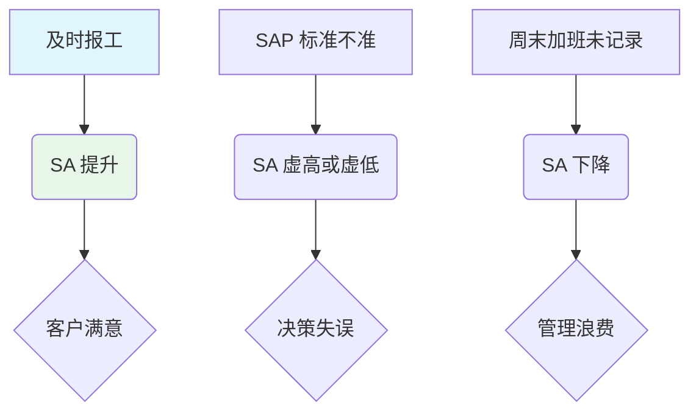
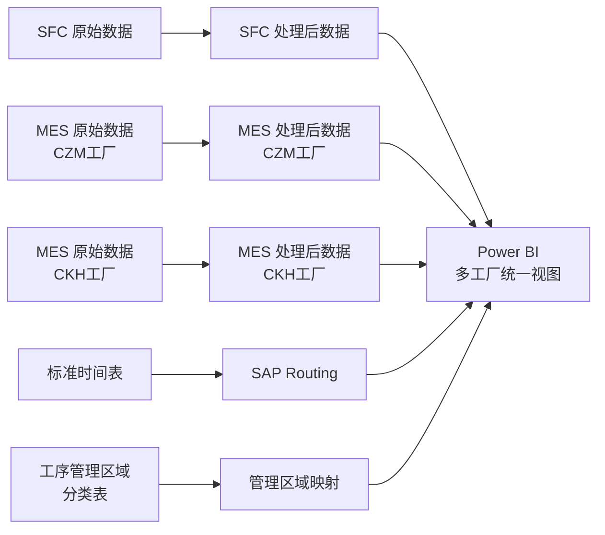
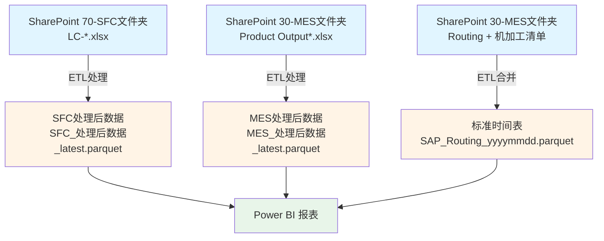
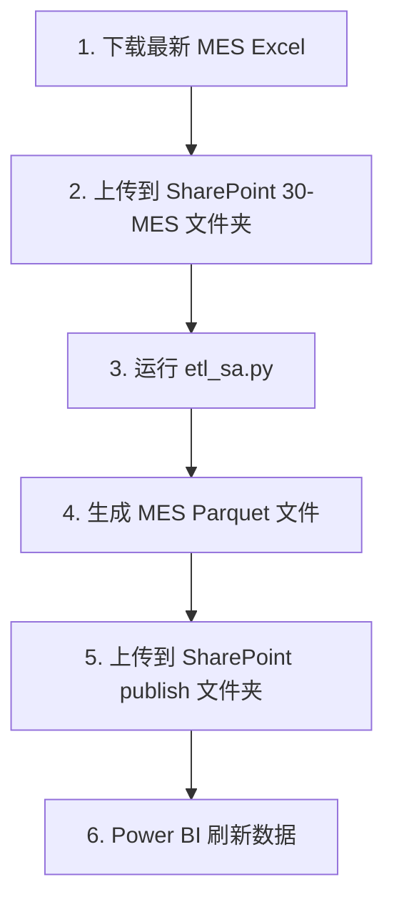
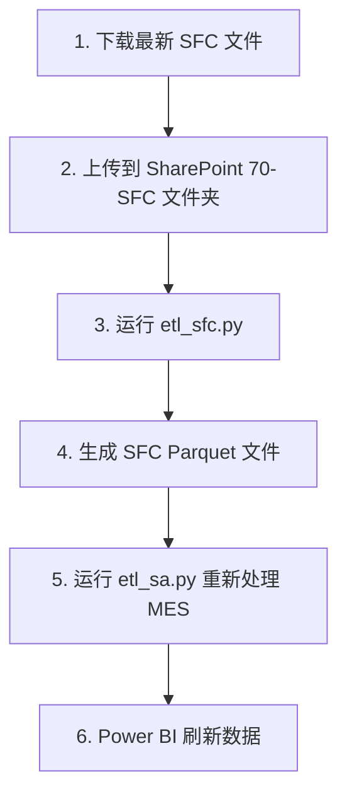
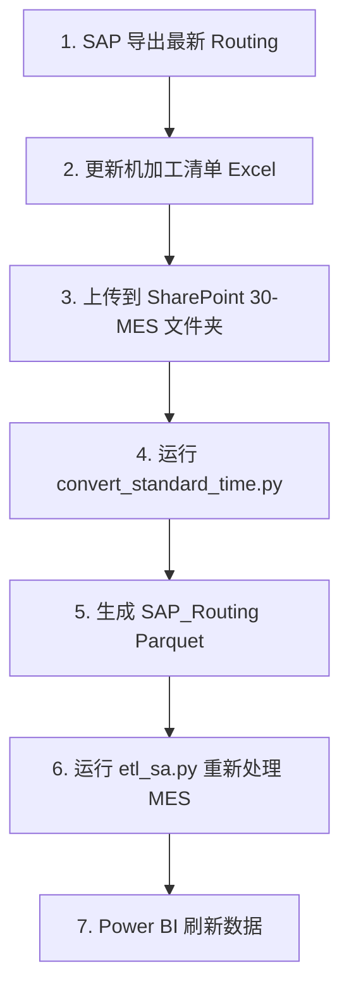

# 🎯 SA - 计划达成率 (Schedule Adherence)

> [!NOTE]
> **业务核心**：SA 不仅仅是一个百分比，它是我们车间“言行一致”的考量。高 SA 意味着我们能够准时交付产品给客户，减少不必要的催货成本。

---

## 🚀 业务全景：我的操作如何影响 SA？

对于业务人员，请关注以下“因果关系”：



---

## 🛠️ 逻辑直击：为什么我的单子逾期了？

系统采用以下逻辑判定一个批次是否“按期”：

### 1. 核心判定公式
> **SA 状态 = 实际完工时间是否小于“应完工时间”**

### 2. 应完工时间 (DueTime) 是怎么算的？
应完工时间 = **开始时间** + **标准耗时 (ST)** + **非工作日宽限**。

*   **案例 1：正常工作周**
    *   开始：周一 08:00
    *   ST：24 小时
    *   应完工：周二 08:00
*   **案例 2：跨周末生产 (系统自动处理)**
    *   开始：周五 08:00
    *   ST：48 小时
    *   应完工：**下周二 08:00** (系统自动扣除了周六、周日的 48 小时非工作时间)

---

## 💡 业务优化指南：如何提升 SA？

| 观察到的现象 | 可能的原因 | 建议采取的行动 |
| :--- | :--- | :--- |
| **SA 长期维持在 100%** | 标准可能过松，存在产能浪费。 | IE 团队重新评估 SAP 标准工时 (ST)。 |
| **SA 突然大幅下滑** | 可能是设备故障或物料短缺。 | 查看 [智能监控](../monitoring/overview.md) 触发的 Planner 异常单。 |
| **SA 正常但库存积压** | 可能是“为了达标而达标”，导致 Lead Time 过长。 | 交叉检查 [生产周期 (LT)](cycle-time.md) 指标。 |

---

## 数据体系

### 多工厂数据源



1. **SFC 批次报工记录**：提供 Check In 时间
2. **MES 批次报工记录**：核心生产数据
   - **CZM工厂**: Product Output -CZM -FY26.xlsx
   - **CKH工厂**: Product Output -CKH -FY26.xlsx
3. **产品标准时间**：计划参数（标准时间、OEE 等）
4. **工序管理区域分类表**：9个标准化管理区域
   - 加工中心 MCT、后处理 EOL、外协 OS、无区域 NA
   - 无菌 STR、纵切 ST、线切割 WED、终检 FI、车削&磨削 TG

---

## 📋 详细内容导航

<details class="abstract">
<summary><strong>🧮 计算方法与定义</strong></summary>

### 1. SA 指标定义

#### 1.1 官方定义

!!! quote "Schedule Adherence Definition"
    Schedule Adherence is a metric revealing whether or not production is adhering to the scheduled operating plan. The metric is defined as a percentage of output over demand. Schedule Adherence plays an important role in production performance.

#### 1.2 中文解读

Schedule Adherence（计划达成率）是衡量生产是否按照既定生产计划执行的重要指标。该指标通常以"产出/需求"的百分比来表示，反映了生产实际完成情况与计划之间的吻合程度。

---

### 2. 核心计算公式

#### 2.1 SA 达成率计算

\[
SA(\%) = \frac{\text{按期完成的批次数}}{\text{总批次数}} \times 100\%
\]

其中：
- **按期完成批次**：CompletionStatus = "OnTime" 的批次
- **总批次数**：统计时间范围内的所有批次

#### 2.2 单批次 SA 状态判断

```
IF TrackOutTime ≤ DueTime THEN
    CompletionStatus = "OnTime"
    SA状态 = 1
ELSE
    CompletionStatus = "Overdue"
    SA状态 = 0
END IF
```

---

### 3. 核心计算逻辑

#### 3.1 Lead Time (LT) 计算

**Lead Time** 表示从批次进入工序到完成报工的总时间。

##### 3.1.1 MES 数据 - LT 计算

**0010 工序**（首道工序）：
```
开始时间选择优先级：
1. Checkin_SFC（从 SFC 数据合并）
2. EnterStepTime（进入工序时间）
3. TrackInTime（工序投入时间）

LT(d) = (TrackOutTime - 开始时间) / 24 小时
```

**非 0010 工序**：
```
LT(d) = (TrackOutTime - EnterStepTime) / 24 小时
```

##### 3.1.2 SFC 数据 - LT 计算

**0010 工序**：
```
LT(d) = (TrackOutTime - Checkin_SFC) / 24 小时
```

**非 0010 工序**：
```
LT(d) = (TrackOutTime - EnterStepTime) / 24 小时
```

!!! note "说明"
    - LT 计算不扣除周末
    - 单位：天，保留 2 位小数
    - 空值处理：如果起始时间为空，返回 null

---

#### 3.2 Process Time (PT) 计算

**Process Time** 表示批次实际加工时间。

##### 3.2.1 MES 数据 - PT 计算

```python
# 确定开始时间
if Checkin_SFC is not None:
    开始时间 = Checkin_SFC
else:
    开始时间 = TrackInTime

# 计算 PT
PT(d) = (TrackOutTime - 开始时间) / 24  # 转换为天
```

##### 3.2.2 SFC 数据 - PT 计算

```python
PT(d) = (TrackOutTime - Checkin_SFC) / 24  # 转换为天
```

!!! note "说明"
    - PT 计算不扣除周末
    - 单位：天，保留 2 位小数
    - 空值处理：如果起始时间为空，返回 null

---

#### 3.3 标准时间 ST(d) 计算

**标准时间** 表示理论上完成该批次所需的时间。

##### 3.3.1 MES 数据 - ST 计算

```python
# 1. 确定单件时间（优先机器时间）
if EH_machine(s) is not None and EH_machine(s) > 0:
    单件时间_秒 = EH_machine(s)
else:
    单件时间_秒 = EH_labor(s)

单件时间_小时 = 单件时间_秒 / 3600

# 2. 确定 OEE（默认 77%）
if OEE is None or OEE == 0:
    OEE = 0.77

# 3. 确定调试时间
if Setup == "Yes":
    调试时间_小时 = Setup_Time_h
else:
    调试时间_小时 = 0

# 4. 计算标准时间
ST_小时 = 调试时间_小时 + (StepInQuantity × 单件时间_小时 / OEE)
ST_天 = round(ST_小时 / 24, 2)
```

##### 3.3.2 SFC 数据 - ST 计算

```python
# 1-3 步骤与 MES 相同

# 4. 计算数量（合格品 + 报废品）
数量 = TrackOutQuantity + ScrapQuantity

# 5. 计算标准时间（包含换批时间）
ST_小时 = 调试时间_小时 + (数量 × 单件时间_小时 / OEE) + 0.5
ST_天 = round(ST_小时 / 24, 2)
```

!!! tip "关键参数说明"
    - **EH_machine(s)**：单件机器加工时间（秒）
    - **EH_labor(s)**：单件人工操作时间（秒）
    - **OEE**：设备综合效率（0-1 之间，默认 0.77）
    - **Setup Time (h)**：调试时间（小时）
    - **换批时间**：SFC 数据固定增加 0.5 小时

---

#### 3.4 应完工时间 (DueTime) 计算

**应完工时间** 基于工作日日历表计算，自动跳过非工作日（周末和法定节假日）。

##### 3.4.1 核心算法

```python
def calculate_due_time(start_time, plan_hours, calendar_df):
    """
    按工作日逐天累加工作时间，跳过非工作日
    
    参数:
        start_time: 开始时间（TrackInTime 或 Checkin_SFC）
        plan_hours: 计划小时数（标准时间 + 换批时间）
        calendar_df: 工作日日历表
    
    返回:
        due_time: 应完工时间
        weekend_days: 扣除的非工作日天数
    """
    current_time = start_time
    remaining_hours = plan_hours
    weekend_hours = 0
    
    while remaining_hours > 0:
        current_date = current_time.date()
        
        # 查询日历表判断是否为工作日
        is_workday = calendar_df[
            calendar_df['日期'] == current_date
        ]['是否工作日'].values[0]
        
        if is_workday:
            # 工作日：减少剩余工时（24小时连续工作）
            daily_hours = min(remaining_hours, 24)  # 每天24小时
            remaining_hours -= daily_hours
        else:
            # 非工作日：计入 Weekend
            weekend_hours += 24
        
        # 推进到下一天
        current_time += timedelta(days=1)
    
    due_time = current_time
    weekend_days = round(weekend_hours / 24, 2)
    
    return due_time, weekend_days
```

!!! warning "重要说明"
    - 应完工时间计算**会跳过非工作日**（周末和法定节假日）
    - 工作日判断基于 `日历工作日表.csv`
    - Weekend(d) 表示从开始到应完工时间之间的非工作日天数
    - 换批时间固定为 0.5 小时

---

#### 3.5 完工状态 (CompletionStatus) 判断

```python
if TrackOutTime <= DueTime:
    CompletionStatus = "OnTime"
    SA状态 = 1
else:
    CompletionStatus = "Overdue"
    SA状态 = 0
```

!!! tip "容差说明"
    - 标准计算不包含容差
    - 如需容差分析，可在 Power BI 中添加 8 小时容差：
      ```
      CompletionStatus_WithTolerance = 
      IF(TrackOutTime <= DueTime + 8/24, "OnTime", "Overdue")
      ```

---

### 4. 换批 (Setup) 判断逻辑

#### 4.1 MES 数据换批判断

```python
# 按 machine 和 CFN 分组，按 TrackOutTime 排序
# 计算 PreviousBatchEndTime（同一机台上一批次的结束时间）

if PreviousBatchEndTime is None:
    # 第一批次，需要换批
    Setup = "Yes"
else:
    # 检查产品号是否相同
    if CFN == 上一批次的CFN:
        Setup = "No"
    else:
        Setup = "Yes"
```

!!! note "换批说明"
    - 换批判断基于同一机台的连续批次
    - 如果产品号（CFN）发生变化，判断为需要换批
    - 换批会增加调试时间（Setup Time）

</details>

<details class="abstract">
<summary><strong>📊 字段说明</strong></summary>

### 1. 基础标识字段

| 字段名 | 英文名 | 数据类型 | 说明 | 示例 | 数据来源 |
|--------|--------|----------|------|------|----------|
| 批次号 | BatchNumber | Text | 生产批次唯一标识 | K24A2066 | MES/SFC |
| 产品号 | CFN | Text | 产品编码 | 858-957-11 | MES/SFC |
| 生产订单 | ProductionOrder | Int64 | 生产订单号（整数格式） | 228032737 | MES |
| 工序号 | Operation | Text | 4位工序代码，自动补零 | 0010, 0020 | MES/SFC |
| 工序名称 | Operation description | Text | 标准化后的工序名称 | 数控铣, 数控车 | MES/SFC |
| 工艺路线 | Group | Text | 产品工艺路线分组（提取数字部分） | CZM 50210119 | MES |
| 机台号 | machine | Int64/Text | 生产设备编号（MES为文本，SFC为整数） | M001, 1 | MES/SFC |
| 生产区域 | ProductionArea | Text | 生产区域名称 | CZM 线切割 WEDM | MES |
| 产品类型 | ProductType | Text | 产品类型分类 | CZM | SFC |
| 报工人 | TrackOut_User | Text | 报工人员姓名 | 张三 | SFC |
| Check In人员 | CheckIn_User | Text | Check In人员姓名 | 李四 | SFC |
| VSM | VSM | Text | 生产主管 | Wang Li | MES |
| ERP代码 | ERPCode | Text | ERP系统代码 | 12345 | MES |
| 产品描述 | Product_Description | Text | 产品描述信息 | Implant Device | MES |

---

### 2. 时间相关字段

| 字段名 | 英文名 | 数据类型 | 说明 | 示例 | 数据来源 |
|--------|--------|----------|------|------|----------|
| 进入工序时间 | EnterStepTime | DateTime | 批次进入工序的时间 | 2025-01-15 08:30:00 | MES/SFC |
| 工序投入时间 | TrackInTime | DateTime | 工序开始加工的时间 | 2025-01-15 08:35:00 | MES |
| SFC Check In时间 | Checkin_SFC | DateTime | SFC系统的Check In时间 | 2025-01-15 08:25:00 | SFC（合并到MES） |
| 工序报工时间 | TrackOutTime | DateTime | 工序完成报工的时间 | 2025-01-15 16:30:00 | MES/SFC |
| 报工日期 | TrackOutDate | Date | 工序报工时间的日期部分 | 2025-01-15 | MES（计算得出） |
| 应完工时间 | DueTime | DateTime | 基于计划计算的应完工时间（考虑周末） | 2025-01-15 17:00:00 | 计算得出 |
| 上批结束时间 | PreviousBatchEndTime | DateTime | 同一机台上一批次的结束时间（空值保存为null） | 2025-01-15 06:00:00 | MES/SFC（计算得出） |

#### 时间字段说明

!!! info "时间字段详细说明"
    - **EnterStepTime**：批次首次进入该工序的时间
    - **TrackInTime**：工序正式开始加工的时间（可能晚于进入时间）
    - **Checkin_SFC**：SFC 系统记录的 Check In 时间（优先用于 PT 计算）
    - **TrackOutTime**：工序完成并报工的时间
    - **DueTime**：基于标准时间和工作日日历计算的应完工时间

!!! warning "时间格式"
    所有时间字段格式为：`YYYY-MM-DD HH:MM:SS`（24小时制）

---

### 3. 数量相关字段

| 字段名 | 英文名 | 数据类型 | 说明 | 示例 | 数据来源 |
|--------|--------|----------|------|------|----------|
| 工序投入数量 | StepInQuantity | Int64 | 进入工序的物料数量 | 300 | MES |
| 工序产出数量 | TrackOutQuantity | Int64 | 工序完成后的产出数量 | 106 | MES/SFC |
| 报废数量 | ScrapQuantity | Int64 | 工序报废的物料数量 | 0 | SFC |

#### 数量字段说明

!!! tip "数量计算规则"
    - **MES 数据 ST 计算**：使用 `StepInQuantity`（投入数量）
    - **SFC 数据 ST 计算**：使用 `TrackOutQuantity + ScrapQuantity`（产出 + 报废）

---

### 4. 标准时间参数字段

| 字段名 | 英文名 | 数据类型 | 说明 | 示例 | 数据来源 |
|--------|--------|----------|------|------|----------|
| 单件机器时间 | EH_machine(s) | Number | 单件机器加工时间（秒） | 3780 | 标准时间表（Machine/Quantity） |
| 单件人工时间 | EH_labor(s) | Number | 单件人工操作时间（秒） | 1800 | 标准时间表（Labor/Quantity） |
| 设备综合效率 | OEE | Number | 设备综合效率（0-1之间；空值或0按0.77处理） | 0.80 | 标准时间表 |
| 调试时间 | Setup Time (h) | Number | 设备调试时间（小时） | 0.50 | 标准时间表 |
| 是否调试 | Setup | Text | 是否需要进行调试（Yes/No） | Yes | MES（计算得出） |

#### 标准时间参数说明

!!! info "参数来源"
    这些参数来自 **SAP Routing 标准时间表**，由以下文件合并生成：
    
    - `1303 Routing.csv`：提供 Machine、Labor 时间（秒）
    - `1303机加工清单.csv`：提供 OEE、Setup Time

!!! note "OEE 默认值"
    如果 OEE 为空或为 0，系统自动使用默认值 **0.77**（77%）

---

### 5. 计算字段

| 字段名 | 英文名 | 数据类型 | 说明 | 计算公式 |
|--------|--------|----------|------|----------|
| Lead Time (天) | LT(d) | Number | 工序实际Lead Time | 见计算方法章节 |
| Process Time (天) | PT(d) | Number | 工序实际加工时间 | 见计算方法章节 |
| 标准时间 (天) | ST(d) | Number | 理论标准加工时间（天，不考虑周末） | 见计算方法章节 |
| 应完工时间 | DueTime | DateTime | 基于计划计算的应完工时间（考虑周末） | 见计算方法章节 |
| 周末扣除天数 | Weekend(d) | Number | TrackIn到应完工之间剔除的周末天数（单位：天） | 算法自动计算 |
| 完工状态 | CompletionStatus | Text | 是否按期完工（不含容差） | OnTime / Overdue |
| 容差小时数 | Tolerance(h) | Number | 固定容差时间（8小时） | 固定值 8.0 |
| 设备编号（数字） | Machine(#) | Number | 从machine字段提取的数字部分 | 从machine字段提取 |

---

### 6. 工序名称标准化

系统会自动将原始工序名称标准化为以下标准工序：

| 原始工序 | 标准工序 |
|----------|----------|
| CNC Milling, 铣削 | 数控铣 |
| CNC Turning, 车削 | 数控车 |
| WEDM, Wire EDM | 线切割 |
| Sawing | 锯 |
| Chrome Plating | 镀铬 |
| Slicing | 纵切 |
| TIG Welding | 氩弧焊 |
| Marking | 打标 |
| Deep Hole Drilling | 深孔钻 |
| Laser Welding | 激光焊 |
| Benchwork | 钳工 |
| Turning | 车削 |
| Assembly | 装配 |
| Vacuum Heat Treatment | 真空热处理 |
| Heat Treatment | 热处理 |

!!! tip "标准化好处"
    统一的工序名称便于跨数据源分析和报表展示

---

### 7. 数据质量说明

#### 7.1 必填字段

以下字段不能为空：
- BatchNumber（批次号）
- CFN（产品号）
- Operation（工序号）
- TrackOutTime（报工时间）

#### 7.2 空值处理

| 字段 | 空值处理方式 |
|------|-------------|
| Checkin_SFC | 空值时使用 EnterStepTime 或 TrackInTime |
| OEE | 空值或 0 时使用默认值 0.77 |
| Setup Time (h) | 空值时按 0 处理 |
| PreviousBatchEndTime | 第一批次为空 |

#### 7.3 数据类型约束

- **时间字段**：必须为有效的日期时间格式
- **数量字段**：必须为非负整数
- **OEE**：必须在 0-1 之间
- **Setup Time**：必须为非负数

</details>

<details class="abstract">
<summary><strong>🗄️ 数据源说明</strong></summary>

### 1. 数据源概览

SA 指标基于三大核心数据源：



---

### 2. 核心数据源详细说明

#### 2.1 SFC 批次报工记录

| 项目 | 说明 |
|------|------|
| **Power Query 文件** | `e4_批次报工记录_SFC.pq` |
| **原始数据位置** | SharePoint `70-SFC` 文件夹 |
| **原始文件格式** | `LC-yyyymmddhhmmss.csv` 或 Excel |
| **处理后文件** | `SFC_处理后数据_latest.parquet` |
| **处理后位置** | SharePoint `30-MES导出数据/publish` 文件夹 |
| **ETL 脚本** | `etl_sfc.py` |
| **更新频率** | 手动触发 ETL 脚本 |

##### 主要字段

- 批次号（BatchNumber）
- 产品号（CFN）
- 工序号（Operation）
- **Check In 时间**（Checkin_SFC）⭐
- 报工时间（TrackOutTime）
- 产出数量（TrackOutQuantity）
- 报废数量（ScrapQuantity）
- Check In 人员、报工人员

##### 主要用途

!!! success "SFC 数据用途"
    - 提供 **Check In 时间**（Checkin_SFC）- PT 计算的关键字段
    - 补充 MES 数据的报工记录
    - 提供报废数量信息

---

#### 2.2 MES 批次报工记录

| 项目 | 说明 |
|------|------|
| **Power Query 文件** | `e2_批次报工记录_MES.pq` |
| **原始数据位置** | SharePoint `30-MES` 文件夹 |
| **原始文件格式** | `Product Output -CZM -FY26.xlsx` |
| **处理后文件** | `MES_处理后数据_latest.parquet` |
| **处理后位置** | SharePoint `30-MES导出数据/publish` 文件夹 |
| **ETL 脚本** | `etl_sa.py` |
| **更新频率** | 手动触发 ETL 脚本 |

##### 主要字段

- 批次号（BatchNumber）
- 产品号（CFN）
- 生产订单（ProductionOrder）
- 工序号（Operation）
- 工序名称（Operation description）
- 生产区域（ProductionArea）
- 工艺路线（Group）
- 机台号（machine）
- **进入工序时间**（EnterStepTime）
- **工序投入时间**（TrackInTime）
- **报工时间**（TrackOutTime）
- 投入数量（StepInQuantity）
- 产出数量（TrackOutQuantity）
- VSM、ERP代码、产品描述

##### 主要用途

!!! success "MES 数据用途"
    - **核心生产数据**，包含工序报工、时间记录、数量信息
    - 所有 SA 计算字段已在 ETL 中完成（LT、PT、ST、DueTime、CompletionStatus）
    - Power BI 中直接读取，无需二次计算

---

#### 2.3 产品标准时间表

| 项目 | 说明 |
|------|------|
| **Power Query 文件** | `e3_产品标准时间.pq` |
| **原始数据位置** | SharePoint `30-MES` 文件夹 |
| **原始文件** | `1303 Routing及机加工产品清单.xlsx` |
| **处理后文件** | `SAP_Routing_yyyymmdd.parquet` |
| **处理后位置** | SharePoint `30-MES导出数据/publish` 文件夹 |
| **ETL 脚本** | `convert_standard_time.py` |
| **更新频率** | SAP 标准时间更新时 |

##### 主要字段

- 产品号（CFN）
- 工序号（Operation）
- **单件机器时间**（EH_machine(s)）- 秒
- **单件人工时间**（EH_labor(s)）- 秒
- **设备综合效率**（OEE）- 0-1 之间
- **调试时间**（Setup Time (h)）- 小时

##### 主要用途

!!! success "标准时间表用途"
    - 提供 **标准时间计算参数**（机器时间、人工时间、OEE、调试时间）
    - 用于计算 **ST(d)**（标准时间）和 **DueTime**（应完工时间）

---

### 3. 辅助数据源

#### 3.1 工作日日历表

| 项目 | 说明 |
|------|------|
| **文件名** | `日历工作日表.csv` |
| **生成脚本** | `generate_calendar.py` |
| **存储位置** | ETL 脚本同级目录 |
| **更新频率** | 年度更新 |

##### 字段说明

| 字段名 | 数据类型 | 说明 | 示例 |
|--------|----------|------|------|
| 日期 | Date | 日期 | 2025-01-01 |
| 星期几 | Text | 周几 | 星期三 |
| 是否工作日 | Boolean | True/False | False |
| 节假日名称 | Text | 节假日名称 | 元旦 |

##### 主要用途

!!! success "日历表用途"
    - **DueTime 计算**：跳过非工作日（周末和法定节假日）
    - **Weekend(d) 计算**：统计非工作日天数

---

### 4. 数据存储格式

#### 4.1 为什么使用 Parquet 格式？

本项目采用 **Parquet 格式**替代传统的 Excel/CSV 格式，实现了显著的性能提升。

##### 性能对比（实测数据）

| 数据量 | Excel/CSV 读取时间 | Parquet 读取时间 | **性能提升** | 文件大小对比 |
|--------|------------------|-----------------|------------|-------------|
| 10万行 | ~30秒 | ~3秒 | **🚀 提升 90%** | CSV: 50MB / Parquet: 5-8MB (**减少 84-90%**) |
| 50万行 | ~2分钟 | ~8秒 | **🚀 提升 93%** | CSV: 250MB / Parquet: 25-40MB (**减少 84-90%**) |
| 100万行 | ~5分钟 | ~15秒 | **🚀 提升 95%** | CSV: 500MB / Parquet: 50-80MB (**减少 84-90%**) |

##### 格式特性对比

| 特性 | Parquet ⭐⭐⭐⭐⭐ | CSV ⭐⭐⭐ | Excel ⭐⭐ |
|------|-----------------|---------|----------|
| **文件大小** | 小（压缩率70-90%） | 大 | 很大 |
| **读取速度** | 极快（10-100倍于CSV） | 慢 | 最慢 |
| **数据类型保留** | ✅ 精确保留 | ❌ 全部文本 | ⚠️ 部分保留 |
| **Power BI 支持** | ✅ 原生支持 | ✅ 支持但慢 | ✅ 支持但很慢 |
| **增量刷新** | ✅ 适合 | ❌ 不适合 | ❌ 不适合 |
| **人工查看** | ❌ 需工具 | ✅ Excel可打开 | ✅ Excel可打开 |

!!! success "Parquet 格式核心优势"
    - ✅ **读取速度提升 90-95%**：列式存储，Power BI 加载速度提升 **5-10 倍**
    - ✅ **文件大小减少 84-90%**：高压缩率，节省存储空间和上传时间
    - ✅ **数据类型精确保留**：自动保留日期、数字、文本等类型，无需重新转换
    - ✅ **Power BI 原生支持**：无需额外配置，直接读取
    - ✅ **适合大数据场景**：处理百万级数据性能优秀

---

### 5. 数据更新流程

#### 5.1 日常更新流程



#### 5.2 SFC 数据更新流程



#### 5.3 标准时间更新流程



---

### 6. 数据质量监控

#### 6.1 ETL 日志

每次 ETL 运行会生成日志文件：

```
logs/
├── etl_sa.log          # MES 处理日志
├── etl_sfc.log         # SFC 处理日志
└── manifest.csv        # 处理记录清单
```

#### 6.2 数据质量检查

ETL 脚本会自动检查：

- ✅ 必填字段完整性
- ✅ 数据类型正确性
- ✅ 时间逻辑合理性
- ✅ 数量非负性
- ✅ OEE 范围（0-1）

</details>

<details class="abstract">
<summary><strong>🧮 计算示例</strong></summary>

### 示例 1：标准批次计算（按期完成）

#### 1.1 基础数据

假设有一个批次的基本信息如下：

| 字段 | 值 |
|------|------|
| BatchNumber | K24A2066 |
| CFN | 858-957-11 |
| Operation | 0020 |
| Operation description | 数控铣 |
| machine | M001 |
| EnterStepTime | 2025-01-10 08:00:00 |
| TrackInTime | 2025-01-10 09:00:00 |
| TrackOutTime | 2025-01-12 16:00:00 |
| StepInQuantity | 100 |

#### 1.2 标准时间参数（来自 Routing 表）

| 参数 | 值 |
|------|------|
| EH_machine(s) | 3600（秒） |
| EH_labor(s) | 1800（秒） |
| OEE | 0.80 |
| Setup Time (h) | 0.5 |
| Setup | Yes |

#### 1.3 计算过程

##### Step 1: 计算 Lead Time (LT)

```python
# 非 0010 工序，使用 EnterStepTime
LT(d) = (TrackOutTime - EnterStepTime) / 24
      = (2025-01-12 16:00:00 - 2025-01-10 08:00:00) / 24
      = 56 小时 / 24
      = 2.33 天
```

##### Step 2: 计算 Process Time (PT)

```python
# 假设没有 Checkin_SFC，使用 TrackInTime
PT(d) = (TrackOutTime - TrackInTime) / 24
      = (2025-01-12 16:00:00 - 2025-01-10 09:00:00) / 24
      = 55 小时 / 24
      = 2.29 天
```

##### Step 3: 计算标准时间 (ST)

```python
# 1. 单件时间
单件时间_秒 = EH_machine(s) = 3600 秒
单件时间_小时 = 3600 / 3600 = 1.0 小时

# 2. OEE
OEE = 0.80

# 3. 调试时间
Setup = "Yes" → 调试时间 = 0.5 小时

# 4. 计算 ST
ST_小时 = 0.5 + (100 × 1.0 / 0.80) + 0.5
        = 0.5 + 125 + 0.5
        = 126 小时

ST(d) = 126 / 24 = 5.25 天
```

##### Step 4: 计算应完工时间 (DueTime)

假设工作日日历如下：

| 日期 | 是否工作日 |
|------|------------|
| 2025-01-10（五） | True |
| 2025-01-11（六） | False |
| 2025-01-12（日） | False |
| 2025-01-13（一） | True |
| 2025-01-14（二） | True |
| 2025-01-15（三） | True |

```python
# 计划小时数 = 126 小时
# 开始时间 = TrackInTime = 2025-01-10 09:00:00

累加过程（24小时连续工作制）：
- 2025-01-10：工作日，累加 24h（剩余 126-24=102h）
- 2025-01-11：周末，跳过（剩余 102h，weekend_hours+24）
- 2025-01-12：周末，跳过（剩余 102h，weekend_hours+48）
- 2025-01-13：工作日，累加 24h（剩余 102-24=78h）
- 2025-01-14：工作日，累加 24h（剩余 78-24=54h）
- 2025-01-15：工作日，累加 24h（剩余 54-24=30h）
- 2025-01-16：工作日，累加 24h（剩余 30-24=6h）
- 2025-01-17：工作日，累加 6h（剩余 0h）

最终：
DueTime = 2025-01-17 15:00:00（约）
Weekend(d) = 48 小时 / 24 = 2.00 天
```

##### Step 5: 判断完工状态

```python
TrackOutTime = 2025-01-12 16:00:00
DueTime = 2025-01-26 17:00:00

TrackOutTime <= DueTime → CompletionStatus = "OnTime"
SA状态 = 1
```

#### 1.4 最终结果

| 计算字段 | 结果 |
|----------|------|
| LT(d) | 2.33 天 |
| PT(d) | 2.29 天 |
| ST(d) | 5.25 天 |
| DueTime | 2025-01-26 17:00:00 |
| Weekend(d) | 1.33 天 |
| CompletionStatus | OnTime |
| SA状态 | 1 |

!!! success "结论"
    该批次提前完成，SA 状态为 **按期（OnTime）**

---

### 示例 2：逾期批次计算

#### 2.1 基础数据

| 字段 | 值 |
|------|------|
| BatchNumber | K24B3088 |
| CFN | 858-957-11 |
| Operation | 0030 |
| Operation description | 线切割 |
| TrackInTime | 2025-01-15 08:00:00 |
| TrackOutTime | 2025-01-25 18:00:00 |
| StepInQuantity | 50 |

#### 2.2 标准时间参数

| 参数 | 值 |
|------|------|
| EH_machine(s) | 7200（秒） |
| OEE | 0.75 |
| Setup Time (h) | 1.0 |
| Setup | Yes |

#### 2.3 计算过程

##### 计算 ST

```python
单件时间_小时 = 7200 / 3600 = 2.0 小时
ST_小时 = 1.0 + (50 × 2.0 / 0.75) + 0.5
        = 1.0 + 133.33 + 0.5
        = 134.83 小时
ST(d) = 134.83 / 24 = 5.62 天
```

##### 计算 DueTime（假设无周末）

```python
# 简化计算：5.62 天 ≈ 6 个工作日
DueTime ≈ 2025-01-23 12:00:00
```

##### 判断完工状态

```python
TrackOutTime = 2025-01-25 18:00:00
DueTime = 2025-01-23 12:00:00

TrackOutTime > DueTime → CompletionStatus = "Overdue"
SA状态 = 0
逾期时间 = 2025-01-25 18:00:00 - 2025-01-23 12:00:00 = 2.25 天
```

#### 2.4 最终结果

| 计算字段 | 结果 |
|----------|------|
| ST(d) | 5.62 天 |
| DueTime | 2025-01-23 12:00:00 |
| TrackOutTime | 2025-01-25 18:00:00 |
| CompletionStatus | Overdue |
| SA状态 | 0 |
| 逾期时间 | 2.25 天 |

!!! warning "结论"
    该批次逾期 2.25 天，SA 状态为 **逾期（Overdue）**

---

### 示例 3：0010 工序特殊处理

#### 3.1 基础数据

| 字段 | 值 |
|------|------|
| BatchNumber | K25A1001 |
| Operation | 0010 |
| EnterStepTime | 2025-01-20 10:00:00 |
| TrackInTime | 2025-01-20 11:00:00 |
| Checkin_SFC | 2025-01-20 09:30:00 |
| TrackOutTime | 2025-01-21 15:00:00 |

#### 3.2 计算 LT（0010 工序特殊逻辑）

```python
# 0010 工序优先级：Checkin_SFC > EnterStepTime > TrackInTime
开始时间 = Checkin_SFC = 2025-01-20 09:30:00

LT(d) = (2025-01-21 15:00:00 - 2025-01-20 09:30:00) / 24
      = 29.5 小时 / 24
      = 1.23 天
```

#### 3.3 计算 PT

```python
# PT 优先使用 Checkin_SFC
开始时间 = Checkin_SFC = 2025-01-20 09:30:00

PT(d) = (2025-01-21 15:00:00 - 2025-01-20 09:30:00) / 24
      = 1.23 天
```

!!! info "0010 工序说明"
    0010 工序（首道工序）会优先使用 **Checkin_SFC** 作为起始时间，因为这是批次正式进入生产的时间点。

---

### 示例 4：多批次 SA 达成率计算

#### 4.1 数据集

假设某周有以下批次：

| BatchNumber | Operation | CompletionStatus | SA状态 |
|-------------|-----------|------------------|--------|
| K24A2066 | 0020 | OnTime | 1 |
| K24B3088 | 0030 | Overdue | 0 |
| K24C1234 | 0010 | OnTime | 1 |
| K24D5678 | 0040 | OnTime | 1 |
| K24E9012 | 0020 | Overdue | 0 |
| K24F3456 | 0030 | OnTime | 1 |

#### 4.2 计算 SA 达成率

```python
总批次数 = 6
按期批次数 = 4（SA状态 = 1 的数量）

SA达成率 = 4 / 6 × 100% = 66.67%
```

#### 4.3 分工序分析

| 工序 | 总批次 | 按期批次 | SA达成率 |
|------|--------|----------|----------|
| 0010 | 1 | 1 | 100.00% |
| 0020 | 2 | 1 | 50.00% |
| 0030 | 2 | 1 | 50.00% |
| 0040 | 1 | 1 | 100.00% |

!!! tip "分析建议"
    - 整体 SA 达成率：66.67%
    - 0010、0040 工序表现优秀（100%）
    - 0020、0030 工序需要关注和改进

---

### 示例 5：容差分析

#### 5.1 数据

| BatchNumber | TrackOutTime | DueTime | 差异（小时） |
|-------------|--------------|---------|-------------|
| K24A1111 | 2025-01-15 16:00 | 2025-01-15 17:00 | -1（提前） |
| K24A2222 | 2025-01-15 20:00 | 2025-01-15 17:00 | +3（逾期） |
| K24A3333 | 2025-01-16 01:00 | 2025-01-15 17:00 | +8（逾期） |
| K24A4444 | 2025-01-16 02:00 | 2025-01-15 17:00 | +9（逾期） |

#### 5.2 不含容差（标准）

```python
容差 = 0 小时

K24A1111: OnTime（-1h ≤ 0）
K24A2222: Overdue（+3h > 0）
K24A3333: Overdue（+8h > 0）
K24A4444: Overdue（+9h > 0）

SA达成率 = 1/4 = 25%
```

#### 5.3 含 8 小时容差

```python
容差 = 8 小时

K24A1111: OnTime（-1h ≤ 8h）
K24A2222: OnTime（+3h ≤ 8h）
K24A3333: OnTime（+8h ≤ 8h）
K24A4444: Overdue（+9h > 8h）

SA达成率 = 3/4 = 75%
```

!!! info "容差说明"
    - 标准 SA 计算不包含容差
    - 如需容差分析，可在 Power BI 中创建计算列
    - 常用容差：8 小时（1 个工作日）

---

## Power BI DAX 示例

### 计算 SA 达成率

```dax
SA达成率 = 
DIVIDE(
    COUNTROWS(FILTER('MES数据', 'MES数据'[CompletionStatus] = "OnTime")),
    COUNTROWS('MES数据'),
    0
)
```

### 计算逾期批次数

```dax
逾期批次数 = 
COUNTROWS(FILTER('MES数据', 'MES数据'[CompletionStatus] = "Overdue"))
```

### 计算平均逾期时间（仅逾期批次）

```dax
平均逾期时间_天 = 
AVERAGEX(
    FILTER('MES数据', 'MES数据'[CompletionStatus] = "Overdue"),
    ('MES数据'[TrackOutTime] - 'MES数据'[DueTime]) * 1
)
```

</details>

---

## 关键字段速查

| 字段名 | 说明 | 作用 |
|--------|------|------|
| **BatchNumber** | 批次号 | 唯一标识一个生产批次 |
| **Operation** | 工序号 | 标识具体工序 |
| **TrackOutTime** | 报工时间 | 实际完工时间 |
| **DueTime** | 应完工时间 | 计划完工时间 |
| **ST(d)** | 标准时间 | 理论加工时间 |
| **CompletionStatus** | 完工状态 | OnTime/Overdue |

---

## 重要说明

!!! warning "数据处理注意事项"
    - SA 指标已在 ETL 阶段完成所有计算
    - Power BI 中直接读取 Parquet 文件，无需二次计算
    - 建议使用增量刷新优化 Power BI 性能

!!! tip "最佳实践"
    - 定期更新标准时间表（SAP Routing）
    - 关注逾期批次的原因分析
    - 结合 OEE、Setup Time 优化生产计划

---

## 相关资源

- [ETL 处理流程](../etl/etl-sa.md)
- [Power Query 代码](../pq/mes-records.md)
- [常见问题](../guide/faq.md)
