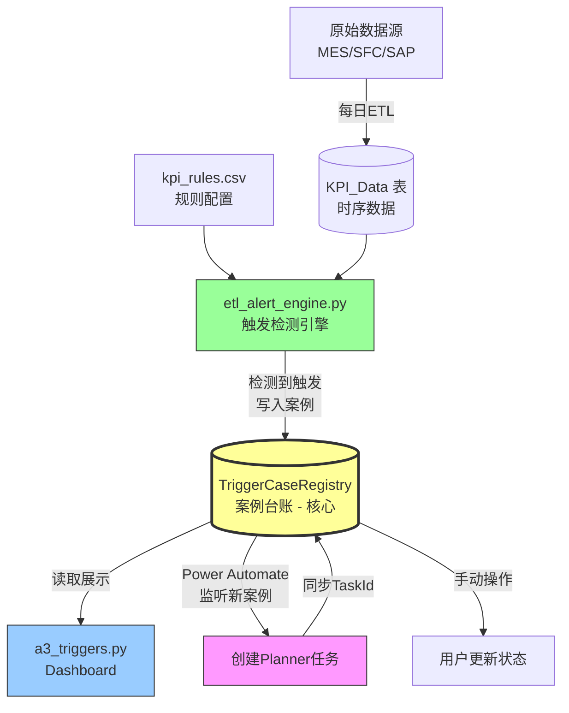
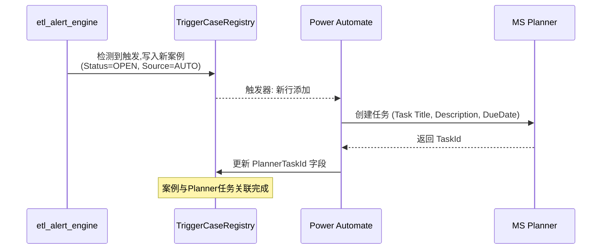

# A3 Trigger System 技术路线图

## 当前实现概览

### 系统架构与数据流



### 🔑 核心组件说明

#### **TriggerCaseRegistry 表 - 系统核心**
> **作用**：整个A3 Trigger系统的"案例台账"，作为单一真实来源 (Single Source of Truth)

**为什么先写入 CaseRegistry，再由 Dashboard 读取？**
1. **数据持久化**：引擎检测到触发后，立即持久化到数据库，避免丢失
2. **解耦设计**：ETL引擎和Dashboard解耦，引擎负责写，Dashboard负责读
3. **状态跟踪**：记录案例完整生命周期 (OPEN -> IN_PROGRESS -> CLOSED)
4. **集成枢纽**：作为与 Power Automate、Planner 等外部系统的集成点
5. **历史审计**：保留所有触发历史，可追溯和分析

**字段说明**：
- `A3Id`: 唯一标识 (A3-YYYYMMDD-####)
- `Category`: 分类/Tag (如: GLOBAL, Product_X)
- `TriggerType`: 规则代码 (如: LT_GLOBAL_CRITICAL)
- `Source`: AUTO (引擎触发) / MANUAL (人工创建)
- `Status`: OPEN / CLOSED
- `OpenedAt/ClosedAt`: 生命周期时间戳
- `PlannerTaskId`: 关联的Planner任务ID (由Power Automate写入)

#### **Power Automate 集成流程**


**Power Automate 触发器配置**：
- **触发条件**: TriggerCaseRegistry 表新增行
- **筛选**: Status = 'OPEN' AND Source = 'AUTO'
- **动作**: 
  1. 在Planner创建任务
  2. 将TaskId写回数据库
  3. (可选) 发送邮件通知

#### 1. 数据层 (Database)
- **KPI_Definition**: KPI定义表 (Id, Name, TargetValue等)
- **KPI_Data**: KPI每日/周数据 (KPI_Id, Tag, CreatedDate, Progress)
- **TriggerCaseRegistry**: 触发案例台账 (A3Id, Category, TriggerType, Status等)
- **TriggerCaseCutoff**: 触发截断表,避免重复触发

#### 2. 配置层 (Config)
- **kpi_rules.csv**: 规则配置文件
  - 字段: RuleCode, KPI_Id, KPI_Name, ThresholdValue, ComparisonOperator, ConsecutiveOccurrences等

#### 3. ETL引擎 ([etl_alert_engine.py](file:///c:/Users/huangk14/OneDrive%20-%20Medtronic%20PLC/Huangkai%20Files/B1_Project/250418_MDDAP_project/data_pipelines/monitoring/etl/etl_alert_engine.py))
- **check_generic_rule()**: 通用规则检查
  - 连续性判断 (ConsecutiveOccurrences)
  - 阈值比较 (ComparisonOperator)
  - 抑制冗余触发 (Warning vs Critical)
- **_alloc_a3_id()**: A3 ID分配 (格式: A3-YYYYM MDD-####)
- **_upsert_case_registry_row()**: 案例登记
- **run_alert_engine()**: 主执行函数

#### 4. Dashboard ([a3_triggers.py](file:///c:/Users/huangk14/OneDrive%20-%20Medtronic%20PLC/Huangkai%20Files/B1_Project/250418_MDDAP_project/dashboard/pages/a3_triggers.py))
- 案例列表展示 (筛选器: Status, Level, Type, Source)
- 手动案例创建/更新
- KPI趋势图可视化

---

## 现有触发规则

根据 [triggers.md](file:///c:/Users/huangk14/OneDrive%20-%20Medtronic%20PLC/Huangkai%20Files/B1_Project/250418_MDDAP_project/docs/monitoring/triggers.md):

| 规则代码 | KPI | 阈值 | 连续周数 | 级别 | 动作 |
|:---------|:----|:-----|:--------:|:-----|:-----|
| LT_GLOBAL_WARNING | Lead Time | \u003e24h | 2 | Warning | 邮件 |
| LT_GLOBAL_CRITICAL | Lead Time | \u003e24h | 3 | Critical | **创建A3** |
| SA_GLOBAL_WARNING | SA | \u003c95% | 2 | Warning | 邮件 |
| SA_GLOBAL_CRITICAL | SA | \u003c95% | 3 | Critical | **创建A3** |
| SAFETY_RANK_CRITICAL | Safety Rank | Top 3 | 3 | Critical | **创建A3** |

---

## 新增4个触发指标计划

### 待用户提供的信息
> ⚠️ **请提供以下4个新触发指标的详细配置：**

1. **指标1名称**
   - KPI: ?
   - 阈值: ?
   - 连续周期: ?
   - 级别: Warning / Critical
   - Tag筛选: ?

2. **指标2名称**
   - ...

3. **指标3名称**
   - ...

4. **指标4名称**
   - ...

---

## 开发实施路线图

### Phase 1: 需求确认 (今晚)
- [x] 梳理现有系统架构
- [x] 绘制技术路线图
- [ ] **用户确认4个新指标的配置细节**

### Phase 2: 配置扩展 (30分钟)
- [ ] 更新 `kpi_rules.csv`,添加4条新规则
- [ ] 如果需要新KPI,在 KPI_Definition 中添加
- [ ] 创建测试数据 (如果需要)

### Phase 3: Engine增强 (1小时)
- [ ] 检查 `check_generic_rule()` 是否支持新规则逻辑
- [ ] 如需特殊逻辑,添加专用检查函数
- [ ] 更新 `suppress_redundant_triggers()` 处理新规则的优先级

### Phase 4: Dashboard适配 (30分钟)
- [ ] 更新 `a3_triggers.py` 筛选器支持新TriggerType
- [ ] 优化趋势图展示,支持新KPI
- [ ] 添加新规则的帮助文档

### Phase 5: 测试与验证 (1小时)
- [ ] 单元测试:规则检测逻辑
- [ ] 集成测试:ETL + Dashboard
- [ ] 用户验收测试

### Phase 6: 部署与文档 (30分钟)
- [ ] 更新 `docs/monitoring/triggers.md`
- [ ] 提交代码并 push
- [ ] 部署到生产环境

**预计总时间: 3-4小时**

---

## 关键技术点

### 1. 连续性判断算法
```python
# 伪代码
consecutive_count = 0
for week in sorted_weeks:
    if violates_threshold(week):
        consecutive_count += 1
        if consecutive_count >= N:
            trigger_alert()
    else:
        consecutive_count = 0  # 重置计数器
```

### 2. 触发抑制逻辑
- 同一 Tag + KPI_Id: 如果存在 Critical,抑制 Warning
- 避免同一案例重复创建: 使用 TriggerCaseCutoff 记录已关闭案例

### 3. A3 ID生成
- 格式: `A3-{YYYYMMDD}-{序号}`
- 每日从0001开始递增

---

## 依赖检查

- ✅ SQL Server (mddap_v2)
- ✅ kpi_rules.csv 配置文件
- ✅ etl_alert_engine.py
- ✅ a3_triggers.py Dashboard
- ✅ dim_calendar (用于fiscal week计算)

---

## 下一步

**请您提供4个新触发指标的详细配置,我将立即开始Phase 2开发。**

可以参考现有规则格式提供以下信息:
- 规则代码 (如: QUALITY_GLOBAL_CRITICAL)
- 监控的KPI名称和ID
- 触发阈值和比较运算符 (\u003e, \u003c, =)
- 连续周数要求
- 级别 (Warning/Critical)
- Tag筛选条件 (如: 'GLOBAL', 'CZ_Campus' 等)
