# Project Name: 运营数据整合与智能报表提升 / Operational Data Integration and Visualization Improvement

**Site:** MDDAP
**Date:** 2025年3月25日 - 2025年4月15日
**Leader:** 项目负责人（待定）
**Members:** 项目组成员（待定）

---

## Problem Statement / 问题陈述
运营数据分散，缺乏标准化，数据采集依赖人工，效率低且易出错。各系统间数据存在差异，难以及时发现和纠正，影响数据的准确性和一致性。管理层和工程师难以及时获取所需的项目及运营数据，影响决策和执行。

Operational data is fragmented and lacks standardization; data collection relies on manual work, which is inefficient and error-prone. Data discrepancies exist between different systems, making it difficult to identify and correct issues in time, affecting data accuracy and consistency. Management and engineers cannot efficiently access the required project and operational data, impacting decision-making and execution.

---

## Objective / 目标
建立统一的运营数据标准和自动化采集机制，实现数据标准化管理。构建数据一致性校验体系，确保数据准确可靠。开发统一的运营数据可视化平台，支持实时分析和决策。

Establish unified operational data standards and automated collection mechanisms for standardized data management. Build a data consistency validation and quality management system to ensure data accuracy and reliability. Develop a unified operational data visualization platform to support real-time analysis and decision-making.

---

## Scope / 范围
- 所有运营相关数据，包括项目进展、资源分配、运营指标和收益等。
- Planisware、Project、Excel、OEE、SFC、Planner等系统数据及线下表格数据。
- 数据标准、采集、校验和展示相关流程。

All operational data, including project progress, resource allocation, operational metrics, and benefits. Data from systems including Planisware, Project, Excel, OEE, SFC, Planner, and offline spreadsheets. Data standards, collection, validation, and presentation processes.

---

## Project Metric / 项目指标
| 指标 | 衡量标准 | 基准值 | 目标值 |
|--------------|--------|----------|-------------|
| 数据准确率 | Dashboard一致性 | 95% | 100% |
| 数据采集自动化率 | 自动采集比例 | 30% | 90% |
| 数据可视化覆盖率 | 主要运营指标 | 60% | 100% |
| 数据一致性校验 | 校验频次 | 月度 | 实时 |

---

## Current State / 现状
- 运营数据分散在多个系统和表格中，缺乏统一标准。
- 数据采集和整合主要依赖人工，效率低，易出错。
- 数据一致性校验不及时，存在数据差异。
- 管理层和工程师获取数据不便，影响决策。

Operational data is scattered across multiple systems and spreadsheets, lacking unified standards. Data collection and integration mainly rely on manual work, which is inefficient and error-prone. Data consistency validation is not timely, and data discrepancies exist. Management and engineers have difficulty accessing data, affecting decision-making.

---

## Future State / 未来状态
- 建立统一的数据标准，实现自动化采集和整合。
- 数据一致性校验自动化，确保数据准确可靠。
- 所有关键运营数据实时可视化展示，支持决策。
- 管理层和工程师可便捷获取所需数据，提升效率。

Unified data standards established, with automated collection and integration. Automated data consistency validation ensures data accuracy and reliability. All key operational data is visualized in real-time to support decision-making. Management and engineers can easily access required data, improving efficiency.

---

## 现状与未来对比 / Current vs. Future State
| 项目 Item | 现状 Current | 未来 Future |
|-----------|--------------|-------------|
| 数据准确率 Data Accuracy | 95% | 100% |
| 数据采集自动化率 Data Automation | 30% | 90% |
| 数据一致性校验频次 Consistency Validation Frequency | 月度 Monthly | 实时 Real-time |
| 数据可视化覆盖率 Visualization Coverage | 60% | 100% |
| 数据获取效率 Data Access Efficiency | 低 Low | 高 High |

---

## KPI 结构图 / KPI Structure Diagram

```mermaid
graph TD
    A[运营数据仪表板<br/>Operational Dashboard] --> B[生产部门<br/>Production]
    A --> C[质量部门<br/>Quality]
    A --> D[持续改进<br/>CI]
    A --> E[供应链<br/>Supply Chain]
    A --> F[财务部门<br/>Finance]
    A --> G[设备管理<br/>Equipment]
    A --> H[设施管理<br/>Facilities]

    B --> B1[OEE]
    B --> B2[生产计划完成率]
    B --> B3[产能利用率]
    B --> B4[生产周期时间]

    C --> C1[一次合格率]
    C --> C2[质量成本]
    C --> C3[客户投诉率]
    C --> C4[返工率]

    D --> D1[改善项目完成率]
    D --> D2[成本节约]
    D --> D3[员工参与度]
    D --> D4[标准化完成率]

    E --> E1[库存周转率]
    E --> E2[准时交付率]
    E --> E3[采购成本节约]
    E --> E4[供应商绩效]

    F --> F1[运营成本]
    F --> F2[投资回报率]
    F --> F3[现金流]
    F --> F4[预算执行率]

    G --> G1[设备可用率]
    G --> G2[预防性维护完成率]
    G --> G3[设备故障率]
    G --> G4[维修成本]

    H --> H1[能源消耗]
    H --> H2[设施维护成本]
    H --> H3[安全事件率]
    H --> H4[环境合规性]
```

### KPI 说明 / KPI Description

1. **生产部门 KPI**
   - OEE (Overall Equipment Effectiveness)
   - 生产计划完成率
   - 产能利用率
   - 生产周期时间

2. **质量部门 KPI**
   - 一次合格率 (First Pass Yield)
   - 质量成本 (Cost of Quality)
   - 客户投诉率
   - 返工率

3. **持续改进 KPI**
   - 改善项目完成率
   - 成本节约
   - 员工参与度
   - 标准化完成率

4. **供应链 KPI**
   - 库存周转率
   - 准时交付率
   - 采购成本节约
   - 供应商绩效

5. **财务部门 KPI**
   - 运营成本
   - 投资回报率 (ROI)
   - 现金流
   - 预算执行率

6. **设备管理 KPI**
   - 设备可用率
   - 预防性维护完成率
   - 设备故障率
   - 维修成本

7. **设施管理 KPI**
   - 能源消耗
   - 设施维护成本
   - 安全事件率
   - 环境合规性

---

> 注：本模板内容根据实际项目定义文件整理，具体细节可根据项目进展进一步补充完善。